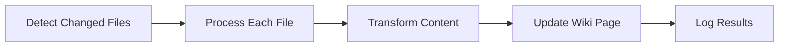

# Documentation Wiki Automation - Design

## Overview

This design outlines a GitHub Actions workflow that automatically synchronizes documentation files to GitHub Wiki pages whenever documentation changes are pushed to the repository.

## Architecture

### Workflow Trigger
- **Event**: Push to main branch
- **Path Filter**: Only trigger when files in `docs/` or `README.md` change
- **Permissions**: Contents read, Wiki write

### File Processing Pipeline



## Components

### 1. GitHub Actions Workflow
- **File**: `.github/workflows/sync-docs-to-wiki.yml`
- **Trigger**: Push events with path filters
- **Runner**: ubuntu-latest
- **Permissions**: contents: read, pages: write

### 2. Wiki Sync Script
- **File**: `scripts/sync-docs-to-wiki.js`
- **Purpose**: Process and upload documentation files
- **Dependencies**: @octokit/rest, fs, path

### 3. File Mapping Configuration
```javascript
const FILE_MAPPINGS = {
  'README.md': 'Home',
  'docs/API.md': 'API-Documentation',
  'docs/DEPLOYMENT.md': 'Deployment-Guide',
  'docs/CONTRIBUTING.md': 'Contributing-Guide',
  'docs/ARCHITECTURE.md': 'Architecture-Documentation'
};
```

## Data Models

### Wiki Page Structure
```javascript
{
  title: string,        // Wiki page title
  content: string,      // Processed markdown content
  message: string,      // Commit message
  sha: string          // Current page SHA (for updates)
}
```

## Error Handling

### Retry Strategy
- **Max Retries**: 3
- **Backoff**: Exponential (1s, 2s, 4s)
- **Retry Conditions**: Network errors, API rate limits

### Error Logging
- Log all errors with context
- Continue processing other files on individual failures
- Fail workflow only on critical errors

## Testing Strategy

### Unit Tests
- File content processing
- Link transformation
- Error handling scenarios

### Integration Tests
- End-to-end workflow execution
- Wiki API interactions
- File change detection