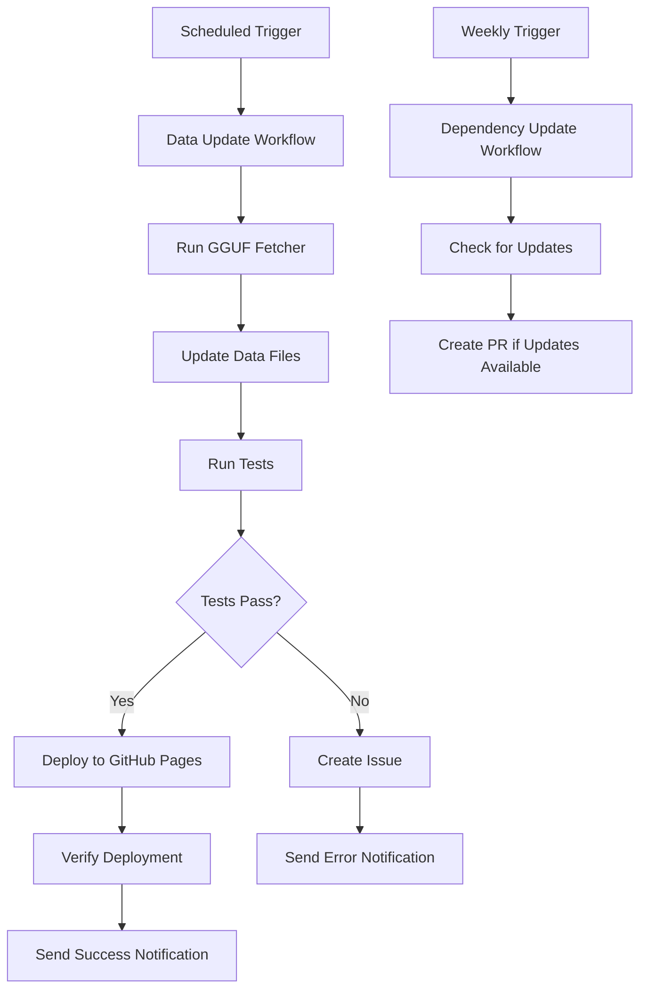

# GitHub Automation Design Document

## Overview

This design implements a comprehensive GitHub Actions-based automation system for the GGUF model loader application. The system will automatically update model data every 24 hours, manage dependencies, run tests, and deploy to GitHub Pages without manual intervention.

The automation leverages GitHub's native features including Actions workflows, repository secrets, and GitHub Pages deployment to create a robust, maintainable solution.

## Architecture

### Core Components

1. **Daily Data Update Workflow** - Scheduled workflow that runs the GGUF fetcher script
2. **Dependency Management Workflow** - Weekly workflow for updating npm and Python dependencies  
3. **Testing Pipeline** - Comprehensive test execution before any deployments
4. **Deployment Pipeline** - Automated GitHub Pages deployment with verification
5. **Notification System** - Status reporting and error alerting
6. **Configuration Management** - Centralized configuration via repository variables

### Workflow Orchestration



## Components and Interfaces

### 1. Daily Data Update Workflow (.github/workflows/daily-update.yml)

**Purpose**: Automatically fetch and update GGUF model data every 24 hours

**Key Features**:
- Scheduled execution via cron (configurable)
- Python environment setup with requirements.txt
- Data fetching using simplified_gguf_fetcher.py
- Automatic commit and push of updated data files
- Integration with testing and deployment pipelines

**Inputs**:
- Schedule configuration (cron expression)
- Python version specification
- Retry configuration

**Outputs**:
- Updated gguf_models.json
- Updated data/raw_models_data.json
- Commit with timestamp and change summary

### 2. Dependency Management Workflow (.github/workflows/dependency-update.yml)

**Purpose**: Keep Node.js and Python dependencies up to date

**Key Features**:
- Weekly execution schedule
- Automated security update application
- Pull request creation for non-security updates
- Dependency vulnerability scanning
- Lock file maintenance

**Components**:
- npm audit and update for Node.js dependencies
- pip-audit for Python security scanning
- Automated PR creation with change summaries
- Test execution before PR merge

### 3. Testing Pipeline (.github/workflows/test.yml)

**Purpose**: Comprehensive testing before any deployment

**Test Categories**:
- **Unit Tests**: Individual component validation
- **Integration Tests**: Component interaction testing
- **End-to-End Tests**: Full application workflow testing
- **Data Validation**: GGUF model data integrity checks
- **Performance Tests**: Load time and responsiveness validation

**Test Execution Strategy**:
- Parallel test execution for speed
- Test result aggregation and reporting
- Artifact generation for test reports
- Failure notification and issue creation

### 4. Deployment Pipeline (.github/workflows/deploy.yml)

**Purpose**: Automated GitHub Pages deployment with verification

**Deployment Steps**:
1. Build static assets (if needed)
2. Deploy to GitHub Pages
3. Wait for deployment completion
4. Run smoke tests against live site
5. Verify model data loading
6. Send deployment notifications

**Rollback Strategy**:
- Automatic rollback on smoke test failure
- Manual rollback trigger via workflow dispatch
- Deployment status tracking

### 5. Configuration Management

**Repository Variables**:
- `AUTOMATION_SCHEDULE`: Cron expression for daily updates (default: "0 2 * * *")
- `PYTHON_VERSION`: Python version for workflows (default: "3.11")
- `NODE_VERSION`: Node.js version for workflows (default: "18")
- `ENABLE_NOTIFICATIONS`: Enable/disable notifications (default: true)
- `TEST_TIMEOUT`: Maximum test execution time (default: 30 minutes)

**Configuration File** (.github/automation-config.json):
```json
{
  "dataUpdate": {
    "enabled": true,
    "retryAttempts": 3,
    "retryDelay": 300
  },
  "testing": {
    "runParallel": true,
    "generateReports": true,
    "failFast": false
  },
  "deployment": {
    "smokeTestTimeout": 300,
    "verificationChecks": [
      "site-accessibility",
      "model-data-loading",
      "search-functionality"
    ]
  },
  "notifications": {
    "channels": ["issues", "email"],
    "onSuccess": false,
    "onFailure": true
  }
}
```

## Data Models

### Workflow Status Tracking

```typescript
interface WorkflowRun {
  id: string;
  name: string;
  status: 'queued' | 'in_progress' | 'completed';
  conclusion: 'success' | 'failure' | 'cancelled' | 'skipped';
  startTime: string;
  endTime?: string;
  artifacts: Artifact[];
}

interface Artifact {
  name: string;
  downloadUrl: string;
  sizeBytes: number;
  createdAt: string;
}
```

### Configuration Schema

```typescript
interface AutomationConfig {
  dataUpdate: {
    enabled: boolean;
    retryAttempts: number;
    retryDelay: number;
  };
  testing: {
    runParallel: boolean;
    generateReports: boolean;
    failFast: boolean;
  };
  deployment: {
    smokeTestTimeout: number;
    verificationChecks: string[];
  };
  notifications: {
    channels: ('issues' | 'email')[];
    onSuccess: boolean;
    onFailure: boolean;
  };
}
```

## Error Handling

### Retry Strategy

**Data Fetching Failures**:
- Exponential backoff: 5min, 15min, 45min
- Maximum 3 retry attempts
- Fallback to cached data if all retries fail
- Issue creation for persistent failures

**Deployment Failures**:
- Immediate rollback to previous version
- Issue creation with deployment logs
- Notification to maintainers
- Manual intervention required for resolution

**Test Failures**:
- Halt deployment pipeline
- Generate detailed test reports
- Create issue with failure analysis
- Preserve test artifacts for debugging

### Error Notification

**Issue Creation Template**:
```markdown
## Automation Failure: [Workflow Name]

**Failure Type**: [Data Update/Deployment/Testing]
**Timestamp**: [ISO 8601 timestamp]
**Workflow Run**: [Link to GitHub Actions run]

### Error Details
[Error message and stack trace]

### Affected Components
- [ ] Data files
- [ ] Dependencies  
- [ ] Deployment
- [ ] Tests

### Recommended Actions
[Automated suggestions based on error type]

### Logs and Artifacts
[Links to relevant logs and artifacts]
```

## Testing Strategy

### Automated Test Categories

1. **Data Integrity Tests**
   - Validate JSON structure of model data
   - Check for required fields in each model entry
   - Verify data consistency between raw and processed files
   - Test GGUF file metadata accuracy

2. **Application Tests**
   - UI component rendering tests
   - Search and filter functionality tests
   - Model card display tests
   - Mobile responsiveness tests
   - Performance benchmarks

3. **Integration Tests**
   - End-to-end user workflows
   - API integration tests
   - Cross-browser compatibility tests
   - Accessibility compliance tests

4. **Deployment Verification**
   - Site accessibility checks
   - Model data loading verification
   - Search functionality validation
   - Performance regression detection

### Test Execution Environment

**Browser Testing Matrix**:
- Chrome (latest)
- Firefox (latest)
- Safari (latest)
- Edge (latest)

**Device Testing**:
- Desktop (1920x1080)
- Tablet (768x1024)
- Mobile (375x667)

**Performance Benchmarks**:
- Initial page load < 3 seconds
- Model search response < 500ms
- Filter application < 200ms
- Memory usage < 100MB

## Security Considerations

### Secrets Management

**Required Secrets**:
- `GITHUB_TOKEN`: For repository operations (automatically provided)
- `HF_TOKEN`: Hugging Face API token (optional, for rate limit increases)

**Security Best Practices**:
- Minimal permission scopes for tokens
- Regular token rotation
- Audit logging for all automated actions
- Dependency vulnerability scanning

### Access Control

**Workflow Permissions**:
- `contents: write` - For committing data updates
- `pages: write` - For GitHub Pages deployment
- `issues: write` - For error reporting
- `pull-requests: write` - For dependency updates

### Data Protection

**Sensitive Data Handling**:
- No sensitive data in logs or artifacts
- Secure handling of API tokens
- Data validation before processing
- Backup and recovery procedures

## Performance Optimization

### Workflow Efficiency

**Parallel Execution**:
- Run tests in parallel where possible
- Cache dependencies between workflow runs
- Use matrix strategies for multi-environment testing
- Optimize artifact storage and retrieval

**Resource Management**:
- Appropriate runner sizes for different workflows
- Timeout configurations to prevent hanging jobs
- Cleanup of temporary files and artifacts
- Efficient use of GitHub Actions minutes

### Caching Strategy

**Dependency Caching**:
- npm cache for Node.js dependencies
- pip cache for Python dependencies
- Browser cache for testing environments
- Build artifact caching

**Data Caching**:
- Cache model data between runs
- Incremental updates when possible
- Fallback to cached data on fetch failures
- Cache invalidation strategies