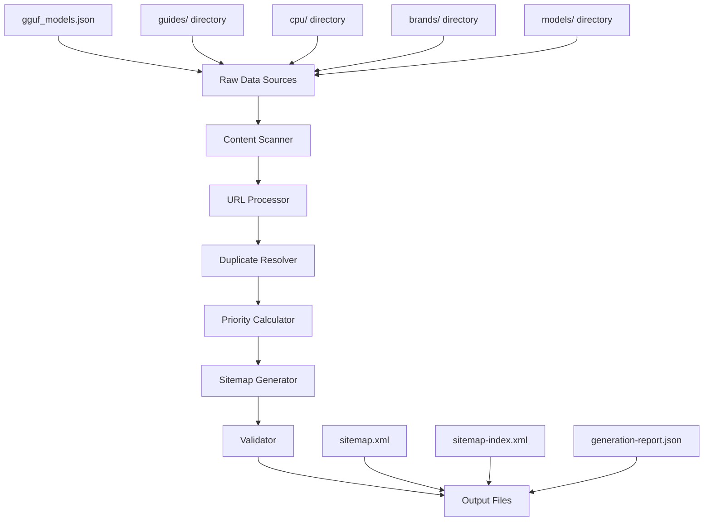

# Design Document

## Overview

This design addresses the SEO sitemap optimization issues by creating a new, improved sitemap generation system that eliminates duplicate URLs, includes missing content directories, and follows SEO best practices. The solution will replace the problematic hash-based URLs with proper HTML pages and ensure comprehensive content coverage.

## Architecture

### Current System Analysis

The existing `scripts/generate-seo.js` has several critical issues:
1. **Duplicate URL Generation**: Creates both hash URLs (`#model=name`) and HTML pages (`models/name.html`)
2. **Missing Content**: Doesn't scan `guides/`, `cpu/`, and `brands/` directories
3. **SEO Problems**: Hash-based URLs are not indexable by search engines
4. **Limited Validation**: No URL validation or duplicate detection

### New Architecture



## Components and Interfaces

### 1. Content Scanner Component

**Purpose**: Discover all content files across the website

```javascript
class ContentScanner {
    scanDirectories(directories) {
        // Scan specified directories for HTML files
        // Return structured content inventory
    }
    
    scanModelsData(jsonFile) {
        // Extract model information from JSON
        // Return model metadata
    }
    
    validateFiles(files) {
        // Check if files exist and are accessible
        // Return validation results
    }
}
```

**Interface**:
- Input: Array of directory paths, JSON data file
- Output: ContentInventory object with categorized files

### 2. URL Processor Component

**Purpose**: Generate proper URLs and eliminate hash-based ones

```javascript
class URLProcessor {
    generateModelURLs(models) {
        // Create proper HTML page URLs for models
        // Exclude hash-based URLs entirely
    }
    
    generateContentURLs(files) {
        // Create URLs for guides, CPU, brands content
        // Ensure proper URL structure
    }
    
    validateURLs(urls) {
        // Check URL format and accessibility
        // Return validation results
    }
}
```

**Interface**:
- Input: Model data, content files
- Output: Array of validated URL objects

### 3. Duplicate Resolver Component

**Purpose**: Identify and resolve duplicate URLs

```javascript
class DuplicateResolver {
    detectDuplicates(urls) {
        // Find duplicate URLs across different sources
        // Return duplicate groups
    }
    
    resolveDuplicates(duplicateGroups) {
        // Apply resolution rules (prefer HTML over hash)
        // Return deduplicated URL list
    }
    
    generateReport(duplicates) {
        // Create detailed duplicate resolution report
        // Return report object
    }
}
```

**Interface**:
- Input: Array of URL objects
- Output: Deduplicated URL array, resolution report

### 4. Priority Calculator Component

**Purpose**: Assign SEO priorities and change frequencies

```javascript
class PriorityCalculator {
    calculatePriority(url, metadata) {
        // Assign priority based on content type and importance
        // Return priority value (0.1-1.0)
    }
    
    determineChangeFreq(url, metadata) {
        // Determine how often content changes
        // Return changefreq value
    }
    
    setLastModified(url, fileStats) {
        // Set last modification date
        // Return ISO date string
    }
}
```

**Interface**:
- Input: URL object, metadata, file statistics
- Output: Enhanced URL object with SEO metadata

### 5. Sitemap Generator Component

**Purpose**: Generate XML sitemap files

```javascript
class SitemapGenerator {
    generateSitemap(urls) {
        // Create XML sitemap content
        // Handle URL limits (50,000 per file)
    }
    
    generateSitemapIndex(sitemaps) {
        // Create sitemap index if multiple files needed
        // Return index XML content
    }
    
    validateXML(xmlContent) {
        // Validate XML structure and encoding
        // Return validation results
    }
}
```

**Interface**:
- Input: Array of URL objects with SEO metadata
- Output: XML sitemap content, validation results

## Data Models

### URL Object Structure

```javascript
{
    loc: "https://local-ai-zone.github.io/guides/example.html",
    lastmod: "2025-08-06",
    changefreq: "monthly",
    priority: "0.7",
    contentType: "guide", // model, guide, cpu, brand, main
    source: "file", // file, json, generated
    originalPath: "/guides/example.html",
    validated: true,
    isDuplicate: false
}
```

### Content Inventory Structure

```javascript
{
    models: [
        {
            name: "model-name",
            htmlPath: "models/model-name.html",
            exists: true,
            lastModified: "2025-08-06T10:00:00Z"
        }
    ],
    guides: [...],
    cpu: [...],
    brands: [...],
    main: [...]
}
```

### Generation Report Structure

```javascript
{
    timestamp: "2025-08-06T10:00:00Z",
    totalURLs: 5000,
    duplicatesFound: 150,
    duplicatesResolved: 150,
    urlsByType: {
        models: 2000,
        guides: 50,
        cpu: 30,
        brands: 40,
        main: 5
    },
    errors: [],
    warnings: [],
    sitemapFiles: ["sitemap.xml"],
    validationResults: {...}
}
```

## Error Handling

### Error Categories

1. **File System Errors**
   - Missing directories
   - Unreadable files
   - Permission issues

2. **Data Validation Errors**
   - Invalid JSON structure
   - Missing required fields
   - Malformed URLs

3. **XML Generation Errors**
   - Invalid XML characters
   - Encoding issues
   - Size limit exceeded

### Error Recovery Strategy

```javascript
class ErrorHandler {
    handleFileSystemError(error, context) {
        // Log error, continue with available files
        // Return partial results with warning
    }
    
    handleValidationError(error, item) {
        // Skip invalid item, log warning
        // Continue processing remaining items
    }
    
    handleXMLError(error, content) {
        // Attempt to fix common XML issues
        // Fall back to basic sitemap if needed
    }
}
```

## Testing Strategy

### Unit Tests

1. **Content Scanner Tests**
   - Directory scanning accuracy
   - File validation logic
   - JSON parsing robustness

2. **URL Processor Tests**
   - URL generation correctness
   - Hash URL exclusion
   - URL validation logic

3. **Duplicate Resolver Tests**
   - Duplicate detection accuracy
   - Resolution rule application
   - Edge case handling

### Integration Tests

1. **End-to-End Workflow**
   - Complete sitemap generation
   - File output validation
   - Performance benchmarks

2. **Error Scenario Tests**
   - Missing file handling
   - Corrupted data recovery
   - Large dataset processing

### Validation Tests

1. **XML Validation**
   - Schema compliance
   - Character encoding
   - URL format validation

2. **SEO Compliance**
   - Google sitemap guidelines
   - URL accessibility
   - Priority distribution

## Performance Considerations

### Optimization Strategies

1. **Lazy Loading**: Process directories on-demand
2. **Caching**: Cache file system operations
3. **Streaming**: Process large datasets in chunks
4. **Parallel Processing**: Scan directories concurrently

### Memory Management

```javascript
class PerformanceOptimizer {
    processInBatches(items, batchSize = 1000) {
        // Process large datasets in manageable chunks
        // Prevent memory overflow
    }
    
    cacheFileStats(directory) {
        // Cache file system operations
        // Reduce I/O overhead
    }
    
    streamLargeFiles(filePath) {
        // Stream large JSON files
        // Process without loading entire file
    }
}
```

### Scalability Limits

- **Maximum URLs**: 50,000 per sitemap file
- **File Size Limit**: 50MB uncompressed
- **Processing Time**: Target < 30 seconds for full generation
- **Memory Usage**: Target < 512MB peak usage

## Security Considerations

### Input Validation

1. **Path Traversal Prevention**
   - Validate all file paths
   - Restrict to allowed directories
   - Sanitize user inputs

2. **XML Injection Prevention**
   - Escape special characters
   - Validate URL formats
   - Sanitize content strings

### Access Control

1. **File System Access**
   - Read-only access to content directories
   - Write access only to output directory
   - No execution of external commands

2. **URL Validation**
   - Whitelist allowed domains
   - Validate URL schemes (https only)
   - Check for malicious patterns

## Deployment Strategy

### Migration Plan

1. **Phase 1**: Deploy new generator alongside existing
2. **Phase 2**: Compare outputs and validate improvements
3. **Phase 3**: Switch to new generator
4. **Phase 4**: Remove old generator code

### Rollback Strategy

1. **Backup Current Sitemap**: Save existing sitemap.xml
2. **Validation Checks**: Verify new sitemap before deployment
3. **Quick Rollback**: Restore previous sitemap if issues detected
4. **Monitoring**: Track search engine crawling behavior

### Configuration Management

```javascript
const config = {
    baseURL: 'https://local-ai-zone.github.io',
    contentDirectories: ['guides', 'cpu', 'brands', 'models'],
    outputFiles: {
        sitemap: 'sitemap.xml',
        sitemapIndex: 'sitemap-index.xml',
        report: 'sitemap-generation-report.json'
    },
    limits: {
        maxURLsPerSitemap: 50000,
        maxFileSize: 52428800, // 50MB
        processingTimeout: 30000 // 30 seconds
    },
    priorities: {
        main: 1.0,
        models: 0.8,
        guides: 0.7,
        cpu: 0.6,
        brands: 0.6
    }
};
```