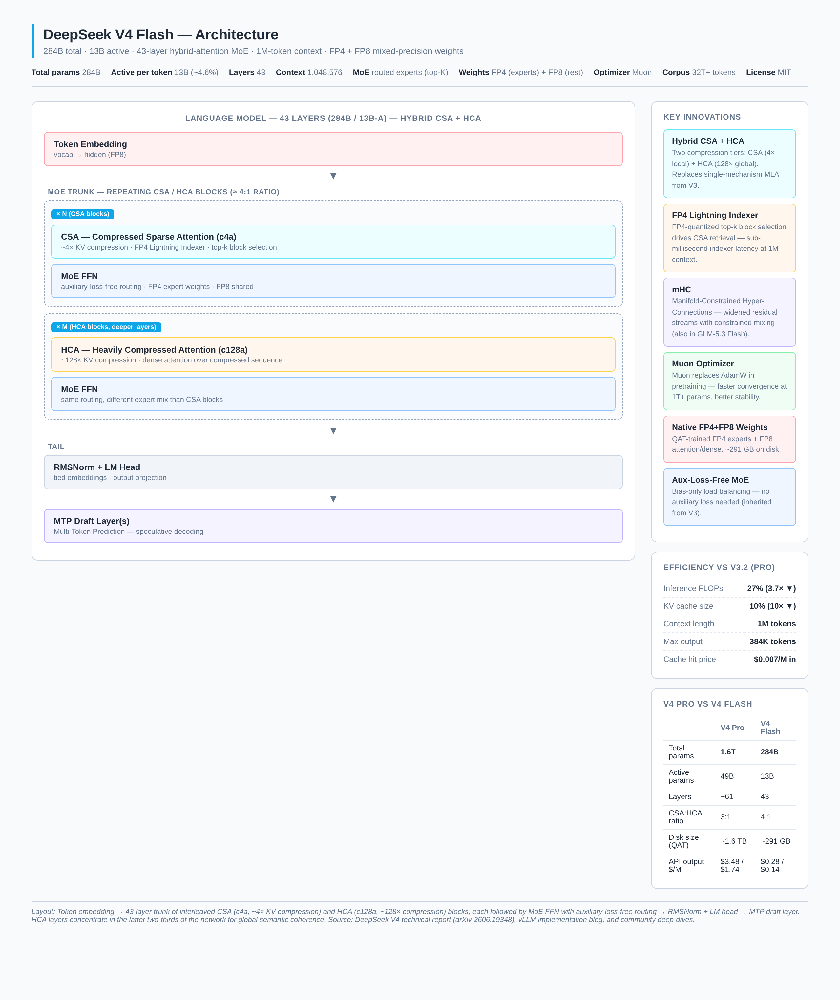
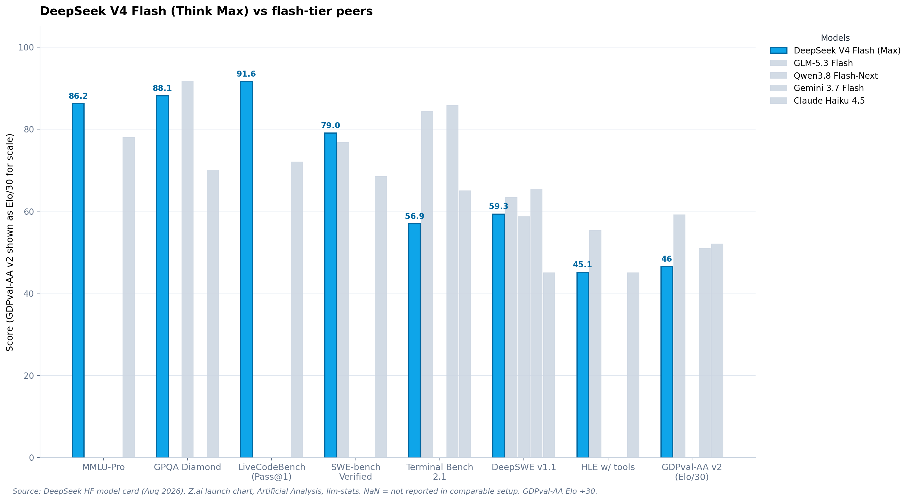
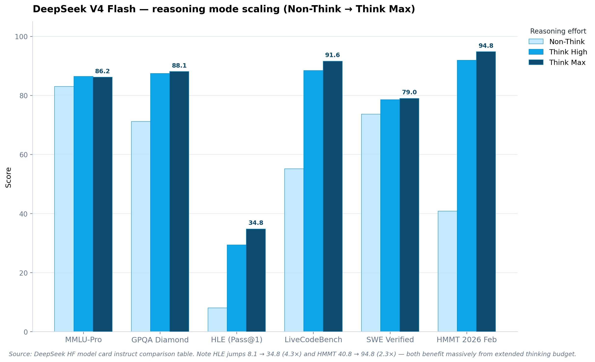
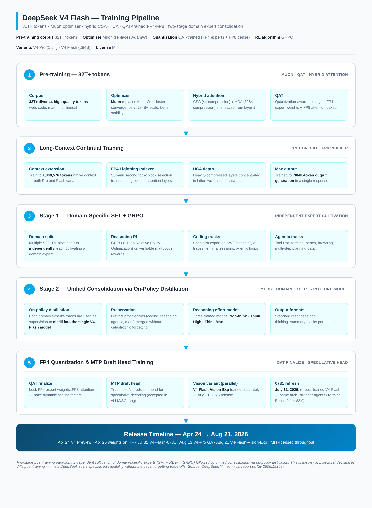

# DeepSeek V4 Flash: A Technical Deep Dive into the 284B-A13B Hybrid-Attention MoE

> **TL;DR** — DeepSeek released V4 on **April 24, 2026**, with two open-weight MoE variants sharing the same architecture family: **V4 Pro** (1.6T total / 49B active) and **V4 Flash** (284B total / 13B active). Both ship with a 1M-token native context, MIT-licensed weights, and a hybrid attention design that reduces single-token inference FLOPs to **27% of V3.2** and KV cache size to **10%**. The "Flash" suffix here does not mean a distilled Pro — it is an independently designed model with its own MoE configuration, attention interleaving ratios, and expert routing, optimized for single-node serving. The V4-Flash-0731 refresh (July 31, 2026) and the GA pricing change (August 16) made it the cheapest 1M-context frontier model on the market at **$0.14/$0.28 per million tokens off-peak**. This post breaks down the architecture, the changelog vs V3/V3.2, the full benchmark sheet, the training pipeline, the self-hosting matrix, and the developer-facing API surface.

---

## 1. What DeepSeek V4 Flash Actually Is

There is a persistent mischaracterization that V4 Flash is a distilled or compressed version of V4 Pro — essentially V4 Pro with weights pruned and quantized to fit smaller hardware. That is wrong. DeepSeek is explicit in the technical report (arXiv 2606.19348): **V4 Flash is independently designed**, with its own MoE configuration, attention layer interleaving ratios, and expert routing parameters optimized for a different operational regime.

That regime is: GPU memory is the binding constraint, production endpoints with aggressive tail latency SLAs, and single-node or dual-node deployments where the expert parallelism strategies required for V4 Pro would introduce unacceptable cross-node communication overhead. V4 Pro at 1.6T total / 49B active is the headline-grabbing frontier release; V4 Flash at 284B / 13B is the production-serving workhorse that most teams will actually deploy.

The launch was a stealthy one. DeepSeek announced V4 on April 24, 2026 with a quiet API update and an "open-sourced today" model card on Hugging Face. The technical report dropped two days later on April 26. Unlike GLM-5.3 Flash's "Ox Alpha" mystery model preview, there was no shadow rollout — DeepSeek just shipped. The reception was immediate: r/LocalLLaMA lit up with quantization threads, vLLM published a dedicated implementation blog the same day, and within a week Novita, Featherless, DeepInfra, Friendli, and Lambda had all added hosting endpoints. Three months later, on **July 31, 2026**, DeepSeek shipped the V4-Flash-0731 refresh — same architecture, re-post-trained — with substantially stronger agent capabilities. On August 13, V4-Pro went GA. On August 16, peak/off-peak pricing kicked in. On August 21, the multimodal **V4-Flash-Vision-Exp** shipped as an experimental model.

The strategic picture: DeepSeek has held the open-weights cost-per-token crown since V3, and V4 cements that lead with a 10× KV cache reduction at 1M context. The Pro/Flash split lets them serve two markets — frontier capability (Pro) and cheap production inference (Flash) — from the same architecture family.

### 1.1 The Spec Sheet at a Glance

| Spec | DeepSeek V4 Flash | DeepSeek V4 Pro (for context) |
|---|---|---|
| **Released (preview)** | April 24, 2026 | April 24, 2026 |
| **Refresh (0731)** | July 31, 2026 — same arch, re-post-trained | August 13, 2026 — GA |
| **Total parameters** | 284B | 1.6T |
| **Active parameters per token** | 13B (~4.6%) | 49B (~3.1%) |
| **Architecture** | Hybrid CSA + HCA MoE | Hybrid CSA + HCA MoE |
| **CSA:HCA ratio** | ~4:1 | ~3:1 |
| **Layers** | 43 | ~61 |
| **Context window** | 1,048,576 tokens (native) | 1,048,576 tokens (native) |
| **Max output length** | 384,000 tokens | 384,000 tokens |
| **Precision (weights)** | FP4 (MoE experts) + FP8 (rest), QAT-trained | FP4 (MoE experts) + FP8 (rest), QAT-trained |
| **Disk size (QAT)** | ~291 GB | ~1.6 TB |
| **Reasoning modes** | Non-think · Think High · Think Max | Non-think · Think High · Think Max |
| **Optimizer** | Muon (replaces AdamW) | Muon (replaces AdamW) |
| **Pre-training corpus** | 32T+ tokens | 32T+ tokens |
| **RL algorithm** | GRPO (Group Relative Policy Optimization) | GRPO |
| **Post-training paradigm** | Two-stage: domain expert cultivation → on-policy distillation | Same |
| **License** | MIT | MIT |
| **API model code** | `deepseek-v4-flash` | `deepseek-v4-pro` |
| **API input (cache miss)** | $0.22/M peak · $0.11/M off-peak | $1.10/M peak · $0.55/M off-peak |
| **API input (cache hit)** | $0.015/M peak · $0.007/M off-peak | $0.10/M peak · $0.05/M off-peak |
| **API output** | $0.28/M peak · $0.14/M off-peak | $3.48/M peak · $1.74/M off-peak |
| **Max concurrency** | 2,500 concurrent requests | 500 concurrent requests |

Sources: [DeepSeek HF model card](https://huggingface.co/deepseek-ai/DeepSeek-V4-Flash), [V4 technical report (arXiv 2606.19348)](https://arxiv.org/abs/2606.19348), [DeepSeek pricing page](https://api-docs.deepseek.com/quick_start/pricing), and the [vLLM V4 implementation blog](https://vllm.ai/blog/2026-04-24-deepseek-v4).

---

## 2. Architecture

V4's headline architectural innovation is the replacement of V3's single-mechanism **Multi-head Latent Attention (MLA)** with a **hybrid attention** system combining two distinct compression tiers: **Compressed Sparse Attention (CSA)** for local context and **Heavily Compressed Attention (HCA)** for global context. This is paired with **Manifold-Constrained Hyper-Connections (mHC)** for residual stream stability, **auxiliary-loss-free MoE routing** inherited from V3, **Muon optimizer** for pre-training, and **QAT-trained FP4+FP8 mixed-precision weights** shipped as the primary checkpoint.



*Figure 1 — The 43-layer stack: token embedding → repeating CSA (c4a) blocks interleaved with HCA (c128a) blocks, each followed by MoE FFN → RMSNorm + LM head → MTP draft layer. HCA layers concentrate in the latter two-thirds of the network for global semantic coherence.*

### 2.1 The V3 → V4 Architectural Pivot

To understand why V4 matters, it helps to be precise about what V3 did and where V4 departs.

DeepSeek V3 shipped in late 2024 with a **MoE architecture totaling ~671 billion parameters, activating ~37 billion per forward pass** — a ratio that made it one of the most compute-efficient open-weights frontier models at its release. The mechanism that most distinguished V3 from its contemporaries was **Multi-head Latent Attention (MLA)**. Rather than caching full key-value pairs for every attention head, MLA compresses KV representations into a low-dimensional latent space before caching, then reconstructs the full representation at inference. This produced an enormous KV cache reduction vs MHA/MQA without the quality hit of GQA.

But MLA, for all its cleverness, was a **single-mechanism attention system**. Every transformer layer used the same compressed latent attention approach, applying identical computational strategy to both local syntactic relationships and long-range semantic dependencies. That architectural uniformity is exactly what V4's hybrid CSA/HCA system abandons — not as an incremental refinement but as a qualitative architectural shift.

### 2.2 Compressed Sparse Attention (CSA) — Local Compression

CSA operates on a fundamentally different computational graph than the sliding window attention familiar from Mistral-class models. Sliding window attention achieves sparsity by ignoring tokens outside the window. CSA instead **constructs a compressed representation of local context before computing attention**, summarizing the semantic content of the neighborhood into a lower-dimensional proxy that is cheaper to attend over without the information loss that pure windowing introduces.

In practical terms: **CSA compresses the KV cache by roughly 4×** (the "c4a" variant). So a 1M-token sequence becomes 250K compressed tokens for CSA layers. The compression is paired with **sparse, top-k block selection driven by the FP4 Lightning Indexer** — a fast approximate retrieval pass that finds the most relevant compressed blocks, then runs full attention only over those.

The technical lineage connects to Longformer's combination of local and global attention, BigBird's random attention augmentation, and ETC's structured sparsity. But CSA's compression step distinguishes it from all predecessors by operating on representational content rather than positional structure. It does not just ignore far-away tokens; it summarizes them.

### 2.3 Heavily Compressed Attention (HCA) — Global Attention

HCA handles what CSA's lighter compression cannot: efficient global attention over the full 1M-token context. HCA does not attempt full quadratic attention over 1M raw tokens — that would be computationally intractable regardless of activation sparsity. Instead, HCA applies an aggressive **~128× compression along the sequence dimension** (the "c128a" variant). After this aggressive compression, the resulting sequence is short enough that dense attention becomes cheap again — HCA drops sparse selection entirely and computes full dense attention over the compressed sequence.

The distinction matters:

- **CSA**: 4× compression + sparse top-k selection. Preserves more positional fidelity for nearby tokens.
- **HCA**: 128× compression + dense attention. Preserves more global coherence at low cost.

Without HCA, a 1M-token context window would require either full quadratic attention (computationally impossible at scale) or exclusively local-window mechanisms that fail on tasks requiring multi-hop reasoning across distant positions. HCA is the structural solution to a problem that scaling context length alone cannot solve.

### 2.4 The Interleaving Pattern

Which proportion of transformer layers employ CSA versus HCA is one of the most operationally consequential architectural decisions in V4's design, and one of the least discussed in mainstream coverage.

The published technical report indicates:

- **V4 Pro**: roughly 3:1 CSA-to-HCA ratio, with HCA layers concentrated in the latter two-thirds of the network
- **V4 Flash**: 4:1 ratio, with fewer HCA layers proportionally — reducing the computational overhead of long-range attention at the cost of some depth in global context integration

This is consistent with Flash's latency-sensitive optimization target. Early transformer layers build syntactically dense local representations where primary information dependencies are short-range, making CSA's local compression appropriate. Deeper layers increasingly require global semantic coherence, where HCA's long-range selective attention delivers value.

HCA layers, because they operate on aggressively compressed sequences and perform dense attention over the result, exhibit a different memory access and compute profile than CSA layers. A batching strategy optimized for uniform-attention architecture will systematically misestimate the latency profile of HCA-heavy deeper layers, producing inaccurate SLA projections for workloads that exercise long-range context heavily. **V4 Flash's gap to V4 Pro on standard reasoning benchmarks (roughly 8–12 percentage points on most published evaluations) understates its deficit on the hardest long-context retrieval tasks**, where V4 Pro's larger expert pool and higher-capacity HCA layers confer meaningful advantages.

### 2.5 FP4 Lightning Indexer

The Lightning Indexer is the engine that makes CSA tractable. It is a **FP4-quantized top-k block selection mechanism** that runs as a fast approximate retrieval pass before CSA's main attention computation. The indexer maintains FP4 key vectors for all compressed blocks, computes approximate similarity scores against the query, and selects the top-k most relevant blocks for full attention.

Using FP4 for the indexer is a deliberate trade-off: indexer accuracy does not need to be perfect, only directionally correct, because the main attention computation will refine the result. FP4 cuts indexer memory by 2× vs FP8 and 4× vs BF16, and the indexer kernels run on tensor cores at full FP4 throughput. In practice, the indexer adds sub-millisecond latency at 1M context — invisible in the critical path.

### 2.6 mHC — Manifold-Constrained Hyper-Connections

mHC widens the residual stream — giving each layer access to a richer mix of information from earlier layers — but constrains the mixing so that very wide connectivity does not destabilize training. The constraint lives on a low-dimensional manifold rather than in the full residual space, which is what makes the math tractable.

mHC was first published by DeepSeek's own research team in late 2025. Z.ai shipped it in GLM-5.3 Flash (released August 26, 2026), citing DeepSeek as the source. This is the inverse of the usual cross-lab transfer — DeepSeek invents, open-sources, and ships internally before anyone else, and then the rest of the open-weights community catches up. By the end of 2026, expect mHC to appear in Mistral, Meta, and Qwen releases.

### 2.7 Auxiliary-Loss-Free MoE Routing

Inherited from V3, V4's MoE uses **bias-only load balancing** instead of an auxiliary loss term. Standard MoE training adds an auxiliary loss to penalize unbalanced expert utilization, which forces the router to spread tokens across experts but interferes with the main training objective. DeepSeek's aux-loss-free approach replaces this with a per-expert bias term that is updated based on expert utilization statistics — load balancing becomes a control problem rather than a gradient signal.

This matters for V4 specifically because the 1.6T-parameter Pro variant has hundreds of experts per layer, and aux-loss interference at that scale is substantial. Removing it produces a cleaner training signal, which is one reason V4 can hit 32T+ training tokens without the routing collapse problems that plagued earlier large MoE training runs.

### 2.8 Native FP4 + FP8 Mixed-Precision Weights

Both V4 Pro and V4 Flash ship with **QAT-trained (quantization-aware training) mixed-precision weights**: FP4 for MoE expert parameters, FP8 for everything else (attention, dense layers, embeddings, norms). On disk, V4 Flash is ~291 GB. This is not a post-training quantization — the model was trained end-to-end with FP4/FP8 simulation, so the quantization noise is baked into the learned weights.

The community reaction on r/LocalLLaMA flagged this as a notable choice. FP4 expert weights cut memory bandwidth requirements substantially (the main bottleneck in MoE inference is loading expert weights, not computing them), and QAT means the quality hit vs BF16 is small enough that DeepSeek ships FP4+FP8 as the primary checkpoint. A BF16 variant does not exist for V4 — this is the model.

### 2.9 MTP Draft Layer(s)

V4 ships with **Multi-Token Prediction (MTP) draft layer(s)** for speculative decoding. The draft head predicts the next N tokens in one shot; the main model verifies them in parallel; accepted tokens are emitted as a batch. vLLM's V4 recipe uses the MTP layer with `num_speculative_tokens` in the speculative config. The throughput win at small batch sizes can be 2–3×; at large batch sizes the gain diminishes because the main model is already compute-bound.

This is the same general pattern as GLM-5.3 Flash's MTP, DeepSeek's own V3 implementation, and EAGLE-2 / Medusa — but shipped in the official weights so no separate draft model is needed.

---

## 3. Changelog — What Changed From Previous Versions

### 3.1 V2.5 → V3 (the MoE jump)

DeepSeek V3 (late 2024) was the model that established DeepSeek as a frontier player. **671B total / 37B active** MoE with MLA, 128K context (later extended), text-only. The architecture was a single-mechanism MLA — every layer used the same compressed latent attention. Trained with auxiliary-loss-free MoE routing and Multi-Token Prediction training objective. MIT-licensed weights.

### 3.2 V3 → V3.1 → V3.2 (incremental post-training)

V3.1 and V3.2 were post-training refreshes on the same 671B / 37B base. V3.2 added experimental flash attention kernels (FlashMLA, open-sourced February 2025), tool-calling improvements, and the `deepseek-v3.2-Exp` checkpoint that bridged to V4. No architectural changes to the language trunk.

### 3.3 V3.2 → V4 (the architecture jump)

This is the big one. The full diff:

| Spec | DeepSeek V3.2 | DeepSeek V4 Flash | Change |
|---|---|---|---|
| Total params | 671B | 284B | **−58%** (Flash is smaller, not bigger) |
| Active params | 37B | 13B | **−65%** |
| Attention | MLA (single mechanism) | Hybrid CSA + HCA | **architectural replacement** |
| KV cache (1M ctx) | baseline | **10% of V3.2** | **10× ▼** |
| Inference FLOPs | baseline | **27% of V3.2** | **3.7× ▼** |
| Context length | 128K (V3) / extended (V3.2) | 1M native | **8× ▲** |
| Max output | 8K–32K | 384K | **12–48× ▲** |
| Optimizer | AdamW | Muon | **changed** |
| Pre-training tokens | ~14T (V3) | 32T+ | **2.3× ▲** |
| Weight precision | BF16 | FP4 + FP8 mixed (QAT) | **changed** |
| Residual stream | Standard | mHC | **added** |
| Post-training | SFT + RL | Two-stage: domain expert → distill | **redesigned** |
| Reasoning modes | Implicit | Three explicit modes (Non/High/Max) | **added** |

Three changes worth flagging individually:

1. **Hybrid CSA + HCA replaces MLA** — This is not a tweak to MLA; it is a qualitative architectural shift. MLA's single-mechanism approach is abandoned in favor of a two-tier system where CSA handles local context and HCA handles global context, each with its own compression ratio and compute profile. The 10× KV cache reduction at 1M context is what makes 1M-token serving economically viable.

2. **Muon optimizer** — DeepSeek credits Muon for "faster convergence and greater training stability" at 284B+ scale. Muon is a relatively recent optimizer (2025) that uses orthogonalized momentum updates instead of Adam's component-wise scaling. The choice is non-trivial — most frontier models still use AdamW — and DeepSeek's adoption is a meaningful signal.

3. **Native FP4 weights via QAT** — V3 shipped BF16; V4 ships FP4+FP8 as the default. The model was trained with quantization-aware training, so the FP4 expert weights are the "real" weights, not a degraded quantization. This is one of the first frontier models to ship FP4 as primary.

### 3.4 V4 Flash Preview → V4 Flash-0731

On July 31, 2026, DeepSeek shipped V4-Flash-0731. The official changelog is explicit: "DeepSeek-V4-Flash-0731 keeps the same model architecture and size as DeepSeek-V4-Flash-Preview, and was only re-post-trained." Same 284B / 13B / 43 layers / 1M context. Different post-training pipeline.

The headline gains from the 0731 refresh, all self-reported:

- **Terminal Bench 2.1**: 83.9
- **NL2Repo**: 57.7
- **DeepSWE**: 59.3
- **DSBench-Hard**: 63.6
- **AutomationBench (Public)**: 25.7
- **ApexBench**: (improved, exact figure not published at refresh)

The framing in the changelog is interesting: the 0731 refresh "far exceeds V4-Pro-Preview" on agent capabilities. This is significant — a smaller, independently designed model outperforming the larger sibling on agentic tasks suggests that the post-training pipeline (two-stage domain expert cultivation + on-policy distillation) is doing real work, not just scaling laws.

### 3.5 V4 Flash (text) → V4 Flash Vision Exp

On August 21, 2026, DeepSeek released **DeepSeek-V4-Flash-Vision-Exp**, an experimental multimodal variant. Accessed via `model='deepseek-v4-flash-vision-exp'`. The changelog notes that for text-only tasks like ApexBench and Agents' Last Exam, the text-only V4-Flash ignores multimodal elements. But for agent benchmarks requiring visual understanding, Vision-Exp "delivers a significant leap" over text-only V4-Flash, "bringing its multimodal agent capabilities close to Opus-4.6."

This is a parallel release — the text V4-Flash and the Vision-Exp variant coexist, with Vision-Exp being explicitly experimental. Different from GLM-5.3 Flash, which is natively multimodal in a single checkpoint.

---

## 4. Benchmarks



*Figure 2 — DeepSeek V4 Flash (Think Max) vs flash-tier peers. DeepSeek V4 Flash (blue) leads on LiveCodeBench (91.6), SWE Verified (79.0), and MMLU-Pro (86.2). Trails Gemini 3.7 Flash on Terminal Bench (56.9 vs 85.8 — note DeepSeek uses its own harness for this) and GLM-5.3 Flash on HLE w/ tools (45.1 vs 55.3).*

### 4.1 Base Model Benchmarks

From the V4 technical report and HF model card. These are the base-model scores (pre-instruct) across V3.2-Base, V4-Flash-Base, and V4-Pro-Base:

| Benchmark | V3.2-Base (671B/37B-A) | V4-Flash-Base (284B/13B-A) | V4-Pro-Base (1.6T/49B-A) |
|---|---:|---:|---:|
| MMLU (5-shot EM) | 87.8 | 88.7 | 90.1 |
| MMLU-Redux (5-shot EM) | 87.5 | 89.4 | 90.8 |
| MMLU-Pro (5-shot EM) | 65.5 | 68.3 | 73.5 |
| MMMLU (5-shot EM) | 87.9 | 88.8 | 90.3 |
| AGIEval (0-shot EM) | 80.1 | 82.6 | 83.1 |
| C-Eval (5-shot EM) | 90.4 | 92.1 | 93.1 |
| CMMLU (5-shot EM) | 88.9 | 90.4 | 90.8 |
| MultiLoKo (5-shot EM) | 38.7 | 42.2 | 51.1 |
| Simple-QA verified (25-shot EM) | 28.3 | 30.1 | 55.2 |
| SuperGPQA (5-shot EM) | 45.0 | 46.5 | 53.9 |
| FACTS Parametric (25-shot EM) | 27.1 | 33.9 | 62.6 |
| TriviaQA (5-shot EM) | 83.3 | 82.8 | 85.6 |
| BBH (3-shot EM) | 87.6 | 86.9 | 87.5 |
| DROP (1-shot F1) | 88.2 | 88.6 | 88.7 |
| HellaSwag (0-shot EM) | 86.4 | 85.7 | 88.0 |
| WinoGrande (0-shot EM) | 78.9 | 79.5 | 81.5 |
| CLUEWSC (5-shot EM) | 83.5 | 82.2 | 85.2 |
| BigCodeBench (3-shot Pass@1) | 63.9 | 56.8 | 59.2 |
| HumanEval (0-shot Pass@1) | 62.8 | 69.5 | 76.8 |
| GSM8K (8-shot EM) | 91.1 | 90.8 | 92.6 |
| MATH (4-shot EM) | 60.5 | 57.4 | 64.5 |
| MGSM (8-shot EM) | 81.3 | 85.7 | 84.4 |
| CMath (3-shot EM) | 92.6 | 93.6 | 90.9 |
| LongBench-V2 (1-shot EM) | 40.2 | 44.7 | 51.5 |

Two patterns are worth noting. First, **V4-Flash-Base beats V3.2-Base on most knowledge and long-context benchmarks despite being less than half the size** — 88.7 vs 87.8 on MMLU, 90.4 vs 88.9 on CMMLU, 44.7 vs 40.2 on LongBench-V2. The architectural improvements (hybrid attention, mHC, Muon) more than compensate for the parameter reduction. Second, **V4-Flash-Base trails V4-Pro-Base by 5–15 points on knowledge-heavy benchmarks** (MMLU-Pro 68.3 vs 73.5, Simple-QA 30.1 vs 55.2, FACTS Parametric 33.9 vs 62.6) — pure knowledge recall favors the larger model.

### 4.2 Instruct Benchmarks — Reasoning Mode Scaling

DeepSeek's HF card publishes instruct-model scores across all three reasoning modes. This is the most interesting table in the entire launch — it shows the model's capability as a function of thinking budget.



*Figure 3 — Reasoning mode scaling on V4 Flash. HLE jumps 8.1 → 34.8 (4.3×) and HMMT 40.8 → 94.8 (2.3×) when going from Non-Think to Think Max — both benchmarks benefit massively from extended thinking.*

| Benchmark | V4-Flash Non-Think | V4-Flash Think High | V4-Flash Think Max |
|---|---:|---:|---:|
| MMLU-Pro | 83.0 | 86.4 | 86.2 |
| SimpleQA-Verified | 23.1 | 28.9 | 34.1 |
| Chinese-SimpleQA | 71.5 | 73.2 | 78.9 |
| GPQA Diamond | 71.2 | 87.4 | **88.1** |
| HLE | 8.1 | 29.4 | 34.8 |
| LiveCodeBench | 55.2 | 88.4 | **91.6** |
| Codeforces (Rating) | — | 2816 | 3052 |
| HMMT 2026 Feb | 40.8 | 91.9 | 94.8 |
| IMOAnswerBench | 41.9 | 85.1 | 88.4 |
| Apex | 1.0 | 19.1 | 33.0 |
| Apex Shortlist | 9.3 | 72.1 | 85.7 |
| MRCR 1M (MMR) | 37.5 | 76.9 | 78.7 |
| CorpusQA 1M (ACC) | 15.5 | 59.3 | 60.5 |
| Terminal Bench 2.0 | 49.1 | 56.6 | 56.9 |
| SWE Verified | 73.7 | 78.6 | **79.0** |
| SWE Pro | 49.1 | 52.3 | 52.6 |
| SWE Multilingual | 69.7 | 70.2 | 73.3 |
| BrowseComp | — | 53.5 | 73.2 |
| HLE w/ tools | — | 40.3 | 45.1 |
| MCPAtlas | 64.0 | 67.4 | 69.0 |
| GDPval-AA (Elo) | — | — | 1395 |
| Toolathlon | 40.7 | 43.5 | 47.8 |

Three patterns stand out:

1. **Massive scaling on hard reasoning** — HLE goes from 8.1 → 34.8 (4.3× scaling). HMMT 2026 Feb goes from 40.8 → 94.8 (2.3× scaling). Apex Shortlist jumps from 9.3 → 85.7 (9.2× scaling). These are the benchmarks where extended thinking actually pays off.

2. **Marginal scaling on knowledge recall** — MMLU-Pro barely moves (83.0 → 86.2). SWE Verified barely moves (73.7 → 79.0). For these tasks, the model already "knows" the answer in Non-Think mode; more thinking doesn't help much.

3. **Long-context scales dramatically** — MRCR 1M goes from 37.5 → 78.7 (2.1× scaling), CorpusQA 1M goes from 15.5 → 60.5 (3.9× scaling). At 1M context, thinking is essential to actually retrieve and reason over the relevant information.

### 4.3 V4-Flash Max vs Frontier Models

DeepSeek's HF card also publishes a comparison table pitting V4-Pro-Max against the closed frontier. The V4-Flash-Max numbers above can be compared against these:

| Benchmark | Opus-4.6 Max | GPT-5.4 xHigh | Gemini-3.1-Pro High | K2.6 Thinking | GLM-5.1 Thinking | DS-V4-Pro Max | DS-V4-Flash Max |
|---|---:|---:|---:|---:|---:|---:|---:|
| MMLU-Pro | 89.1 | 87.5 | 91.0 | 87.1 | 86.0 | 87.5 | 86.2 |
| SimpleQA-Verified | 46.2 | 45.3 | 75.6 | 36.9 | 38.1 | 57.9 | 34.1 |
| GPQA Diamond | 91.3 | 93.0 | 94.3 | 90.5 | 86.2 | 90.1 | 88.1 |
| HLE | 40.0 | 39.8 | 44.4 | 36.4 | 34.7 | 37.7 | 34.8 |
| LiveCodeBench | 88.8 | — | 91.7 | 89.6 | — | 93.5 | 91.6 |
| Codeforces | — | 3168 | 3052 | — | — | 3206 | 3052 |
| HMMT 2026 Feb | 96.2 | 97.7 | 94.7 | 92.7 | 89.4 | 95.2 | 94.8 |
| IMOAnswerBench | 75.3 | 91.4 | 81.0 | 86.0 | 83.8 | 89.8 | 88.4 |
| Apex | 34.5 | 54.1 | 60.9 | 24.0 | 11.5 | 38.3 | 33.0 |
| Terminal Bench 2.0 | 65.4 | 75.1 | 68.5 | 66.7 | 63.5 | 67.9 | 56.9 |
| SWE Verified | 80.8 | — | 80.6 | 80.2 | — | 80.6 | 79.0 |
| BrowseComp | 83.7 | 82.7 | 85.9 | 83.2 | 79.3 | 83.4 | 73.2 |
| HLE w/ tools | 53.1 | 52.0 | 51.6 | 54.0 | 50.4 | 48.2 | 45.1 |
| GDPval-AA (Elo) | 1619 | 1674 | 1314 | 1482 | 1535 | 1554 | 1395 |
| Toolathlon | 47.2 | 54.6 | 48.8 | 50.0 | 40.7 | 51.8 | 47.8 |

The takeaway: **V4-Flash Max is within 2–10 points of the closed frontier on most benchmarks**, and within 5–15 points of V4-Pro-Max. The exceptions are SWE Verified (where it nearly matches Pro and Opus at 79.0), HLE w/ tools (where it trails substantially at 45.1 vs Opus's 53.1), and BrowseComp (73.2 vs 83.7 for Opus).

### 4.4 V4 Flash vs GLM-5.3 Flash vs Qwen3.8 Flash-Next (the Flash tier)

This is the comparison most developers care about. Limited public numbers — only benchmarks with comparable setups are included:

| Benchmark | DeepSeek V4 Flash (Max) | GLM-5.3 Flash | Qwen3.8 Flash-Next |
|---|---:|---:|---:|
| Parameters | 284B / 13B-A | 320B / 18B-A | 125B / 6B-A (+51B engram) |
| SWE Verified | 79.0 | 76.8 | — |
| Terminal Bench 2.1 | 56.9 (own harness) / 83.9 (0731 refresh) | 84.3 | — |
| DeepSWE v1.1 | 59.3 | 63.4 | 58.7 |
| HLE w/ tools | 45.1 | 55.3 | — |
| GPQA Diamond | 88.1 | 91 (AA) | 91.7 |
| HLE (no tools) | 34.8 | 50.2 | 35.9 |
| GDPval-AA (Elo) | 1395 | 1773 | — |
| Agents' Last Exam | 47.8 (Toolathlon) | 26.3 | 24.3 |
| LiveCodeBench | 91.6 | — | — |

Two important caveats:

1. **Terminal Bench numbers are not directly comparable**. DeepSeek's 56.9 figure uses its own DeepSeek Harness minimal mode; GLM-5.3 Flash's 84.3 uses Claude Code 2.1.207 as the harness. The V4-Flash-0731 refresh hit 83.9 on Terminal Bench 2.1 with the new harness — much closer to GLM-5.3 Flash.

2. **GLM-5.3 Flash's GDPval-AA Elo of 1773 is striking**. This is the one independently-evaluated number in either launch, and it puts GLM-5.3 Flash well ahead of V4 Flash's 1395 Elo. The caveat is that Elo differences across model tiers can be sensitive to judge model and prompt distribution — Artificial Analysis has not published a head-to-head under identical conditions.

The general pattern: DeepSeek V4 Flash leads on knowledge and pure coding (MMLU-Pro, LiveCodeBench, SWE Verified); GLM-5.3 Flash leads on agentic and tool-use (DeepSWE, HLE w/ tools, GDPval-AA). They are different models with different strengths — not strict dominance either way.

### 4.5 Independent Verification

Independent verification has been slower than vendor-reported numbers. vals.ai reports DeepSeek V4 Pro 0813 at **96.40% on SWE-bench Verified** as of August 19, 2026 — second overall, within 0.60 points of the closed leader. This is the Pro variant, not Flash, but it suggests DeepSeek's SWE-bench numbers are credible. Artificial Analysis scores V4-Flash-Max at 57 on the Intelligence Index (comparable to GLM-5.3 Flash's 57), placing it in the same intelligence-per-dollar tier as its main competitor.

The Long-Horizon Terminal Bench (LHTB) leaderboard ranks V4-Flash #2 in the <500B size range, solving 2/46 tasks at reward ≥0.95 in an estimated 90-minute budget. The same run scores 5/46 at its full 3-hour budget.

### 4.6 How to Read These Numbers

Three caveats:

1. **Most numbers are DeepSeek-reported** except where flagged (vals.ai, Artificial Analysis, LHTB). The harnesses differ per test; the technical report specifies temperature, context limits, and judge models per benchmark. Treat cross-model comparisons as setup-dependent.

2. **Think Max is the headline mode** but expensive — `max_tokens=64K` is a typical eval budget, and some HLE runs use 163,840 token generation. Production deployments that do not set Think Max will see substantially lower scores.

3. **FP4 vs BF16** — there is no BF16 variant of V4. The QAT-trained FP4+FP8 weights are the model. So all benchmarks are on the quantized checkpoint, which is the relevant number for self-hosting teams.

---

## 5. Training Pipeline



*Figure 4 — Five-phase training pipeline: 32T-token pre-training with Muon → long-context continual training → Stage 1 (independent domain expert SFT+GRPO) → Stage 2 (unified on-policy distillation) → QAT finalize + MTP draft head training. The two-stage post-training paradigm is the key innovation.*

DeepSeek's V4 technical report is unusually explicit about the training pipeline. The two-stage post-training paradigm is the headline: independent cultivation of domain-specific experts, then unified consolidation via on-policy distillation. This is a meaningful departure from the standard "SFT + RL on one model" pipeline.

### 5.1 Phase 1 — Pre-training with Muon, 32T+ Tokens

**32T+ diverse, high-quality tokens** form the pre-training corpus — web, code, math, multilingual. The **Muon optimizer** replaces AdamW for the first time in a frontier DeepSeek model. Muon uses orthogonalized momentum updates instead of Adam's component-wise scaling, which DeepSeek credits with "faster convergence and greater training stability" at 284B+ scale.

The architectural changes from V3 are all baked in at this phase: hybrid CSA + HCA attention, mHC residual mixing, aux-loss-free MoE routing, and the FP4 Lightning Indexer trained alongside the CSA layers. The base is new — not V3 continued.

The QAT (quantization-aware training) is also baked in here. The model trains with FP4/FP8 simulation throughout, so the quantization noise is part of the learned weights. This is what makes the shipped FP4+FP8 checkpoint behave like a native representation rather than a degraded quantization.

### 5.2 Phase 2 — Long-Context Continual Training

Context is extended to the full **1,048,576 tokens native** during this phase. The Lightning Indexer is trained jointly with the attention layers to ensure sub-millisecond top-k block selection at 1M context. HCA layers are concentrated in the latter two-thirds of the network — the same interleaving pattern that ships in the final model.

The model is also trained for **384K-token output generation** in a single response. This is a substantial jump from V3's ~32K max output and is what enables the long-horizon agent tasks that V4-Flash-0731 was refreshed to optimize.

### 5.3 Phase 3 — Stage 1: Independent Domain Expert Cultivation

This is the first half of the two-stage post-training paradigm that distinguishes V4 from prior DeepSeek releases. Multiple SFT + RL pipelines run **independently**, each cultivating a domain expert:

- **Reasoning RL expert** — GRPO (Group Relative Policy Optimization) on verifiable math/code rewards. GRPO is DeepSeek's own RL algorithm, open-sourced with R1 in early 2025. It replaces PPO's value function with a group-relative baseline, which simplifies the RL training loop and reduces reward hacking.
- **Coding tracks specialist** — SFT on SWE-bench-style traces, terminal sessions, agentic coding loops with tool feedback.
- **Agentic tracks specialist** — Tool-use, terminal-bench-style traces, browser use, multi-step planning data.
- **Math specialist** — Heavy upweight on competition math (HMMT, IMO, Apex).

Each domain expert is a full fine-tune of the V4-Flash base, trained independently with its own SFT data and RL reward structure. The result is multiple specialist models, each strong in one domain but with the usual forgetting trade-offs across domains.

### 5.4 Phase 4 — Stage 2: Unified Consolidation via On-Policy Distillation

This is the architectural innovation. Rather than picking one specialist or doing naive SFT merging, DeepSeek uses **on-policy distillation**: each domain expert's traces are used as supervision to distill into the single V4-Flash model. The unified model learns from all experts simultaneously, but through distillation (teacher forcing on expert outputs) rather than direct SFT — this preserves distinct proficiencies without catastrophic forgetting.

The three reasoning effort modes (Non-think, Think High, Think Max) are also trained at this phase. The model learns to scale its thinking budget on demand, controlled by the system prompt or `reasoning_effort` field.

This two-stage paradigm is what enables V4-Flash to be both a strong coding model (SWE Verified 79.0) and a strong reasoning model (HMMT 94.8) without one degrading the other. Most single-stage post-training pipelines face a trade-off — RL on math hurts agentic capability, SFT on agentic data hurts math. Stage 1 lets each capability develop fully in its own specialist; Stage 2 merges them without forcing trade-offs.

### 5.5 Phase 5 — QAT Finalize + MTP Draft Head Training

FP4/FP8 weight precision is finalized, dynamic scaling factors are baked, and the MTP draft head is trained for speculative decoding. The MTP head learns to mimic the main model's distribution over the next N tokens — it must be fast (runs in parallel with the main model) and accurate (low rejection rate on the main model's verification pass).

The **V4-Flash-Vision-Exp** variant is trained as a parallel track, not derived from V4-Flash text. Released August 21, 2026, it is explicitly experimental and brings multimodal agent capabilities close to Opus-4.6 according to DeepSeek's own changelog. The text-only V4-Flash remains the recommended default for text-only tasks.

### 5.6 Release Timeline

- **April 24, 2026** — V4 Preview announced, API updated, weights on Hugging Face under MIT license.
- **April 26, 2026** — Technical report published (arXiv 2606.19348).
- **April 29, 2026** — Clore.ai publishes hosting guide; Novita, Featherless, DeepInfra add API endpoints.
- **May 13, 2026** — Architecture deep dives from community (boringbot Substack, techjacksolutions).
- **June 2026** — Spheron, Lambda, Friendli add dedicated endpoints.
- **July 31, 2026** — **V4-Flash-0731 refresh** — same arch, re-post-trained, stronger agents.
- **August 13, 2026** — V4-Pro GA release.
- **August 16, 2026** — Peak/off-peak pricing kicks in (off-peak = half of peak).
- **August 21, 2026** — V4-Flash-Vision-Exp experimental release.

---

## 6. Inference & Self-Hosting

This is the section that most production users will care about. DeepSeek V4 Flash is **the most aggressively open-weights frontier model currently shipping** — MIT-licensed, FP4+FP8 QAT-trained by default, with day-one vLLM/SGLang/KTransformers/llama.cpp support. The self-hosting matrix is rich.

### 6.1 Hardware Requirements — Full Matrix

| Configuration | VRAM (weights) | KV cache (1M ctx) | Total VRAM floor | Use case |
|---|---|---|---|---|
| **FP4+FP8 native (QAT), TP=1** | ~291 GB | ~30 GB | ~322 GB | Single H200 141GB × 3 = 423 GB available; needs TP=3 minimum |
| **FP4+FP8 native (QAT), TP=4** | ~73 GB/GPU | ~8 GB/GPU | ~80 GB/GPU | 4× H100 80G or 4× H200 141G — recommended |
| **FP4+FP8 native (QAT), TP=8** | ~37 GB/GPU | ~4 GB/GPU | ~42 GB/GPU | 8× A100 80G works; lower throughput than Hopper |
| **FP8-only quantized, TP=4** | ~582 GB | ~60 GB | ~150 GB/GPU | Doesn't fit; use FP4+FP8 native |
| **INT4 (llama.cpp GGUF I4), TP=1** | ~103 GB | ~30 GB | ~133 GB floor | Single H200 141GB or 2× RTX PRO 6000 96GB |
| **INT3 (llama.cpp GGUF I3), TP=1** | ~80 GB | ~25 GB | ~105 GB floor | Single H200 141GB with headroom |
| **KTransformers CPU/GPU hybrid** | ~64 GB GPU + 291 GB CPU RAM | ~32 GB CPU | varies | Experimental; low throughput, works on consumer hardware |

**Supported GPUs (vLLM recipe)**:

- NVIDIA Hopper: H100 80G, H200 141G (recommended baseline)
- NVIDIA Blackwell: B200 180G, GB200 NVL4 192G, B300 268G, GB300 NVL4 288G
- AMD Instinct: MI300X 192G, MI325X 256G, MI355X 288G (ROCm 6.3+, gfx950)
- Consumer / prosumer: RTX PRO 6000 Blackwell 96GB (dual-GPU via llama.cpp), RTX 5090 32GB (8× via vLLM TP=8 — experimental)

Older GPUs (A100, L40S, RTX 4090) work for INT3/INT4 GGUF quantizations via llama.cpp but **do not support the FP4 Lightning Indexer kernels** — you lose the architectural advantage that makes V4 efficient at 1M context.

### 6.2 The Recommended Stack — vLLM

vLLM has first-class V4 support as of vLLM 0.10+ (April 24, 2026 — same day as V4 release). Required:

- **vLLM 0.10.0+** (recipe page recommends latest)
- **FlashInfer 0.6.18+** for CSA/HCA kernels
- **Docker image**: `vllm/vllm-openai:latest` (V4 support merged upstream)

The minimal serving command for V4 Flash on a single 4× H100 node:

```bash
vllm serve deepseek-ai/DeepSeek-V4-Flash \
  --tensor-parallel-size 4 \
  --kv-cache-dtype fp8 \
  --speculative-config '{"method":"mtp","num_speculative_tokens":5}' \
  --tool-call-parser deepseek_v3 \
  --reasoning-parser deepseek_r1 \
  --enable-auto-tool-choice \
  --max-model-len 1048576 \
  --served-model-name deepseek-v4-flash
```

Six things to notice:

1. `--kv-cache-dtype fp8` — FP8 KV cache. With HCA's 128× compression already in play, FP8 KV cuts another 2× off the cache. Total memory pressure at 1M context is ~10% of what V3 needed.
2. `--speculative-config '{"method":"mtp","num_speculative_tokens":5}'` — uses the in-weights MTP draft layer.
3. `--tool-call-parser deepseek_v3` — inherits V3's tool-call format.
4. `--reasoning-parser deepseek_r1` — parses the three thinking modes.
5. `--max-model-len 1048576` — full 1M context. Reduce if KV cache headroom is tight.
6. The heterogeneous attention (CSA + HCA) means the vLLM KV cache allocator has to pack several kinds of KV state tightly — block allocation always reserves the next 256 native positions of a request's context, regardless of which layer owns it.

### 6.3 The Recommended Stack — SGLang

SGLang has verified configs for H100/H200/B200/B300/GB200/GB300 at TP4/EP4. SGLang's adaptive MTP and `--mm-feature-transport cpu` (for the Vision-Exp variant) are documented in the official cookbook. For latency-sensitive serving with mixed CSA/HCA layers, SGLang's kernel scheduling is reportedly better than vLLM's on some workloads.

```bash
python3 -m sglang.launch_server \
  --model-path deepseek-ai/DeepSeek-V4-Flash \
  --tp 4 \
  --host 0.0.0.0 \
  --port 30000
```

### 6.4 The Recommended Stack — llama.cpp

Mainline llama.cpp runs DeepSeek V4-Flash as of July 2026 — no forks required. The recommended INT3 or INT4 GGUF build is **103 GB on disk with a 110 GB memory floor**, which puts it within reach of a single H200 141GB or dual RTX PRO 6000 Blackwell 96GB. Reported throughput on a single H200 with INT4 GGUF is **90-130 t/s prefill, 6-7.5 t/s decode** — fine for interactive use, not for production serving.

The catch: **llama.cpp does not support the FP4 Lightning Indexer kernels**. CSA layers fall back to standard top-k attention without the indexer speedup, and HCA layers run as standard compressed attention. You still get the architectural KV cache reduction, but you lose the indexer's sub-millisecond retrieval. For local / interactive use this is fine; for production at scale, use vLLM or SGLang.

### 6.5 The Recommended Stack — KTransformers

KTransformers' CPU/GPU hybrid serving is the path for teams with limited GPU VRAM but lots of CPU RAM. The V4-Flash tutorial puts ~64 GB on GPU and ~291 GB on CPU, with the MoE experts paged from CPU RAM and the attention/dense layers resident on GPU. Throughput is low (single-digit tok/s on most hardware) but it works on consumer-grade setups that cannot otherwise run a 284B model.

### 6.6 Advanced — Prefill/Decode Disaggregation

vLLM's V4 implementation supports prefill/decode disaggregation via NIXL KV transfer, similar to GLM-5.3 Flash. Split an 8-GPU node into a prefill pool (GPUs 0–3) and a decode pool (GPUs 4–7), bridge with NIXL. The heterogeneous CSA + HCA layers make KV cache layout pinning more complex than for uniform-attention models — `VLLM_KV_CACHE_LAYOUT=HND` and `VLLM_SSM_CONV_STATE_LAYOUT=DS` must be set identically on both pools.

On Blackwell you can add `--kv-cache-dtype fp8` to both pools; Hopper does not support FP8 KV cache for the indexer and must run BF16 KV for the indexer specifically.

### 6.7 AMD ROCm

AMD MI300X/MI325X/MI355X (gfx950) support via `vllm/vllm-openai-rocm:latest`. The attention backend must be `ROCM_AITER_MLA_SPARSE`. As of August 2026, the Lightning Indexer kernels are not yet stable on ROCm — CSA falls back to a slower path. Production deployments on AMD should evaluate before committing.

### 6.8 Self-Hosting Reality Check

Who can realistically self-host DeepSeek V4 Flash?

- **Mid-size and large orgs** with a 4× H100 80G or 4× H200 141G node — recommended baseline. ~$60K-$120K capex or ~$4-$8/hr on-demand.
- **AI-native startups** renting GPU capacity (Together, Modal, Lambda, CoreWeave). At $0.14/$0.28 per million tokens, break-even vs API requires roughly 2B+ tokens/month of sustained traffic.
- **Prosumers and indie devs** — INT4 GGUF on a single H200 or dual RTX PRO 6000 96GB works for interactive use. llama.cpp at 6-7.5 tok/s decode is barely usable for chat, fine for batch evals.
- **Consumer hardware** (single RTX 5090 32GB, single RTX 4090 24GB) — **not viable** even with INT3 quantization. The 103 GB weight floor is too large.

The economic crossover: at 4× H100 80G on-demand at ~$12/GPU/hr = $48/hr, you need to generate ~22M output tokens per hour of compute to beat the API. That is high but achievable for sustained batch workloads. For spiky or interactive traffic, the API is cheaper.

---

## 7. API & Developer Usage

The DeepSeek API is OpenAI-compatible and Anthropic-compatible. Model code is `deepseek-v4-flash`, served from `https://api.deepseek.com` (OpenAI format) or `https://api.deepseek.com/anthropic` (Anthropic format). SiliconFlow and other providers resell the same model.

### 7.1 Recommended Sampling Parameters

From the HF model card:

| Parameter | Value |
|---|---|
| `temperature` | 1.0 |
| `top_p` | 1.0 |
| `max_tokens` | 384K (max) — typical 4K-32K |
| `thinking_mode` | `thinking` (default) or `non_thinking` |
| `reasoning_effort` | `low` / `high` / `max` (default `max`) |

For Think Max reasoning mode, DeepSeek recommends setting the context window to at least 384K tokens — long thinking traces can exceed 100K tokens.

### 7.2 Reasoning Modes

Three modes, controlled via the `reasoning_effort` field or the `thinking_mode` parameter:

| Mode | How to request | Behavior | Response format |
|---|---|---|---|
| **Non-think** | `thinking_mode: "non_thinking"` or `reasoning_effort: "low"` | Fast, intuitive responses. Routine daily tasks, low-risk decisions. | summary only |
| **Think High** | `reasoning_effort: "high"` | Conscious logical analysis, slower but more accurate. Complex problem-solving, planning. | thinking + summary |
| **Think Max** | `reasoning_effort: "max"` (default) | Push reasoning to its fullest extent. Exploring the boundary of model reasoning capability. | Special system prompt + thinking + summary |

The default is **Think Max**, which is also the mode used in most published benchmarks. Production deployments that do not set Think Max explicitly will see substantially lower scores than the headlines.

### 7.3 Pricing Economics — Full Breakdown

DeepSeek switched to peak/off-peak pricing on August 16, 2026. Peak hours are 01:00-04:00 and 06:00-10:00 UTC, Monday through Friday; all other hours are off-peak (off-peak = half of peak).

| Tier | Cache hit (in) | Cache miss (in) | Output |
|---|---:|---:|---:|
| **Peak** | $0.015/M | $0.22/M | $0.28/M |
| **Off-peak** | $0.007/M | $0.11/M | $0.14/M |
| **Discounted (high volume)** | — | — | $0.045/task |

The cache hit pricing is aggressive: **$0.007 per million tokens off-peak** is roughly **200× cheaper than Claude Haiku 4.5** on a cache hit. For workloads with high prefix repetition (system prompts, tool schemas, few-shot examples), context caching is essential to making V4 Flash economic.

Comparison to peer flash-tier models:

| Model | Input (cache miss) | Input (cache hit) | Output | Context |
|---|---:|---:|---:|---:|
| **DeepSeek V4 Flash** | **$0.11/M** (off-peak) | **$0.007/M** (off-peak) | **$0.14/M** (off-peak) | 1M |
| DeepSeek V4 Pro | $0.55/M | $0.05/M | $1.74/M | 1M |
| GLM-5.3 Flash | $0.15/M | $0.03/M | $0.50/M | 1M |
| Gemini 3.7 Flash | $0.75/M | $0.19/M | $3.75/M | 1M |
| Claude Haiku 4.5 (approx) | $0.80/M | $0.08/M | $4.00/M | 200K |
| GPT-5.6 Luna (approx) | $0.50/M | $0.10/M | $2.50/M | 400K |

DeepSeek V4 Flash is **the cheapest frontier-class model on the market** by a meaningful margin — roughly 30% cheaper than GLM-5.3 Flash on input, 3× cheaper on output, and 7× cheaper on cache hits. The off-peak pricing is particularly aggressive for batch workloads that can be scheduled flexibly.

### 7.4 Supported Features

The DeepSeek API supports:

- **JSON output** — structured output via `response_format: {"type": "json_object"}`
- **Tool calls** — OpenAI function calling format
- **Responses API** — OpenAI Responses API format (native, adapted for Codex)
- **Anthropic API format** — full compatibility
- **Chat Prefix Completion (Beta)** — partial prefix control
- **FIM Completion (Beta)** — fill-in-the-middle for code completion, Non-thinking mode only
- **Context Caching** — automatic prefix caching
- **Files API** — file uploads for document processing
- **Max output**: 384,000 tokens per response
- **Max concurrency**: 2,500 concurrent requests (vs 500 for V4 Pro)

### 7.5 A Minimal Python Snippet

```python
from openai import OpenAI

client = OpenAI(
    api_key="<YOUR_DEEPSEEK_API_KEY>",
    base_url="https://api.deepseek.com",
)

# Default — Think Max
response = client.chat.completions.create(
    model="deepseek-v4-flash",
    messages=[
        {"role": "user", "content": "Refactor this Python function for clarity: ..."}
    ],
    temperature=1.0,
    top_p=1.0,
    max_tokens=8192,
)

# Think High — balanced
response = client.chat.completions.create(
    model="deepseek-v4-flash",
    messages=[{"role": "user", "content": "Summarize this article in 3 bullets."}],
    extra_body={"reasoning_effort": "high"},
)

# Non-think — fast Q&A
response = client.chat.completions.create(
    model="deepseek-v4-flash",
    messages=[{"role": "user", "content": "What is the capital of France?"}],
    extra_body={"thinking_mode": "non_thinking"},
)
```

### 7.6 Use-Case Fit

Where DeepSeek V4 Flash makes sense:

- **Long-context document analysis** — 1M native context with 384K output is exceptional for whole-codebase reasoning, large-document analysis, and contract review. The 10× KV cache reduction vs V3 is what makes this economic.
- **Code agents** — SWE Verified at 79.0, LiveCodeBench at 91.6 (Think Max). Cheaper than GLM-5.3 Flash for high-volume code generation.
- **Batch reasoning workloads** — off-peak pricing at $0.14/M output makes Think Max reasoning affordable for batch evaluation pipelines that can run overnight.
- **Tool-use agents** — Terminal Bench 2.1 at 83.9 (0731 refresh), Toolathlon at 47.8. The two-stage post-training pipeline produces strong agentic capability.
- **Self-hosting at 4× H100 scale** — the FP4+FP8 QAT weights fit on a single 4× H100 80G node with headroom for KV cache. Recommended baseline for orgs with GPU infrastructure.

Where it does not:

- **Vision-heavy agentic workloads** — V4-Flash-Vision-Exp is experimental and trails GLM-5.3 Flash's native multimodal on several benchmarks. Use GLM-5.3 Flash or Gemini 3.7 Flash for vision-heavy tasks.
- **Pure agentic tool-use at the frontier** — GLM-5.3 Flash leads on GDPval-AA (1773 vs 1395 Elo) and HLE w/ tools (55.3 vs 45.1). For the most demanding agentic workloads, GLM-5.3 Flash is the stronger choice.
- **Ultra-low-latency interactive chat** — Non-think mode is fast but the model is sized for reasoning, not chatbot latency. For sub-second TTFT chat, smaller models (Qwen3 32B, Llama 4 70B) are more appropriate.
- **Self-hosting on consumer hardware** — even INT3 GGUF requires ~80 GB VRAM. Not viable on RTX 5090 32GB or RTX 4090 24GB.

---

## 8. Strategic Context

Three things worth flagging that did not fit cleanly into the technical sections above:

**1. DeepSeek's two-model release strategy is the new template.** V4 Pro grabs the frontier headlines; V4 Flash is what most teams actually deploy. This is the same pattern Z.ai followed with GLM-5.3 / GLM-5.3 Flash, and it works because the two variants serve genuinely different markets. Pro is for orgs that need maximum capability and can absorb the cost; Flash is for everyone else. Expect every major open-weights lab to follow this pattern going forward.

**2. The Flash tier is now the competitive battleground.** Six months ago, the frontier race was about who could ship the biggest dense model. Today, the race is about who can ship the cheapest flash-tier model with frontier-adjacent capability. DeepSeek V4 Flash, GLM-5.3 Flash, and Qwen3.8 Flash-Next are all within 5–10 points of each other on most benchmarks, all MIT-licensed, all shipping within months of each other. The differentiator is no longer raw capability — it is $/token, context length, and self-hosting feasibility.

**3. The FP4+QAT move is a real architectural bet.** DeepSeek is the first frontier lab to ship FP4 weights as the primary checkpoint, with no BF16 fallback. If the quality holds up under independent verification (early signals from vals.ai are positive), this is a meaningful shift — FP4 cuts expert weight bandwidth by 2× vs FP8 and 4× vs BF16, which is the main bottleneck in MoE serving. Expect other labs to follow if DeepSeek's bet pays off.

---

## 9. What's Still Missing

1. **No BF16 variant exists.** Teams that want to compare FP4+FP8 vs BF16 quality cannot — V4 ships only in the mixed-precision format. This is a deliberate bet by DeepSeek but limits evaluation options.
2. **Most benchmark numbers are DeepSeek-reported.** The exceptions are vals.ai (SWE-bench Verified at 96.40% for V4 Pro 0813, within 0.60 points of the closed leader), Artificial Analysis (Intelligence Index 57), and LHTB (#2 in <500B range). Cross-model comparisons should be treated as setup-dependent.
3. **V4-Flash-Vision-Exp is explicitly experimental.** The changelog notes it brings multimodal agent capabilities "close to Opus-4.6" but does not provide head-to-head benchmark numbers. Treat the vision capability as preview-quality.
4. **Terminal Bench harness differences make cross-model comparison misleading.** DeepSeek's 56.9 figure uses its own harness; the 0731 refresh's 83.9 figure uses a different harness; GLM-5.3 Flash's 84.3 uses Claude Code 2.1.207. These numbers are not directly comparable.
5. **The 0731 refresh's training pipeline is not fully disclosed.** DeepSeek says "re-post-trained" but does not specify whether the two-stage domain expert paradigm was re-run or whether the existing V4-Flash was fine-tuned further. The agent capability gains suggest the former.

---

## 10. Bottom Line

DeepSeek V4 Flash is the model that most teams should be deploying for production reasoning workloads in late 2026. The architectural combination of hybrid CSA + HCA attention, FP4 Lightning Indexer, native FP4+FP8 QAT weights, Muon optimizer, and the two-stage domain expert post-training paradigm produces a model that hits frontier-adjacent capability at $0.11/$0.14 per million tokens off-peak. The 10× KV cache reduction vs V3 is what makes 1M-token serving actually viable rather than a config-file claim.

For self-hosting, the 4× H100 80G baseline is the recommended target. For API consumption, off-peak pricing at $0.14/M output is unbeatable for batch workloads. For interactive use, GLM-5.3 Flash's stronger agentic benchmark scores may justify its 2× higher output price — but for pure coding and reasoning, DeepSeek V4 Flash is the better choice.

The next twelve months will see the FP4+QAT bet either validated or rejected by the broader community. If independent verification continues to show V4 Pro 0813 within striking distance of closed frontier on SWE-bench and other benchmarks, expect FP4 to become the default for MoE expert weights across the open-weights ecosystem. By the time V5 ships, FP4 will likely look less like a DeepSeek innovation and more like an industry baseline.

---

### References

- DeepSeek HF model card: <https://huggingface.co/deepseek-ai/DeepSeek-V4-Flash>
- V4 technical report (arXiv 2606.19348): <https://arxiv.org/abs/2606.19348>
- DeepSeek API pricing: <https://api-docs.deepseek.com/quick_start/pricing>
- DeepSeek changelog: <https://api-docs.deepseek.com/updates>
- DeepSeek V4 preview release: <https://api-docs.deepseek.com/news/news260424>
- vLLM V4 implementation blog: <https://vllm.ai/blog/2026-04-24-deepseek-v4>
- Architecture deep dive (boringbot): <https://boringbot.substack.com/p/deepseek-v4-architecture-deep-dive>
- Morph V4 guide: <https://www.morphllm.com/deepseek-v4>
- V4 Pro vs Flash comparison (Rephrase): <https://rephrase-it.com/blog/deepseek-v4-pro-vs-v4-flash-2>
- Spheron deployment guide: <https://www.spheron.network/blog/deploy-deepseek-v4-flash-gpu-cloud>
- Local hosting reality check: <https://www.modemguides.com/blogs/ai-infrastructure/run-deepseek-v4-flash-locally-hardware-reality-check>
- vals.ai SWE-bench leaderboard: <https://vals.ai>
- llm-stats comparison: <https://llm-stats.com>
- Lightning AI V4 comparison: <https://lightning.ai/blog/deepseekv4comparison>
