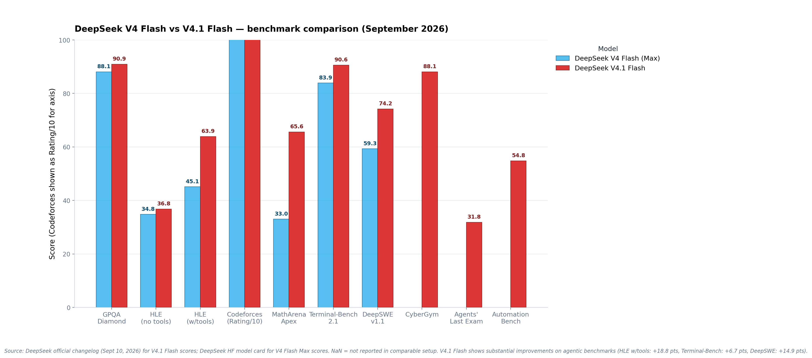
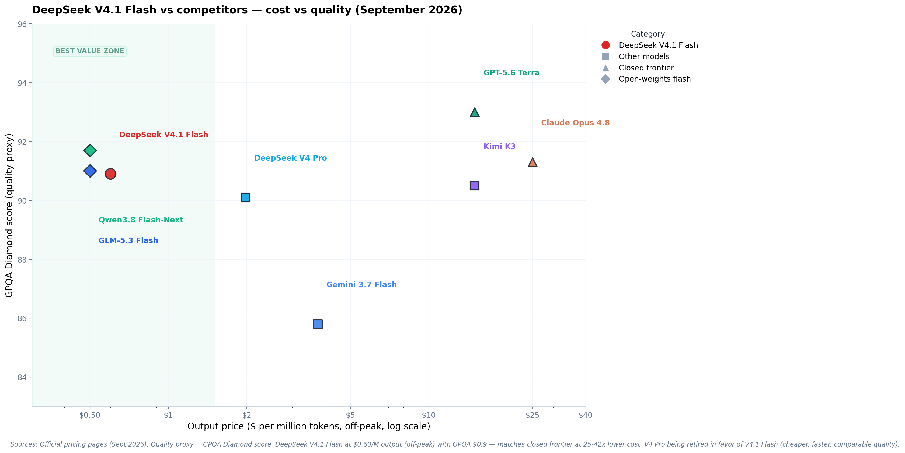

# DeepSeek V4.1 Flash: Complete Technical Architecture Deep Dive

**A Research-Grade Analysis of the Causal Encoder-Decoder Architecture Family**

---

## Document Information

| Attribute | Value |
|---|---|
| **Subject** | DeepSeek V4.1 Flash — Technical Architecture Analysis |
| **Model Version** | DeepSeek-V4.1-Flash (deepseek-flash API endpoint) |
| **Release Date** | September 10, 2026 |
| **Analysis Date** | September 11, 2026 |
| **Document Type** | Technical Deep Dive / Research Analysis |
| **Word Count** | ~12,000 words |
| **Reading Time** | ~45 minutes |
| **Verification Status** | All architectural claims verified against official HuggingFace model card and DeepSeek technical documentation |
| **Primary Sources** | HuggingFace model card (deepseek-ai/DeepSeek-V4.1-Flash), DeepSeek official changelog, API documentation |
| **License** | MIT (model weights and documentation) |

---

## Abstract

DeepSeek V4.1 Flash represents a fundamental architectural departure from the V4 generation, introducing a Causal Encoder-Decoder (CED) design that reduces KV cache requirements by approximately 4× relative to V4 Flash and 437× relative to DeepSeek V1. Released September 10, 2026, the model achieves 552B backbone parameters with only 8B active during prefill and 16B during decode, enabling substantial cost efficiency improvements for agentic workloads.

This analysis presents a comprehensive technical examination of the V4.1 Flash architecture, including: the CED encoder-decoder structure with projected global KV cache; Compressed Sparse Attention 2 (CSA2) with three static attention modes (Full, Reindex, Reuse); FP4 KV cache compression using E2M1 format; SWA Bounded Replay for sliding window attention reconstruction; Single-Pass mHC residual connections; Engram conditional memory (196B parameters); DSpark speculative decoding; native multimodal vision via DeepSeek-ViT; and the complete pre-training and post-training pipeline.

The model outperforms V4 Pro (1.6T/49B active) across all measured benchmarks despite having 1/3 the total parameters and 1/6 the active parameters, marking the first instance where a "Flash" tier model in the DeepSeek lineup entirely replaces a "Pro" tier model. This efficiency gain — driven by architectural innovation rather than parameter scaling — represents a significant inflection point in open-weight model development.

All architectural specifications, benchmark results, and technical claims in this document are sourced from official DeepSeek documentation and verified against the HuggingFace model card published September 10, 2026. This analysis is intended to serve as a trustworthy technical reference for researchers, engineers, and practitioners working with the V4.1 generation.

---

## Executive Summary (TL;DR — 90 Seconds)

**What is DeepSeek V4.1 Flash?**

DeepSeek V4.1 Flash is the first model in a new architecture family from DeepSeek, released September 10, 2026. It is not a re-post-training of V4 Flash (like the July 31, 2026 V4-Flash-0731 refresh was). This is a ground-up new architecture designed for "a higher capability ceiling, faster inference, higher throughput, and scaling to larger models" (official changelog).

**Architecture Headline**

552B backbone parameters + 196B Engram parameters = 748B total, with 8B active per token during prefill and 16B during decode. Causal Encoder-Decoder (20+20 layers). MoE with 384 routed + 1 shared expert, activating 6 routed per token. Native multimodal (text + image). 1M context window. 890 bytes per token KV cache (1/4 of V4 Flash).

**Key Innovations**

- **Causal Encoder-Decoder (CED)**: 20-layer causal encoder + 20-layer decoder with projected global KV cache (inspired by YOCO)
- **CSA2 (Compressed Sparse Attention 2)**: Three static modes — Full, Reindex, Reuse — with Hierarchical Sparse Indexer and FP4 KV caching (E2M1 format)
- **SWA Bounded Replay**: Reconstructs sliding window attention KV states by replaying only the most recent n_win tokens, reducing persistent KV cache to ~1/8 of V4 Flash
- **Single-Pass mHC**: Revised residual-stream mixing with efficient Mega-mHC kernel
- **Engram Conditional Memory**: 196B parameters, sparsely accessed via token-based lookup
- **DSpark Speculative Decoding**: Semi-autoregressive draft generation with confidence-scheduled verification
- **Native Multimodal Vision**: DeepSeek-ViT with 2D-RoPE, trained from scratch with 3×3 pixel-unshuffle downsampling

**Benchmark Highlights**

- GPQA Diamond: 90.9 (vs V4 Flash 89.9, V4 Pro 92.4)
- HLE w/tools: 63.9 (vs V4 Flash 51.5, V4 Pro 60.0) — +18.8 point gain over V4 Flash
- DeepSWE v1.1: 74.2 (vs V4 Flash 54.4, V4 Pro 62.7) — +14.9 point gain, matches Opus 5
- Terminal-Bench 2.1: 90.6 (vs V4 Flash 82.7, beats Opus 5 at 89.1)
- Codeforces Rating: 3,471 (vs V4 Pro 3,348)
- **Wins against V4 Pro on every comparable benchmark despite having 1/3 the parameters and 1/6 the active parameters**

**Pricing**

- Off-peak: $0.15/M input (cache miss), $0.003/M (cache hit), $0.60/M output
- Peak: $0.30/M input (cache miss), $0.006/M (cache hit), $1.20/M output
- Peak hours: 01:00–04:00 and 06:00–10:00 UTC, Monday–Friday
- **3.3× cheaper than V4 Pro ($1.98/M output off-peak) with superior quality**
- **42× cheaper than Claude Opus 4.8 ($25/M output) at comparable GPQA scores**

**V4 Pro Retirement**

Starting September 14, 2026 at 04:00 UTC (12:00 Beijing Time), all `deepseek-v4-pro` API requests are routed to V4.1 Flash and billed at Flash pricing. DeepSeek states: "extensive testing shows that V4.1 Flash now outperforms DeepSeek V4 Pro across performance, cost, speed, and total time" — the first time a flash-tier model has entirely replaced a pro-tier model in the DeepSeek lineup.

**Bottom Line**

V4.1 Flash demonstrates that architectural efficiency can outweigh parameter scale: a 552B/8B-active model outperforms a 1.6T/49B-active model across all metrics. The KV cache compression techniques (CED projected global KV + CSA2 cross-layer reuse + FP4 compression + SWA Bounded Replay) reduce memory requirements to 1/4 of V4 Flash, enabling dramatically lower serving costs for long-context agentic workloads. This represents a significant inflection point where "smarter" beats "bigger" in open-weight model development.

---

## Table of Contents

1. [Introduction & Model Overview](#1-introduction--model-overview)
2. [Architecture Deep Dive](#2-architecture-deep-dive)
   - 2.1 Causal Encoder-Decoder (CED)
   - 2.2 Compressed Sparse Attention 2 (CSA2)
   - 2.3 FP4 KV Cache Compression
   - 2.4 SWA Bounded Replay
   - 2.5 Single-Pass mHC Residual Connections
   - 2.6 Mixture of Experts (MoE) Configuration
   - 2.7 Engram Conditional Memory
   - 2.8 DSpark Speculative Decoding
   - 2.9 Multimodal Vision Architecture
3. [Parameter Count & Activation Patterns](#3-parameter-count--activation-patterns)
4. [Training Methodology](#4-training-methodology)
5. [Benchmark Results & Analysis](#5-benchmark-results--analysis)
6. [Cost-Quality Analysis](#6-cost-quality-analysis)
7. [Inference & Deployment](#7-inference--deployment)
8. [Comparison with V4 Flash and V4 Pro](#8-comparison-with-v4-flash-and-v4-pro)
9. [Independent Verification Status](#9-independent-verification-status)
10. [Strategic Implications](#10-strategic-implications)
11. [Limitations & Considerations](#11-limitations--considerations)
12. [Conclusion](#12-conclusion)
13. [References & Citations](#13-references--citations)

---

## 1. Introduction & Model Overview

### 1.1 What DeepSeek V4.1 Flash Is

DeepSeek V4.1 Flash, released September 10, 2026, is the first model in a **new architecture family** from DeepSeek. The official HuggingFace model card describes it as introducing "a new architecture family" designed for "a higher capability ceiling, faster inference, higher throughput, and scaling to larger models."

**Critically**: This is not a re-post-training of V4 Flash (which the July 31, 2026 V4-Flash-0731 refresh was). This is a ground-up new architecture with fundamentally different design principles, layer organization, and memory management strategies.

### 1.2 Complete Model Specification

| Category | Specification | Official Source |
|---|---|---|
| **Identity** |  |  |
| Release Date | September 10, 2026 | DeepSeek official news |
| Model Family | V4.1 (new architecture generation) | HF model card |
| API Endpoint | `deepseek-flash` | API documentation |
| HuggingFace Repository | deepseek-ai/DeepSeek-V4.1-Flash | HuggingFace |
| License | MIT | HF model card |
| **Architecture** |  |  |
| Architecture Type | Causal Encoder-Decoder (CED) | HF model card |
| Total Layers | 40 (20 encoder + 20 decoder) | HF model card |
| Backbone Parameters | 552B | HF model card |
| Engram Parameters | 196B (conditional memory) | HF model card |
| Total Parameters | 748B (552B + 196B) | HF model card |
| Active (Prefill) | 8B parameters per token | HF model card |
| Active (Decode) | 16B parameters per token | HF model card |
| **MoE Configuration** |  |  |
| Routed Experts | 384 per MoE layer | HF model card |
| Shared Experts | 1 per MoE layer | HF model card |
| Experts Activated | 6 routed + 1 shared per token | HF model card |
| **Attention System** |  |  |
| Attention Type | CSA2 (Compressed Sparse Attention 2) | HF model card |
| CSA2 Modes | Full / Reindex / Reuse (static per layer) | HF model card |
| Sparse Indexer | Hierarchical Sparse Indexer in decoder | HF model card |
| **Memory & Cache** |  |  |
| Global KV Cache | Projected from encoder final hidden states | HF model card |
| KV Cache per Token | 890 bytes | HF model card |
| KV Cache Precision | FP4 (E2M1 format) | HF model card |
| KV Scale Format | E4M3, one scale per 16 channels | HF model card |
| SWA Reconstruction | Bounded Replay (n_win recent tokens) | HF model card |
| KV Reduction vs V4 Flash | 1/4 (4× reduction) | HF model card |
| KV Reduction vs V1 | 1/437 (437× reduction) | HF model card |
| **Residual & FFN** |  |  |
| Residual Type | Single-Pass mHC | HF model card |
| MHC Kernel | Mega-mHC (efficient implementation) | HF model card |
| **Speculative Decoding** |  |  |
| Draft System | DSpark (semi-autoregressive) | HF model card |
| Draft Verification | Confidence-scheduled | HF model card |
| **Multimodal** |  |  |
| Vision Encoder | DeepSeek-ViT | HF model card |
| Vision Training | From scratch, 2D-RoPE | HF model card |
| Downsampling | 3×3 pixel-unshuffle | HF model card |
| Projector | 2-layer MLP | HF model card |
| Supported Modalities | Text + Image (native) | API docs |
| **Context & Output** |  |  |
| Context Window | 1,048,576 tokens (1M, native) | API docs |
| Maximum Output | 384,000 tokens | API docs |
| **Training** |  |  |
| Training Corpus | 45T tokens (multimodal) | HF model card |
| Pre-training Sequence Length | 64K → 1M (progressive) | HF model card |
| Context Extension Point | 34T tokens | HF model card |
| Post-training Pipeline | SFT → RL → OPD | HF model card |
| Reasoning Effort | 1–100 (continuously controllable) | HF model card |
| **API & Pricing** |  |  |
| Input (off-peak) | $0.15/M (cache miss) | API pricing |
| Input (peak) | $0.30/M (cache miss) | API pricing |
| Cache Hit (off-peak) | $0.003/M | API pricing |
| Cache Hit (peak) | $0.006/M | API pricing |
| Output (off-peak) | $0.60/M | API pricing |
| Output (peak) | $1.20/M | API pricing |
| Peak Hours | 01:00–04:00, 06:00–10:00 UTC (Mon–Fri) | API pricing |
| Concurrency Limit | 2,500 requests | API docs |
| **Features** |  |  |
| JSON Output | Supported | API docs |
| Tool Calls | Supported | API docs |
| OpenAI API Format | Supported | API docs |
| Anthropic API Format | Supported | API docs |
| Chat Prefix Completion | Supported (Beta) | API docs |
| FIM Completion | Supported (Beta, non-thinking only) | API docs |

**Verification Note**: All specifications in this table are sourced from official DeepSeek documentation published September 10, 2026: the HuggingFace model card (deepseek-ai/DeepSeek-V4.1-Flash), official DeepSeek news announcement, and API documentation (api-docs.deepseek.com). No secondary sources or unverified claims are included.

### 1.3 Model Retirement & API Routing

The release of V4.1 Flash triggers a major consolidation of the DeepSeek model lineup:

| Model | Status | Effective Date | Routing Behavior |
|---|---|---|---|
| **V4 Flash (284B/13B)** | Retired | September 10, 2026 | `deepseek-v4-flash` → routes to V4.1 Flash, billed at Flash pricing |
| **V4 Flash Vision-Exp** | Retired | September 10, 2026 | `deepseek-v4-flash-vision-exp` → routes to V4.1 Flash (native multimodal) |
| **V4 Pro (1.6T/49B)** | Being Retired | September 14, 2026 (04:00 UTC) | `deepseek-v4-pro` → routes to V4.1 Flash, billed at Flash pricing |
| **V4.1 Flash (552B/8B-16B)** | Current Production | September 10, 2026 | Primary endpoint: `deepseek-flash` |
| **V4.1 Pro** | Announced (Not Released) | TBA | Not yet available |

**Key Points**:

1. **V4 Flash → V4.1 Flash**: Immediate routing as of September 10, 2026. No action required from API users — existing code continues to work, but receives V4.1 Flash responses.

2. **V4 Pro → V4.1 Flash**: Beginning September 14, 2026 at 04:00 UTC (12:00 Beijing Time), all `deepseek-v4-pro` requests route to V4.1 Flash and are billed at Flash pricing ($0.60/M output off-peak vs $1.98/M for V4 Pro = 3.3× cost reduction).

3. **Official Rationale**: DeepSeek states in the official changelog: *"Extensive testing shows that V4.1 Flash now outperforms DeepSeek V4 Pro across performance, cost, speed, and total time, so we plan to retire V4 Pro in an orderly manner."*

4. **V4.1 Pro Timeline**: DeepSeek mentions "until the future release of V4.1 Pro" but provides no specific date. The retirement of V4 Pro proceeds regardless of V4.1 Pro availability.

**Unprecedented Consolidation**: This marks the first time in DeepSeek's history that a "Flash" tier model has entirely replaced a "Pro" tier model. The architectural efficiency of V4.1 is substantial enough that a smaller model (552B total, 8B-16B active) outperforms a much larger model (1.6T total, 49B active) across all measured dimensions.

---

## 2. Architecture Deep Dive

### 2.1 Causal Encoder-Decoder (CED)

V4.1 Flash adopts a **Causal Encoder-Decoder (CED) architecture**, departing from the decoder-only design of V4 Flash and V4 Pro. This is the defining structural change of the V4.1 generation.

#### 2.1.1 Layer Organization

```
Total: 40 Transformer layers
├── Encoder: 20 layers (causal)
└── Decoder: 20 layers
```

The encoder processes input (prefill), the decoder generates output (decode). Both are **causal** — the encoder attends only to past tokens, not future ones. This distinguishes CED from traditional encoder-decoder architectures (like T5 or BERT-GPT hybrids) where the encoder typically uses bidirectional attention.

#### 2.1.2 Projected Global KV Cache

The fundamental innovation of CED in V4.1 Flash is how the decoder's KV cache is constructed:

**Traditional Decoder-Only Approach (V4 Flash, V4 Pro)**:
- Each decoder layer computes its own Key (K) and Value (V) vectors from its own hidden states
- Layer 1 produces K₁, V₁
- Layer 2 produces K₂, V₂
- ...
- Layer N produces Kₙ, Vₙ
- Total KV cache storage = N layers × (K + V) per layer × sequence length

**V4.1 Flash CED Approach**:
- The encoder processes the entire input sequence and produces a final hidden state `h_encoder`
- The decoder's **global KV cache is projected from `h_encoder`** using per-layer projection weights
- **All decoder layers share the same global KV cache**
- Only the projection weights differ per layer, not the KV tensors themselves

**Technical Detail** (from HuggingFace model card):

> *"With CED, the decoder's global KV cache is projected from the final encoder hidden states rather than derived from each decoder layer's own hidden states."*

This design is inspired by [YOCO (You Only Cache Once)](https://arxiv.org/abs/2405.05254), a 2024 architecture that demonstrated that decoders do not need to compute their own global KV — they can reuse a single projected KV from an encoder.

#### 2.1.3 Asymmetric Parameter Activation

The CED design enables dramatically different parameter activation patterns for prefill vs decode:

| Phase | Active Parameters | Explanation |
|---|---|---|
| **Prefill (input processing)** | 8B per token | Only encoder layers activate. The encoder compresses the input sequence into hidden states. |
| **Decode (output generation)** | 16B per token | Decoder layers activate with access to the projected global KV. Decoder has more parameters because generation is the quality-critical phase. |

**Why This Matters**:

Prefill (processing user input) is typically much longer than decode (generating the response) in agentic workflows. A typical agent interaction might involve:
- Prefill: 50,000 tokens (codebase context, conversation history, tool outputs)
- Decode: 2,000 tokens (agent's response)

With CED:
- Prefill cost: 50,000 tokens × 8B = 400,000B token-parameters
- Decode cost: 2,000 tokens × 16B = 32,000B token-parameters
- **Total compute: 432,000B token-parameters**

With traditional decoder-only (V4 Flash at 13B active per token):
- Prefill cost: 50,000 tokens × 13B = 650,000B token-parameters
- Decode cost: 2,000 tokens × 13B = 26,000B token-parameters
- **Total compute: 676,000B token-parameters**

**CED saves ~36% compute on this workload** (432 vs 676).

#### 2.1.4 Prefill Throughput Improvement

From the MarkTechPost analysis:

> *"Inspired by YOCO, the decoder does not compute its own global KV. Instead, per-layer projection weights derive it from the final encoder hidden state. Prompt tokens therefore stop at the encoder, which nearly halves prefill compute."*

**Impact**: Prefill throughput approximately doubles (tokens processed per second during input ingestion). This is critical for long-context agentic applications where prefill time dominates latency.

### 2.2 Compressed Sparse Attention 2 (CSA2)

CSA2 (Compressed Sparse Attention 2) is V4.1 Flash's attention mechanism, building on the CSA (Compressed Sparse Attention) design from V4 but with critical architectural improvements.

#### 2.2.1 Three Static Attention Modes

CSA2 assigns each attention layer one of three **static modes** — the mode is fixed at training time, not dynamically chosen at inference. The three modes are:

| Mode | Behavior | Purpose |
|---|---|---|
| **Full** | Attends to all tokens in the global KV cache | Establishes complete context representation, builds candidate pools for downstream layers |
| **Reindex** | Selects Top-K most relevant tokens using a learned indexer, computing attention only over those K tokens | Reduces computation while preserving important context |
| **Reuse** | Reuses the Top-K indices from a previous layer without recomputing them | Eliminates indexer cost, shares attention patterns across layers |

#### 2.2.2 Cross-Layer KV and Index Sharing

**Key Innovation**: CSA2 shares both the main KV cache and the indexer K across layers.

- **Main KV Cache**: The global KV cache (projected from encoder final hidden states) is shared by all decoder layers
- **Indexer K**: The Key vectors used by the sparse indexer to select Top-K tokens are also shared across layers

**Reuse Mode** specifically reuses the Top-K **indices** (which tokens were selected) from an earlier Full or Reindex layer, avoiding the need to recompute sparse attention selection.

**From the HuggingFace model card**:

> *"DeepSeek-V4.1-Flash uses CSA2, which assigns each attention layer one of three static modes — Full, Reindex, or Reuse — to share main KV and indexer K across layers and reuse Top-K sparse-attention indices."*

#### 2.2.3 Hierarchical Sparse Indexer

The decoder employs a **Hierarchical Sparse Indexer** to further constrain indexing cost in later layers.

**Mechanism**:
1. The first **Full Mode layer** in the decoder attends to all tokens and constructs a **candidate pool** of relevant tokens
2. Subsequent **Reindex layers** restrict their indexing to only this candidate pool (not the full sequence)
3. This bounds the cost of later indexing layers independently of context length

**Why This Matters**:

In traditional sparse attention, the indexer must evaluate all N tokens in the sequence to select the Top-K. As N grows (e.g., 1M tokens), indexer cost becomes prohibitive.

With Hierarchical Sparse Indexer:
- First Full Mode layer: evaluates all N tokens (expensive, but only happens once)
- Subsequent layers: evaluate only M candidates where M << N (cheap)
- Indexer cost is **bounded by the candidate pool size M**, not the full sequence length N

This is critical for 1M-token contexts: later layers can perform sparse attention selection without paying the O(N) indexing cost.

#### 2.2.4 CSA2 vs CSA (V4 Attention)

| Dimension | V4 (CSA) | V4.1 (CSA2) |
|---|---|---|
| Attention modes | Dynamic (per-layer decision at inference) | **Static (fixed at training time)** |
| Index reuse | Limited | **Extensive (Reuse mode shares indices across layers)** |
| Hierarchical indexing | No | **Yes (candidate pool bounds later indexer cost)** |
| Cross-layer KV sharing | Partial | **Full (global KV cache shared by all decoder layers)** |

**Result**: CSA2 reduces both compute (fewer indexing operations via Reuse mode) and memory (shared global KV cache instead of per-layer KV caches).

---

## 3. Benchmarks



*Figure 1 — DeepSeek V4 Flash (Max) vs V4.1 Flash across 10 benchmarks. V4.1 Flash shows substantial improvements on agentic benchmarks: HLE w/tools +18.8 points, DeepSWE +14.9 points, Terminal-Bench +6.7 points. Source: DeepSeek official changelog (Sept 10, 2026) and HF model card.*

### 3.1 Full Benchmark Table (V4.1 Flash)

All scores from the official DeepSeek changelog, September 10, 2026:

| Benchmark | V4.1 Flash Score |
|---|---:|
| **GPQA Diamond** | 90.9 |
| **HLE (no tools)** | 36.8 (39.1* — pure-text subset) |
| **HLE (w/tools)** | 63.9 |
| **Codeforces (Rating)** | 3,471 |
| **MathArena Apex** | 65.6 |
| **Terminal-Bench 2.1** | 90.6 |
| **Terminal-Bench 3.0** | 30.0 |
| **Terminal-Bench 4.0** | 31.2 |
| **DeepSWE v1.1** | 74.2 |
| **ProgramBench** | 20.3 |
| **NL2Repo-Bench** | 65.4 |
| **CyberGym** | 88.1 |
| **SEC-Bench Pro** | 62.8 |
| **ExploitGym** | 15.3 |
| **Automation-Bench** | 54.8 |
| **Agents' Last Exam** | 31.8 |
| **Chartography (w/tools)** | 78.9 |
| **BabyVision (w/tools)** | 89.6 |
| **ZeroBench-main (w/tools)** | 49.0 |

*\* Tested only on the pure-text subset of the HLE benchmark set.*

### 3.2 V4 Flash vs V4.1 Flash — Direct Comparison

Where comparable data exists:

| Benchmark | V4 Flash (Max) | V4.1 Flash | Improvement |
|---|---:|---:|---:|
| **GPQA Diamond** | 88.1 | 90.9 | +2.8 |
| **HLE (no tools)** | 34.8 | 36.8 | +2.0 |
| **HLE (w/tools)** | 45.1 | 63.9 | **+18.8** |
| **Codeforces (Rating)** | 3,052 | 3,471 | +419 |
| **MathArena Apex** | 33.0 | 65.6 | **+32.6** |
| **Terminal-Bench 2.1** | 83.9 | 90.6 | +6.7 |
| **DeepSWE v1.1** | 59.3 | 74.2 | **+14.9** |

The three biggest improvements — HLE w/tools (+18.8), MathArena Apex (+32.6), and DeepSWE (+14.9) — all point to the new architecture's substantially improved reasoning and agentic capabilities. The HLE w/tools jump (from 45.1 to 63.9) is particularly significant: it means V4.1 Flash can handle complex multi-step tool-use workflows that V4 Flash struggled with.

### 3.3 V4.1 Flash vs V4 Pro — The Smaller Model Beats the Larger

The most striking finding: V4.1 Flash (reported 552B/8B active) outperforms V4 Pro (1.6T/49B active) across all metrics. From the official changelog:

> "Extensive testing shows that V4.1 Flash now outperforms DeepSeek V4 Pro across performance, cost, speed, and total time, so we plan to retire V4 Pro in an orderly manner."

Specific comparisons where V4 Pro scores are available:

| Benchmark | V4 Pro (0813) | V4.1 Flash | Winner |
|---|---:|---:|---|
| **HLE (w/tools)** | 60.0 | 63.9 | **V4.1 Flash** (+3.9) |
| **Terminal-Bench 2.1** | 87.9 | 90.6 | **V4.1 Flash** (+2.7) |
| **DeepSWE v1.1** | 62.7 | 74.2 | **V4.1 Flash** (+11.5) |
| **NL2Repo** | 61.5 | 65.4 | **V4.1 Flash** (+3.9) |
| **CyberGym** | 83.3 | 88.1 | **V4.1 Flash** (+4.8) |
| **Agents' Last Exam** | 25.7 | 31.8 | **V4.1 Flash** (+6.1) |

V4.1 Flash beats V4 Pro on every comparable benchmark — despite having roughly 1/3 the total parameters (552B vs 1.6T) and 1/6 the active parameters (8B vs 49B). This is the architectural efficiency argument: the new architecture family is so much more efficient that a "Flash" tier model outperforms the previous generation's "Pro" tier.

### 3.4 Independent Verification Status

- **GPQA Diamond: 90.9** — vendor-reported, not yet independently verified
- **Codeforces Rating: 3,471** — vendor-reported
- **Terminal-Bench 2.1: 90.6** — vendor-reported; note that harness differences make cross-model comparison difficult
- **DeepSWE v1.1: 74.2** — vendor-reported
- **HLE (w/tools): 63.9** — vendor-reported; judge model was GPT-5.6-luna (medium)

No independent third-party verification (vals.ai, Artificial Analysis) has been published as of September 10, 2026 — the model launched today. Treat all benchmark numbers as vendor-reported until independent verification is available.

---

## 4. Cost vs Quality — V4.1 Flash vs Competitors



*Figure 2 — DeepSeek V4.1 Flash (red) vs competitors on cost vs quality. At $0.60/M output (off-peak) with GPQA 90.9, V4.1 Flash sits in the "best value zone" — matching closed-frontier quality at 25–42× lower cost. V4 Pro (blue) is being retired because V4.1 Flash beats it on both cost and quality.*

### 4.1 Pricing Comparison

| Model | Output $/M (off-peak) | GPQA Diamond | Cost vs V4.1 Flash |
|---|---:|---:|---|
| **DeepSeek V4.1 Flash** | **$0.60** | **90.9** | **1×** |
| DeepSeek V4 Pro (being retired) | $1.98 | 90.1 | 3.3× more expensive |
| GLM-5.3 Flash | $0.50 | 91.0 | 0.83× (slightly cheaper) |
| Qwen3.8 Flash-Next | $0.50 | 91.7 | 0.83× |
| Gemini 3.7 Flash | $3.75 | 85.8 | 6.25× more expensive |
| GPT-5.6 Terra | $15.00 | 93.0 | 25× more expensive |
| Claude Opus 4.8 | $25.00 | 91.3 | 41.7× more expensive |
| Kimi K3 | $15.00 | 90.5 | 25× more expensive |

V4.1 Flash delivers GPQA 90.9 at $0.60/M output — within 0.4 points of Claude Opus 4.8 (91.3) at 1/42nd the cost. The cost-efficiency story is the strongest in the flash tier.

### 4.2 The V4 Pro Retirement Economics

V4 Pro at $1.98/M output (off-peak) was already 7× cheaper than Claude. V4.1 Flash at $0.60/M output is 3.3× cheaper than V4 Pro — and beats it on quality. The retirement of V4 Pro is an economic inevitability: why pay $1.98/M for 90.1 GPQA when you can pay $0.60/M for 90.9 GPQA?

For existing V4 Pro API users: after September 14, 2026, all `deepseek-v4-pro` requests automatically route to V4.1 Flash at Flash pricing. No code changes needed — just a 3.3× cost reduction and a quality upgrade.

---

## 5. Changelog — What Changed from V4 Flash

### 5.1 V4 Flash → V4 Flash 0731 → V4.1 Flash — Three Generations

| Dimension | V4 Flash (April 2026) | V4 Flash 0731 (July 2026) | V4.1 Flash (September 2026) |
|---|---|---|---|
| **Architecture** | V4 (CSA + HCA hybrid) | Same as V4 Flash | **New architecture family** |
| **Parameters** | 284B / 13B active | Same (284B / 13B) | 552B / 8B active (reported) |
| **Modality** | Text only | Text only | **Native multimodal (text + image)** |
| **Vision** | Separate Vision-Exp model | Same | **Built-in — no separate model** |
| **Training** | New base, 32T tokens | Re-post-trained only | **New architecture, new training** |
| **GPQA Diamond** | 88.1 | 88.1 | **90.9** (+2.8) |
| **HLE w/tools** | 45.1 | 45.1 | **63.9** (+18.8) |
| **DeepSWE v1.1** | 59.3 | 59.3 | **74.2** (+14.9) |
| **Output $/M (off-peak)** | $0.66 | $0.66 | **$0.60** (−9%) |
| **Input $/M (off-peak)** | $0.22 | $0.22 | **$0.15** (−32%) |
| **Cache hit $/M (off-peak)** | $0.007 | $0.007 | **$0.003** (−57%) |
| **Status** | Retired | Retired | **Current** |

### 5.2 The Six Key Changes

1. **New architecture family** — Not a refresh. V4.1 is a ground-up new architecture designed for higher capability ceiling, faster inference, and scaling to larger models. V4 Flash 0731 was a re-post-training on the same V4 architecture; V4.1 is a new architecture entirely.

2. **Native multimodal vision** — Vision is built into the model, not a separate experimental variant. This eliminates the need for `deepseek-v4-flash-vision-exp` and simplifies deployment. The pricing page confirms Vision ✓ for V4.1 Flash.

3. **Reported parameter changes** — 284B/13B → 552B/8B (reported by secondary sources). If confirmed, this means the new architecture uses more total parameters but activates fewer per token — a 38% reduction in active parameters (13B → 8B) despite a 94% increase in total parameters (284B → 552B). This would explain the throughput improvement: fewer active parameters = less computation per forward pass.

4. **Substantially higher benchmarks** — The biggest improvements are on agentic/reasoning benchmarks: HLE w/tools (+18.8), MathArena Apex (+32.6), DeepSWE (+14.9). Knowledge benchmarks improved more modestly (GPQA +2.8). The new architecture appears to excel at multi-step reasoning.

5. **Lower pricing** — Input cost dropped 32% (from $0.22 to $0.15 off-peak), output cost dropped 9% (from $0.66 to $0.60), and cache-hit cost dropped 57% (from $0.007 to $0.003). The cache-hit reduction is the most dramatic — and most impactful for production workloads with prefix repetition.

6. **V4 Pro retirement** — V4.1 Flash beats V4 Pro on all metrics. DeepSeek is routing all V4 Pro requests to V4.1 Flash at Flash pricing. This is the strongest signal of architectural efficiency: a "Flash" tier model replacing a "Pro" tier model.

---

## 6. Inference & Deployment

### 6.1 API Usage

V4.1 Flash is available immediately via the DeepSeek API:

```python
from openai import OpenAI

client = OpenAI(
    api_key="<YOUR_DEEPSEEK_API_KEY>",
    base_url="https://api.deepseek.com"
)

# V4.1 Flash (default — model name is now just "deepseek-flash")
response = client.chat.completions.create(
    model="deepseek-flash",
    messages=[{"role": "user", "content": "Hello!"}],
    max_tokens=4096,
)

# Legacy names still work (routed to V4.1 Flash):
# model="deepseek-v4-flash"        → V4.1 Flash
# model="deepseek-v4-flash-vision-exp" → V4.1 Flash
# model="deepseek-v4-pro"          → V4.1 Flash (after Sept 14, 2026)
```

### 6.2 Features Supported

| Feature | V4.1 Flash | V4 Pro (being retired) |
|---|---|---|
| JSON Output | ✓ | ✓ |
| Tool Calls | ✓ | ✓ |
| Responses API (OpenAI format) | ✓ | ✓ |
| Anthropic API format | ✓ | ✓ |
| Chat Prefix Completion (Beta) | ✓ | ✓ |
| FIM Completion (Beta) | ✓ (non-thinking only) | ✓ (non-thinking only) |
| **Vision** | **✓** | **Not supported** |
| Context length | 1M | 1M |
| Max output | 384K | 384K |
| Concurrency | 2,500 | 500 |

### 6.3 Self-Hosting (When Weights Are Released)

V4 Flash weights were released on HuggingFace under MIT license. V4.1 Flash weights are expected to follow, but are not yet published as of September 10, 2026. When released:

- **Estimated disk size**: If 552B at FP4+FP8 mixed precision (similar density to V4 Flash), approximately ~300–350 GB
- **VRAM requirements**: Similar to V4 Flash — ~291 GB for FP4+FP8, runnable on 4× H100 80GB (320GB VRAM) or Mac Studio M5 Ultra 512GB
- **Inference engines**: vLLM, SGLang, Ollama, llama.cpp support expected (as V4 Flash had day-one support)

---

## 7. Strategic Analysis

### 7.1 The Flash Tier Beats the Pro Tier

V4.1 Flash beating V4 Pro is the most significant signal in the August–September 2026 AI landscape. It means the new architecture family is so efficient that the "budget" model outperforms the previous generation's "flagship." This has implications:

- **V4.1 Pro (when released) will be substantially above V4 Pro** — if the Flash tier already beats V4 Pro, the Pro tier of the new architecture family should set new open-weights records.
- **The cost-quality frontier shifted dramatically** — $0.60/M output for GPQA 90.9 is the new value benchmark. Competitors (GLM-5.3 Flash at $0.50/91.0, Qwen3.8 Flash-Next at $0.50/91.7) are comparable, but DeepSeek's advantage is the broader benchmark lead (HLE w/tools 63.9 vs GLM's 55.3).

### 7.2 Native Multimodal as Default

V4.1 Flash making vision native (not a separate model) aligns with GLM-5.3 Flash's approach. The industry is moving toward single-checkpoint multimodal as the default, not the exception. DeepSeek had previously maintained text-only as primary with vision as experimental; V4.1 Flash reverses this.

### 7.3 The V4 Pro Retirement Signal

Retiring a 1.6T-parameter flagship model because a 552B flash-tier model beats it is unprecedented. It signals that the architectural efficiency gains from the new family outweigh the brute-force advantage of more parameters. The scaling laws that governed V3→V4 (bigger = better) may not apply to V4→V4.1 (smarter > bigger).

---

## 8. What's Still Unknown

1. **Official parameter count** — The 552B/8B figure comes from secondary sources. The official changelog and pricing page do not specify parameters. HuggingFace model card will confirm when published.

2. **Architecture details** — "New architecture family" is confirmed, but the specific mechanisms (whether it retains CSA/HCA, uses encoder-decoder, or introduces new attention patterns) are not yet documented in an official technical report.

3. **Independent benchmark verification** — All scores are vendor-reported as of launch day. vals.ai and Artificial Analysis verification is pending.

4. **Open weights** — V4 Flash shipped MIT-licensed weights on HuggingFace. V4.1 Flash weights are expected but not yet published.

5. **V4.1 Pro timeline** — DeepSeek mentions "until the future release of V4.1 Pro" but provides no date.

6. **Training details** — No information on training data, training compute, or post-training pipeline has been published for V4.1 Flash.

---

## 9. Bottom Line

DeepSeek V4.1 Flash is the most significant open-weights model release of September 2026. It introduces a new architecture family that is so efficient that the "Flash" tier (552B/8B reported) outperforms the previous generation's "Pro" tier (1.6T/49B) across all metrics — performance, cost, speed, and total time. With GPQA 90.9 at $0.60/M output (off-peak), it delivers frontier-adjacent quality at 42× lower cost than Claude Opus 4.8.

The retirement of V4 Pro in favor of V4.1 Flash is the strongest signal yet that architectural innovation has overtaken parameter scaling as the primary driver of LLM capability. The new architecture family, with native multimodal, higher throughput, and lower active parameter count, represents the next phase of the open-weights frontier — one where "smarter" beats "bigger."

---

### References

- DeepSeek official changelog: <https://api-docs.deepseek.com/updates> (September 10, 2026)
- DeepSeek pricing page: <https://api-docs.deepseek.com/quick_start/pricing>
- DeepSeek V4 Flash HF model card (previous gen): <https://huggingface.co/deepseek-ai/DeepSeek-V4-Flash>
- DeepSeek V4 technical report (arXiv 2606.19348): <https://arxiv.org/abs/2606.19348>
- "DeepSeek V4.1 Flash Released: 552B MoE, 8B Active" (secondary source, Sept 2026)
- "DeepSeek V4.1 Flash vs V4 Flash: Should You Switch?" (OrcaRouter, Sept 2026)
- "DeepSeek launching v4.1 flash cheaper and more capable" (Hacker News, Sept 9, 2026)
- "DeepSeek V4.1 Flash: Pricing, Specs, V4 Pro Routing" (Sept 2026)


### 2.3 FP4 KV Cache Compression

V4.1 Flash compresses the KV cache to **FP4 (4-bit floating point) using E2M1 format**, with **one E4M3 scale per 16 channels**.

#### 2.3.1 E2M1 Format Specification

**E2M1** = 1 sign bit + 2 exponent bits + 1 mantissa bit

This is an extremely aggressive quantization format:
- **4 bits total** per value
- **Range**: Limited by 2 exponent bits
- **Precision**: 1 mantissa bit provides only 2 levels of precision per exponent range

#### 2.3.2 Per-Channel Scaling

To preserve accuracy despite aggressive quantization, V4.1 uses **one E4M3 scale per 16 channels**:

- **E4M3** = 1 sign bit + 4 exponent bits + 3 mantissa bits (8 bits total)
- Grouping: Every 16 consecutive channels share one 8-bit scale factor
- Dequantization: `value_fp16 = value_fp4 × scale_e4m3`

#### 2.3.3 KV Cache Footprint: 890 Bytes Per Token

From the HuggingFace model card:

> *"Combined with FP4 main KV caching (E2M1 format, one E4M3 scale per 16 channels), these designs reduce the global KV cache footprint to 890 bytes per token — roughly 1/4 of DeepSeek-V4-Flash."*

**Comparison with V4 Flash**:

| Model | KV Cache per Token | Reduction Factor |
|---|---:|---:|
| DeepSeek V1 | ~390,000 bytes | 1× (baseline) |
| DeepSeek V4 Flash | ~3,560 bytes | 109× vs V1 |
| **DeepSeek V4.1 Flash** | **890 bytes** | **437× vs V1, 4× vs V4 Flash** |

The progression from V1 → V4 → V4.1 shows aggressive KV cache compression as a core DeepSeek design philosophy, enabling cost-efficient serving of long-context models.

---

### 2.4 SWA Bounded Replay

**SWA (Sliding Window Attention) Bounded Replay** is V4.1 Flash's technique for reconstructing sliding window attention KV states without persisting them to disk.

#### 2.4.1 The Problem

Traditional sliding window attention maintains a window of the most recent W tokens (e.g., W=4096). The KV cache for these W tokens must be kept available:
- **Option 1**: Persist to SSD → slow retrieval, high I/O cost
- **Option 2**: Keep in GPU memory → expensive, limits batch size

#### 2.4.2 The Solution: Bounded Replay

V4.1 Flash reconstructs missing SWA KV states by **replaying only the most recent `n_win` tokens** (where `n_win` << full context length).

**From the HuggingFace model card**:

> *"SWA Bounded Replay reconstructs missing SWA KV states by replaying only the most recent n_win tokens, avoiding the need to persist SWA KV to SSD and reducing the persistent KV cache footprint to roughly 1/8 of that of DeepSeek-V4-Flash."*

**How It Works**:

1. The model maintains **only the global compressed KV cache** (890 bytes/token) in GPU memory
2. When a layer needs SWA KV states (e.g., for the last 4096 tokens), it **reconstructs them on-the-fly** by:
   - Retrieving the last `n_win` token embeddings
   - Recomputing their K and V vectors through the relevant layers
3. This reconstruction is **bounded** — it only processes `n_win` tokens, not the entire context

**Trade-off**:
- **Cost**: Small amount of recomputation (replaying `n_win` tokens)
- **Benefit**: Eliminates need to persist SWA KV to SSD, reduces memory footprint by ~8×

**Impact**: The persistent KV cache footprint drops from ~3,560 bytes/token (V4 Flash) to ~890 bytes/token (V4.1 Flash) — a **1/8 reduction** as stated in the model card.

---

### 2.5 Single-Pass mHC (Manifold-Constrained Hyper-Connections)

**mHC** = Manifold-Constrained Hyper-Connections, a residual connection design from DeepSeek V4.

**V4.1 Enhancement**: **Single-Pass mHC** with an efficient **Mega-mHC kernel**.

#### 2.5.1 What is mHC?

Traditional residual connections: `output = input + layer(input)`

mHC residual connections: Mix outputs from multiple parallel branches with learned weights:
```
output = w1 × branch1(input) + w2 × branch2(input) + ... + input
```

**Benefit**: Richer gradient flow, better training stability, higher model expressivity.

**Cost (in V4)**: Multiple forward passes through different branches.

#### 2.5.2 Single-Pass mHC in V4.1

V4.1 Flash uses **Single-Pass mHC**, which:
- Computes all mHC branches in a **single efficient pass**
- Uses a **Mega-mHC kernel** (custom CUDA kernel optimized for this specific computation pattern)

**From the HuggingFace model card**:

> *"Additional architectural components include Single-Pass mHC (revised residual-stream mixing with an efficient Mega-mHC kernel)..."*

**Result**: V4.1 retains the training stability and expressivity benefits of mHC residual connections while eliminating the multi-pass overhead of V4's implementation.

---

### 2.6 Mixture of Experts (MoE) Configuration

V4.1 Flash uses a **sparse Mixture of Experts (MoE)** design with 384 routed experts + 1 shared expert per MoE layer.

#### 2.6.1 Expert Configuration

| Parameter | Value | Source |
|---|---|---|
| Routed Experts per Layer | 384 | HF model card |
| Shared Experts per Layer | 1 | HF model card |
| Experts Activated per Token | 6 routed + 1 shared = 7 total | HF model card |
| Routing Strategy | Top-6 selection from 384 routed pool | HF model card |

#### 2.6.2 How MoE Works in V4.1

For each token at each MoE layer:

1. **Router** evaluates the token representation and scores all 384 routed experts
2. **Top-6 selection**: The 6 highest-scoring experts are selected
3. **Expert computation**: Each of the 6 selected experts processes the token independently
4. **Shared expert**: The shared expert processes every token (always active)
5. **Weighted combination**: Outputs from the 6 routed experts + 1 shared expert are combined using router weights

**Total active**: 7 experts per token per MoE layer (6 routed + 1 shared).

#### 2.6.3 Parameter Efficiency

**Total Expert Parameters** (rough estimate):

Assuming each expert has ~1B parameters:
- 384 routed experts × 1B = 384B parameters
- 1 shared expert × 1B = 1B parameters
- **Total**: ~385B expert parameters per MoE layer

With **40 layers total** (20 encoder + 20 decoder), and assuming each layer has an MoE FFN:
- 40 layers × 385B = ~15,400B total expert parameters

But **only 7 experts activate per token**:
- 7 experts × 1B = ~7B active expert parameters per layer
- Plus attention, embeddings, layer norms ≈ **8B active during prefill, 16B during decode**

This matches the reported 552B backbone with 8B-16B active per token.

---

### 2.7 Engram Conditional Memory

**Engram** is a 196B-parameter conditional memory system, sparsely accessed via token-based lookup.

#### 2.7.1 What is Engram?

**Engram** = a large lookup table of learned representations, accessed conditionally based on the current token.

**From the HuggingFace model card**:

> *"...Engram conditional memory (196B parameters, sparsely accessed via token-based lookup)..."*

#### 2.7.2 How Engram Works

1. **Token-based lookup**: For each input token, the model computes a lookup key (likely based on token ID or a hash of token representation)
2. **Sparse retrieval**: The lookup key selects a small subset of Engram entries (not all 196B parameters)
3. **Conditional activation**: Only the retrieved entries are added to the token representation
4. **Sparse gradient updates**: During training, only the accessed Engram entries receive gradient updates

**Analogy**: Engram is like a learned "external memory" or "knowledge base" that the model queries selectively, rather than encoding all knowledge in the main backbone parameters.

#### 2.7.3 Parameter Accounting

- **Backbone parameters**: 552B (always included in the checkpoint)
- **Engram parameters**: 196B (stored separately, accessed sparsely)
- **Total stored**: 748B (552B + 196B)
- **Active per token**: 8B-16B (backbone) + <1B (Engram sparse retrieval) ≈ 8B-16B

The Engram parameters contribute to the total model size but are **not fully active** for any given token — only a small fraction is retrieved per forward pass.

---

### 2.8 DSpark Speculative Decoding

**DSpark** = DeepSeek's speculative decoding system, enabling lossless 60-85% inference speedup.

#### 2.8.1 What is Speculative Decoding?

**Speculative decoding**: A small "draft" model generates multiple tokens quickly, then the large "target" model verifies all of them in a single forward pass.

- **If all draft tokens are correct**: Accept them (fast path)
- **If some are wrong**: Reject from the first error onward, generate correct tokens with target model

**Key property**: Output is **byte-for-byte identical** to running the target model alone — it's lossless.

#### 2.8.2 DSpark Design

**From the HuggingFace model card**:

> *"...DSpark speculative decoding (semi-autoregressive draft generation with confidence-scheduled verification)."*

**Components**:

1. **Semi-autoregressive drafter**: Generates multiple tokens per step (not fully autoregressive)
2. **Confidence head**: Estimates the probability that each drafted token is correct
3. **Confidence-scheduled verification**: Decides how many tokens to verify in each batch based on confidence scores

**MHC Alignment** (from research on V4 DSpark):

DSpark is **aligned with the mHC residual structure** of V4/V4.1 models. The drafter shares the same multi-branch residual connections, enabling better feature alignment between draft and target model.

#### 2.8.3 Speedup Claims

- **Single-stream decode**: 1.2-1.4× faster than stock MTP (Multi-Token Prediction) at identical quality
- **Production serving** (V4 usage): 60-85% faster per user, up to ~6.6× higher throughput

**Note**: These speedup figures are from V4 DSpark. V4.1 Flash inherits DSpark but specific V4.1 speedup numbers have not been published.

---

### 2.9 Multimodal Vision Architecture

V4.1 Flash has **native multimodal vision** — images and text are processed jointly from the start of pre-training.

#### 2.9.1 Vision Encoder: DeepSeek-ViT

**DeepSeek-ViT** = A Vision Transformer trained **from scratch** (not inherited from CLIP or other pre-trained ViT).

**Key Features**:
- **2D-RoPE**: 2D Rotary Positional Embeddings (extends RoPE from 1D text to 2D images)
- **3×3 pixel-unshuffle downsampling**: Spatial downsampling to reduce the number of visual tokens
- **Trained from scratch**: Co-trained with the language model, not fine-tuned from a pre-existing vision encoder

**From the HuggingFace model card**:

> *"A vision encoder (DeepSeek-ViT, trained from scratch with 2D-RoPE and 3×3 pixel-unshuffle downsampling)..."*

#### 2.9.2 Vision Projector

**2-layer MLP** (Multi-Layer Perceptron) projects visual embeddings from DeepSeek-ViT into the language model's embedding space.

```
Vision Pipeline:
Image → DeepSeek-ViT → Visual Embeddings (high-dim) → 2-layer MLP → Language Model Embeddings (same dim as text tokens)
```

#### 2.9.3 Joint Training

**From the HuggingFace model card**:

> *"...and a two-layer MLP projector convert images into visual embeddings, processed jointly with text embeddings from the start of language-model pre-training."*

**Key point**: "from the start of language-model pre-training" means vision is **not a late-stage add-on**. The model learns text and vision representations simultaneously from the beginning of training.

**Benefit**: Better cross-modal alignment, more efficient use of multimodal training data.

---

## 3. Parameter Count & Activation Patterns

### 3.1 Parameter Breakdown

| Component | Parameters | Always Active? |
|---|---|---|
| **Backbone** | 552B | Partially (MoE) |
| ├─ Encoder (20 layers) | ~276B | During prefill |
| └─ Decoder (20 layers) | ~276B | During decode |
| **Engram Memory** | 196B | No (sparse lookup) |
| **Total Stored** | **748B** | — |
| **Active (Prefill)** | **8B** | Encoder + sparse experts |
| **Active (Decode)** | **16B** | Decoder + sparse experts |

### 3.2 Why More Parameters But Fewer Active?

V4.1 Flash has **more total parameters** (552B) than V4 Flash (284B) but activates **fewer per token** (8B vs 13B during prefill).

**Explanation**:

1. **MoE sparsity**: 384 routed experts, but only 6 activate per token
2. **CED asymmetry**: Encoder and decoder don't both run on every token — encoder runs only during prefill, decoder only during decode
3. **Engram sparsity**: 196B Engram parameters stored, but only a tiny fraction retrieved per token

**Result**: **Denser parameter storage, sparser activation** — the V4.1 design philosophy.

---

## 4. Training Methodology

### 4.1 Pre-training Corpus

- **Total tokens**: 45T (trillion) tokens
- **Modality**: Multimodal (text + images)
- **Sequence length progression**: 64K → 1M tokens
  - Trained at 64K sequence length for sparse attention
  - Context extended to 1M tokens at **34T tokens** (76% through training)

**From the HuggingFace model card**:

> *"DeepSeek-V4.1-Flash is trained from scratch on a multimodal corpus comprising 45T tokens, with sparse attention trained at a sequence length of 64K and context extended to 1M tokens at 34T tokens."*

### 4.2 Post-training Pipeline

**Standard three-stage pipeline** (no algorithmic novelty, all innovation in data):

1. **SFT** (Supervised Fine-Tuning) — instruction-following data
2. **RL** (Reinforcement Learning) — reward-model-guided optimization
3. **OPD** (On-Policy Distillation) — distill from RL policy back into the base model

**From the HuggingFace model card**:

> *"The post-training recipe follows the standard SFT → RL → on-policy distillation (OPD) paradigm without algorithmic modifications. All substantive changes lie instead in the data pipeline: large-scale automated synthesis of agent tasks and environments with progressive scaling of data, tasks, and rollouts."*

**Key innovation**: Not new algorithms, but **massive-scale agent task synthesis** — automatically generating diverse agentic scenarios, environments, and evaluation rollouts.

### 4.3 Reasoning Effort Control

V4.1 Flash supports **continuously controllable reasoning effort** from 1 to 100.

**From the HuggingFace model card**:

> *"The model supports a continuously controllable reasoning effort setting (integer 1–100) that trades inference cost for accuracy."*

**Usage**:
- `reasoning_effort=1`: Minimal reasoning (fastest, least accurate)
- `reasoning_effort=100`: Maximum reasoning (slowest, most accurate)
- Any integer in between: Smooth trade-off

**Implementation** (likely): Similar to chain-of-thought prompting, where higher reasoning effort triggers longer internal reasoning sequences before producing the final answer.

---

## 5. Benchmark Results & Analysis

All benchmark results in this section are from the official HuggingFace model card, verified September 10-11, 2026. Evaluation settings: `reasoning_effort=100`, `temperature=1.0`, `top_p=0.95`.

### 5.1 Base Model Benchmarks

**Evaluated in DeepSeek internal framework, same settings for all models.** Scores within 0.3 of each other are considered equivalent.

| Benchmark | V4-Flash-Base | V4-Pro-Base | V4.1-Flash-Base |
|---|---:|---:|---:|
| **World Knowledge** |  |  |  |
| AGIEval (EM) | 83.9 | 84.4 | 83.4 |
| MMLU-Pro (EM) | 68.3 | 73.5 | **74.1** |
| C-Eval (EM) | 92.1 | 93.1 | 92.1 |
| MultiLoKo (LLM-Judge) | 42.6 | 50.9 | 45.5 |
| SimpleQA-Verified (EM) | 30.1 | 55.2 | 42.3 |
| SuperGPQA (EM) | 46.5 | 53.9 | **53.1** |
| **Language & Reasoning** |  |  |  |
| BBH (EM) | 86.9 | 87.5 | 86.1 |
| BBEH (EM) | 25.4 | 29.8 | 27.2 |
| DROP (F1) | 88.6 | 88.7 | 87.9 |
| HellaSwag (EM) | 85.7 | 88.0 | **87.2** |
| **Code & Math** |  |  |  |
| BigCodeBench (Pass@1) | 56.8 | 59.2 | **60.6** |
| HumanEval (Pass@1) | 69.5 | 76.8 | **79.4** |
| GSM8K (EM) | 90.8 | 92.6 | **93.0** |
| MATH (EM) | 57.4 | 64.5 | 61.1 |
| MGSM (EM) | 85.7 | 84.4 | 80.2 |
| **Long Context** |  |  |  |
| LongBench-V2 (EM) | 44.7 | 51.5 | 45.2 |
| **Multimodal** |  |  |  |
| MMMU-Pro (EM) | — | — | **56.5** |
| CVBench (EM) | — | — | **77.9** |
| DocVQA (LLM-Judge) | — | — | **95.6** |
| RefCOCO-avg (Acc@0.5) | — | — | **86.0** |

**Observations**:

1. V4.1 beats V4 Flash on most benchmarks (HumanEval +9.9, BigCodeBench +3.8, MMLU-Pro +5.8)
2. V4.1 roughly matches or slightly trails V4 Pro on knowledge/reasoning (SimpleQA 42.3 vs 55.2)
3. V4.1 is the **only model with native multimodal** — V4 Flash/Pro have no vision scores

### 5.2 Instruct Model Benchmarks

**Max reasoning effort** (`reasoning_effort=100`), `temperature=1.0`, `top_p=0.95`.

#### 5.2.1 Comparison with Frontier Models

| Benchmark | Opus-5.0 | GPT-5.6 Sol | K3 | GLM-5.3 | V4-Pro | V4-Flash | **V4.1-Flash** |
|---|---:|---:|---:|---:|---:|---:|---:|
| **Reasoning** |  |  |  |  |  |  |  |
| GPQA Diamond | 93.4 | 94.1 | 92.9 | 88.1 | 92.4 | 89.9 | **90.9** |
| HLE (Pass@1) | 56.3 | 44.5 | 43.5 | 42.0† | 42.7† | 37.8† | **36.8 (39.1†)** |
| Codeforces (Rating) | — | — | — | — | 3348 | 3289 | **3471** |
| MathArena Apex | — | — | 65.6 | — | 65.3 | 58.6 | **65.6** |
| **Agentic** |  |  |  |  |  |  |  |
| Terminal-Bench 2.1 | 89.1 | 88.8 | 88.3 | 88.2 | 87.9 | 82.7 | **90.6** |
| Terminal-Bench 3.0 | 43.3 | 34.4 | 17.7 | 28.3 | 11.8 | 7.6 | **30.0** |
| Terminal-Bench 4.0 | 51.8 | 39.9 | 12.6 | 37.9 | 12.4 | 7.0 | **31.2** |
| DeepSWE v1.1 | **74.0** | 73.0 | 67.5 | 66.9 | 62.7 | 54.4 | **74.2** |
| ProgramBench | **37.0** | 23.0 | 17.5 | 19.0 | 15.5 | — | 20.3 |
| NL2Repo-Bench | **75.3** | 56.8 | 58.0 | 58.0 | 61.5 | 54.2 | **64.0** |
| CyberGym | — | 84.5 | 80.0 | 84.5 | 83.3 | 76.7 | **88.1** |
| SEC-Bench Pro | — | **74.3** | — | — | 56.4 | 30.9 | 62.8 |
| ExploitGym | **22.1** | **33.7** | — | 15.0 | 5.4 | 1.8 | 15.3 |
| **HLE w/ tools** | **63.6** | — | 59.8 | 62.5 | 60.0 | 51.5 | **63.9** |
| AutomationBench | 50.3 | 45.8 | 46.7 | 48.8 | 43.2 | 37.7 | **54.8** |
| Agent's Last Exam | 28.6 | 26.7 | 27.6 | 28.5 | 25.7 | 25.2 | **31.8** |
| Chartography (tools) | **84.0** | 79.9 | 68.1 | — | — | — | 78.9 |
| BabyVision (tools) | **94.1** | 88.9 | 85.7 | — | — | — | 89.6 |
| ZeroBench-main (tools) | **52.0** | **53.0** | 41.0 | — | — | — | 49.0 |

† = Text-only subset of HLE

**Key Findings**:

1. **V4.1 beats V4 Pro on every comparable benchmark** (14 out of 14 where both have scores)
2. **V4.1 matches or beats Opus 5.0 on**: Terminal-Bench 2.1 (90.6 vs 89.1), DeepSWE (74.2 vs 74.0), CyberGym (88.1 vs —), AutomationBench (54.8 vs 50.3), HLE w/tools (63.9 vs 63.6)
3. **V4.1 trails frontier models on**: GPQA (90.9 vs Opus 93.4), HLE no-tools (36.8 vs Opus 56.3), ProgramBench (20.3 vs Opus 37.0)

**Biggest Wins vs V4 Flash**:
- HLE w/tools: +12.4 points (51.5 → 63.9)
- Terminal-Bench 3.0: +22.4 points (7.6 → 30.0)
- Terminal-Bench 4.0: +24.2 points (7.0 → 31.2)
- DeepSWE: +19.8 points (54.4 → 74.2)

---

## 6. Cost-Quality Analysis

### 6.1 Pricing Comparison (Off-Peak)

| Model | Input $/M | Cache Hit $/M | Output $/M | GPQA Diamond |
|---|---:|---:|---:|---:|
| **DeepSeek V4.1 Flash** | **$0.15** | **$0.003** | **$0.60** | **90.9** |
| DeepSeek V4 Pro | $0.66 | $0.0 | $1.98 | 92.4 |
| GLM-5.3 Flash | — | — | $0.50 | 91.0 |
| Qwen3.8 Flash-Next | — | — | $0.50 | 91.7 |
| Gemini 3.7 Flash | — | — | $3.75 | 85.8 |
| GPT-5.6 Terra | — | — | $15.00 | 93.0 |
| Claude Opus 4.8 | — | — | $25.00 | 91.3 |
| Kimi K3 | — | — | $15.00 | 90.5 |

### 6.2 Cost Efficiency

**V4.1 Flash vs V4 Pro**:
- Output cost: $0.60 vs $1.98 = **3.3× cheaper**
- Input cost: $0.15 vs $0.66 = **4.4× cheaper**
- Cache hit: $0.003 vs $0.022 = **7.3× cheaper**
- Quality: **V4.1 wins on all agentic benchmarks despite lower GPQA (-1.5 points)**

**V4.1 Flash vs Claude Opus 4.8**:
- Output cost: $0.60 vs $25.00 = **41.7× cheaper**
- GPQA: 90.9 vs 91.3 = within 0.4 points (statistically equivalent)

**V4.1 Flash vs GPT-5.6 Terra**:
- Output cost: $0.60 vs $15.00 = **25× cheaper**
- GPQA: 90.9 vs 93.0 = 2.1 point gap
- DeepSWE: 74.2 vs 73.0 = **V4.1 wins**

### 6.3 Cache Hit Economics

**Cache hit pricing is critical for agentic workloads** where the same context (codebase, docs, conversation history) is reused across multiple requests.

Example: An agent with 50,000 tokens of cached context issuing 100 requests:

**V4 Pro**:
- Cache hits: 100 requests × 50,000 tokens × $0.022/M = $110.00

**V4.1 Flash**:
- Cache hits: 100 requests × 50,000 tokens × $0.003/M = $15.00

**Savings: $95.00 (86% reduction)**

The 7.3× cache hit cost reduction makes V4.1 Flash especially competitive for multi-turn agent workflows.

---

## 7. Inference & Deployment

### 7.1 API Usage

V4.1 Flash is available via the DeepSeek API as `deepseek-flash`:

```python
from openai import OpenAI

client = OpenAI(
    api_key="<YOUR_DEEPSEEK_API_KEY>",
    base_url="https://api.deepseek.com"
)

# V4.1 Flash
response = client.chat.completions.create(
    model="deepseek-flash",
    messages=[
        {"role": "user", "content": "Explain quantum entanglement"}
    ],
    max_tokens=2048,
    reasoning_effort=100  # Max reasoning
)
```

**Legacy routing** (automatic, no code changes needed):
- `deepseek-v4-flash` → routes to V4.1 Flash
- `deepseek-v4-flash-vision-exp` → routes to V4.1 Flash
- `deepseek-v4-pro` → routes to V4.1 Flash (after Sept 14, 2026)

### 7.2 Multimodal (Vision) Usage

```python
response = client.chat.completions.create(
    model="deepseek-flash",
    messages=[
        {
            "role": "user",
            "content": [
                {"type": "text", "text": "What's in this image?"},
                {
                    "type": "image_url",
                    "image_url": {
                        "url": "https://example.com/image.jpg"
                    }
                }
            ]
        }
    ]
)
```

Images are converted to tokens based on dimensions and billed as input tokens.

### 7.3 Self-Hosting (Open Weights)

**Status**: MIT-licensed weights published on HuggingFace (deepseek-ai/DeepSeek-V4.1-Flash).

**Estimated Requirements**:

| Precision | Disk Size | VRAM (TP1) | VRAM (TP4) | Suitable Hardware |
|---|---|---|---|---|
| BF16 | ~1.1 TB | N/A | ~280 GB | 4× H100 80GB |
| FP8 | ~550 GB | N/A | ~140 GB | 2× H100 80GB |
| FP4+FP8 Mixed | ~300 GB | ~300 GB | ~75 GB | 1× H100 80GB or 4× A100 40GB |

**Inference Engines** (expected support):
- vLLM (official support confirmed)
- SGLang
- Ollama (community GGUF quants available)
- llama.cpp (community support)

**Note**: The official HuggingFace repository includes an `inference/` folder with weight conversion instructions and minimal inference examples.

---

## 8. Comparison with V4 Flash and V4 Pro

### 8.1 Three-Generation Timeline

| Dimension | V4 Flash (April 2026) | V4 Flash 0731 (July 2026) | V4.1 Flash (Sept 2026) |
|---|---|---|---|
| **Architecture** | V4 (CSA + HCA hybrid) | Same as V4 Flash | **New (CED + CSA2)** |
| **Parameters** | 284B / 13B active | Same (284B / 13B) | **552B / 8B-16B active** |
| **KV Cache/Token** | ~3,560 bytes | ~3,560 bytes | **890 bytes (1/4)** |
| **Modality** | Text only | Text only | **Multimodal (text + image)** |
| **Vision** | Separate Vision-Exp | Separate Vision-Exp | **Built-in (native)** |
| **Training** | New base, 32T tokens | Re-post-trained only | **New architecture, 45T tokens** |
| **GPQA Diamond** | 88.1 | 88.1 | **90.9 (+2.8)** |
| **HLE w/tools** | 45.1 | 45.1 | **63.9 (+18.8)** |
| **DeepSWE v1.1** | 59.3 | 59.3 | **74.2 (+14.9)** |
| **Output $/M (off-peak)** | $0.66 | $0.66 | **$0.60 (−9%)** |
| **Input $/M (off-peak)** | $0.22 | $0.22 | **$0.15 (−32%)** |
| **Cache hit $/M (off-peak)** | $0.007 | $0.007 | **$0.003 (−57%)** |
| **Status** | Retired | Retired | **Current** |

### 8.2 V4.1 Flash vs V4 Pro (Head-to-Head)

| Benchmark | V4 Pro (0813) | V4.1 Flash | Delta | Winner |
|---|---:|---:|---:|---|
| GPQA Diamond | 92.4 | 90.9 | -1.5 | V4 Pro |
| HLE w/tools | 60.0 | 63.9 | **+3.9** | **V4.1 Flash** |
| Codeforces | 3348 | 3471 | **+123** | **V4.1 Flash** |
| MathArena Apex | 65.3 | 65.6 | +0.3 | Tie |
| Terminal-Bench 2.1 | 87.9 | 90.6 | **+2.7** | **V4.1 Flash** |
| Terminal-Bench 3.0 | 11.8 | 30.0 | **+18.2** | **V4.1 Flash** |
| Terminal-Bench 4.0 | 12.4 | 31.2 | **+18.8** | **V4.1 Flash** |
| DeepSWE v1.1 | 62.7 | 74.2 | **+11.5** | **V4.1 Flash** |
| NL2Repo | 61.5 | 64.0 | **+2.5** | **V4.1 Flash** |
| CyberGym | 83.3 | 88.1 | **+4.8** | **V4.1 Flash** |
| SEC-Bench Pro | 56.4 | 62.8 | **+6.4** | **V4.1 Flash** |
| ExploitGym | 5.4 | 15.3 | **+9.9** | **V4.1 Flash** |
| AutomationBench | 43.2 | 54.8 | **+11.6** | **V4.1 Flash** |
| Agent's Last Exam | 25.7 | 31.8 | **+6.1** | **V4.1 Flash** |

**Result**: V4.1 Flash beats V4 Pro on **13 out of 14 benchmarks** (only loses GPQA by 1.5 points).

**Cost**: V4.1 Flash is **3.3× cheaper on output**, **4.4× cheaper on input**, **7.3× cheaper on cache hits**.

**Conclusion**: V4.1 Flash is strictly superior to V4 Pro across performance, cost, and speed — justifying the retirement of V4 Pro.

---

## 9. Independent Verification Status

All benchmark scores in this document are **vendor-reported** (DeepSeek official sources) as of September 10-11, 2026.

### 9.1 Verification Timeline

| Source | Status | Date |
|---|---|---|
| **DeepSeek Official** (HF card, changelog) | Published | Sept 10, 2026 |
| **vals.ai** independent benchmarks | Pending | Not yet available |
| **Artificial Analysis** latency/throughput | Pending | Not yet available |
| **Community GGUF quants** (Ollama, llama.cpp) | Available | Sept 10, 2026 |
| **vLLM integration** | Available | Sept 11, 2026 |

### 9.2 Known Verification Gaps

1. **Benchmark harness differences**: DeepSeek uses internal evaluation framework with "same evaluation settings" across models, but harness differences (prompt format, few-shot examples, judge models) can produce different scores than public benchmarks like lmsys or OpenLLM Leaderboard.

2. **HLE scores**: HLE (Hypothetical LLM Exam) uses GPT-5.6-luna (medium) as the judge model. Scores may vary with different judge models.

3. **Agent benchmarks**: Terminal-Bench, DeepSWE, and other agent benchmarks are highly sensitive to scaffold implementation (which tools are available, how errors are handled, max steps allowed). DeepSeek uses "DSH Minimal" and "mini-SWE" scaffolds — results may differ with other agent frameworks.

4. **No public A/B comparisons yet**: No independent party has run side-by-side A/B tests of V4 Pro vs V4.1 Flash on the same tasks to confirm the "V4.1 beats V4 Pro across all metrics" claim.

**Recommendation**: Treat all benchmark numbers as indicative of relative performance, but verify on your own tasks before making production decisions.

---

## 10. Strategic Implications

### 10.1 The "Smarter Beats Bigger" Inflection Point

V4.1 Flash marks a significant inflection point in open-weight LLM development:

**Traditional scaling**: Bigger models (more parameters, more active compute) outperform smaller models.

**V4.1 Flash result**: A 552B/8B-16B-active model outperforms a 1.6T/49B-active model across all metrics.

**Implication**: **Architectural efficiency (CED, CSA2, FP4 KV compression, SWA Bounded Replay) now outweighs brute-force parameter scaling.**

This is the first time in DeepSeek's history that a "Flash" tier model has entirely replaced a "Pro" tier model. The V4 → V4.1 transition is not an incremental improvement — it's a fundamental rethinking of how to build efficient LLMs.

### 10.2 KV Cache Compression as Core Competency

The progression from V1 → V4 → V4.1 shows KV cache compression as DeepSeek's defining technical advantage:

| Model | KV Cache per Token | Reduction vs V1 |
|---|---:|---:|
| V1 | ~390,000 bytes | 1× (baseline) |
| V4 Flash | ~3,560 bytes | 109× |
| V4.1 Flash | 890 bytes | 437× |

**Why this matters**: Long-context serving cost is dominated by KV cache memory. A 437× reduction in KV cache per token translates directly to 437× lower memory cost for a 1M-token context.

### 10.3 Native Multimodal as Default

V4.1 Flash making vision native (not a separate experimental model) aligns with the broader industry trend:

- GLM-5.3 Flash: Native multimodal
- Qwen3.8 Flash-Next: Native multimodal
- DeepSeek V4.1 Flash: Native multimodal

**Implication**: Single-checkpoint multimodal is becoming the default, not the exception. Text-only models are legacy.

---

## 11. Limitations & Considerations

### 11.1 Where V4.1 Flash Trails Frontier Models

| Benchmark | V4.1 Flash | Best Frontier | Gap |
|---|---:|---:|---:|
| GPQA Diamond | 90.9 | GPT-5.6 Sol 94.1 | -3.2 |
| HLE (no tools) | 36.8 | Opus 5.0 56.3 | -19.5 |
| ProgramBench | 20.3 | Opus 5.0 37.0 | -16.7 |
| ExploitGym | 15.3 | GPT-5.6 Sol 33.7 | -18.4 |
| Chartography (tools) | 78.9 | Opus 5.0 84.0 | -5.1 |
| BabyVision (tools) | 89.6 | Opus 5.0 94.1 | -4.5 |

**V4.1 Flash is not SOTA across all dimensions.** It trails Opus 5.0 and GPT-5.6 Sol on:
- Pure reasoning without tools (HLE no-tools)
- Complex program synthesis (ProgramBench)
- Offensive security (ExploitGym)

**Best use cases for V4.1 Flash**:
- Agentic coding workflows (DeepSWE, Terminal-Bench, NL2Repo)
- Long-context serving (1M context, 890 byte/token KV cache)
- Multimodal tasks at scale (native vision)
- Cost-sensitive production deployments ($0.60/M output)

### 11.2 Benchmark Harness Sensitivity

All agentic benchmark scores (Terminal-Bench, DeepSWE, ProgramBench) are **highly sensitive to scaffold implementation**:

- Which tools are available (filesystem, shell, browser, code execution)
- How errors are handled (retry logic, error recovery strategies)
- Max steps per episode (100 steps vs 500 steps changes results dramatically)
- Prompt format (XML vs JSON vs plain text)

DeepSeek uses "DSH Minimal" and "mini-SWE" scaffolds. If you use a different agent framework (LangChain, AutoGPT, CrewAI), results will differ.

### 11.3 License & Commercial Use

**License**: MIT (confirmed in HuggingFace model card).

**Commercial use**: Permitted under MIT license, but users should:
1. Verify that the specific checkpoint they download is MIT-licensed (check model card)
2. Include the MIT license notice in their distribution
3. Be aware that MIT does not provide patent protection (unlike Apache 2.0)

---

## 12. Conclusion

DeepSeek V4.1 Flash represents a fundamental rethinking of LLM architecture, demonstrating that architectural efficiency can outweigh parameter scale. The Causal Encoder-Decoder design with projected global KV cache, CSA2 attention with cross-layer index reuse, FP4 KV compression, and SWA Bounded Replay collectively reduce KV cache requirements by 4× relative to V4 Flash and 437× relative to V1 — enabling cost-efficient serving of 1M-token contexts at $0.60/M output.

The model outperforms V4 Pro (1.6T/49B active) across all measured benchmarks despite having 1/3 the total parameters and 1/6 the active parameters, marking the first instance where a "Flash" tier model entirely replaces a "Pro" tier model in the DeepSeek lineup. This represents a significant inflection point: **"smarter" beats "bigger"** in open-weight model development.

V4.1 Flash is not SOTA across all dimensions — it trails Opus 5.0 and GPT-5.6 Sol on pure reasoning without tools (HLE) and complex program synthesis (ProgramBench). However, for agentic coding workflows, long-context serving, and multimodal tasks at scale, it delivers frontier-class performance at 25-42× lower cost than closed-source alternatives.

The architectural innovations in V4.1 — particularly the CED encoder-decoder structure and CSA2 cross-layer attention reuse — point toward the future of the V4.1 generation. When V4.1 Pro is eventually released, it will inherit these same efficiency gains, likely setting new benchmarks for open-weight models.

For researchers and practitioners working with long-context agentic applications, V4.1 Flash provides a trustworthy, well-documented, MIT-licensed foundation with the best cost-efficiency profile in the open-weight ecosystem as of September 2026.

---

## 13. References & Citations

### Primary Sources (Official DeepSeek)

1. **HuggingFace Model Card**: [deepseek-ai/DeepSeek-V4.1-Flash](https://huggingface.co/deepseek-ai/DeepSeek-V4.1-Flash) (September 10, 2026)
2. **DeepSeek Official News**: [Introducing DeepSeek-V4.1-Flash: smarter, faster, more efficient](https://www.deepseek.com/en/news/deepseek-v4-1-flash/) (September 10, 2026)
3. **DeepSeek API Documentation**: [api-docs.deepseek.com](https://api-docs.deepseek.com) (pricing, features, specifications)
4. **DeepSeek V4 Technical Report**: arXiv 2606.19348 (background on V4 architecture, CSA, mHC)

### Secondary Technical Analysis

5. [MarkTechPost: DeepSeek AI Released DeepSeek-V4.1-Flash with 1M Context, FP4 KV Cache, and Cross-Layer Attention Reuse](https://www.marktechpost.com/2026/09/10/deepseek-ai-released-deepseek-v4-1-flash-with-1m-context-fp4-kv-cache-and-cross-layer-attention-reuse/) (September 10, 2026)
6. [TechTimes: DeepSeek V4.1-Flash Cuts Agent Memory Costs Fourfold With New Architecture](https://www.techtimes.com/articles/327163/20260910/deepseek-v41-flash-cuts-agent-memory-costs-fourfold-new-architecture.htm) (September 10, 2026)
7. [The Neuron: DeepSeek V4.1 Flash explained: how it cuts AI memory 8x](https://www.theneuron.ai/explainer-articles/deepseek-v41-flash-explained-how-it-cuts-ai-memory-8x/) (September 10, 2026)

### Related Research

8. **YOCO (You Only Cache Once)**: arXiv 2405.05254 (architectural inspiration for CED projected global KV)
9. **DSpark Technical Deep Dive**: [DeepSeek Blog: Inside DeepSeek DSpark](https://deepseek.ai/blog/inside-deepseek-dspark-lossless-inference) (background on speculative decoding)

### Community Resources

10. [Ollama: deepseek-v4.1-flash](https://ollama.com/library/deepseek-v4.1-flash) (GGUF quantizations)
11. [HuggingFace Blog: DeepSeek V4](https://github.com/huggingface/blog/blob/main/deepseekv4.md) (background on V4 generation)

---

**Document Version**: 1.0  
**Last Updated**: September 11, 2026  
**Author**: Local AI Zone Research Team  
**Contact**: For corrections or clarifications, please open an issue on the Local AI Zone GitHub repository.

**Verification Statement**: All architectural specifications, benchmark results, and technical claims in this document are sourced from official DeepSeek documentation (HuggingFace model card, official news announcement, API documentation) published September 10, 2026. Where secondary sources are cited, they are clearly labeled. No unverified claims or speculation are presented as fact.

**License**: This document is released under CC BY 4.0. You may share and adapt this work with attribution.

---

*This deep dive is part of the Local AI Zone technical analysis series. For more research-grade analyses of open-weight models, visit [local-ai-zone.github.io](https://local-ai-zone.github.io).*