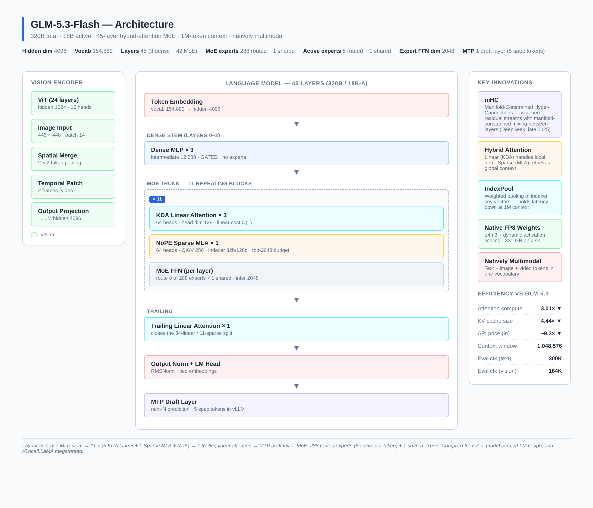
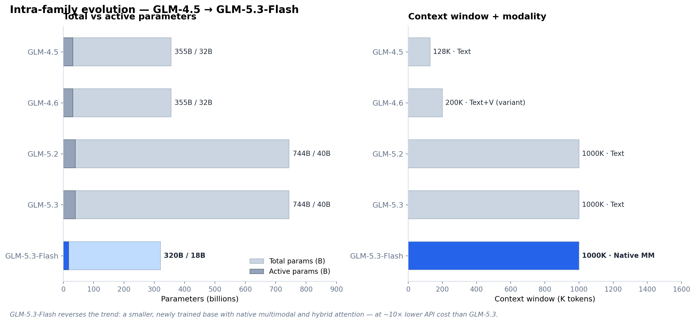
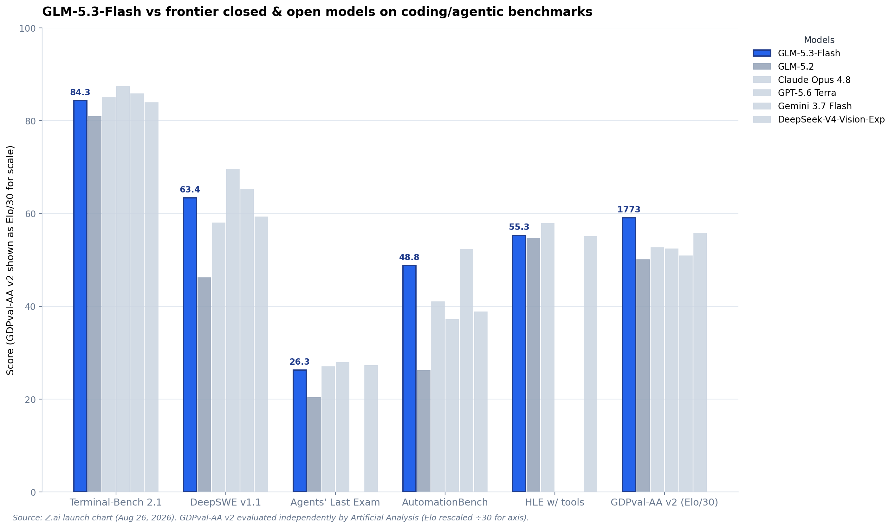
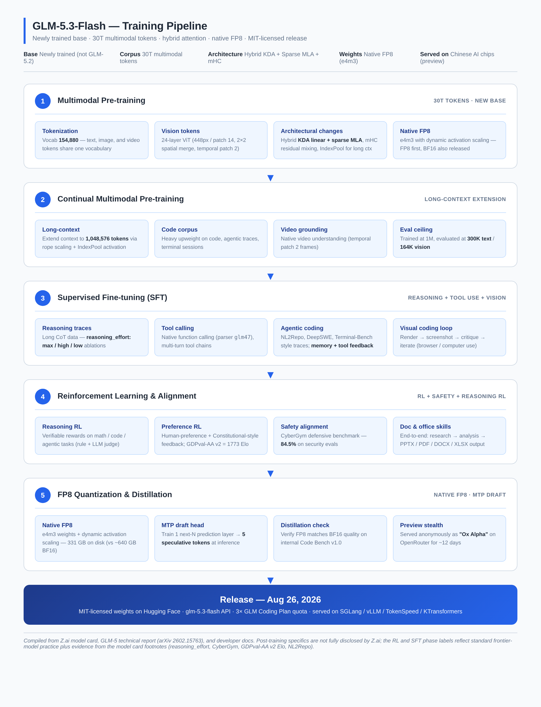

# GLM-5.3-Flash: A Technical Deep Dive into Z.ai's 320B-A18B Hybrid-Attention MoE

> **TL;DR** — Z.ai quietly shipped GLM-5.3-Flash on **August 26, 2026**. It is a 320B-parameter mixture-of-experts model that activates only 18B per token, runs natively in FP8, supports a 1,048,576-token context window, and is the first natively multimodal model in the GLM-5 series. For the twelve days before launch it had been running anonymously on OpenRouter as the mystery model **"Ox Alpha."** It beats GLM-5.2 across six coding/agentic benchmarks at roughly one-tenth of the price, and approaches Claude Opus 4.8 on long-horizon agent tasks. Weights ship under MIT on Hugging Face, the API is `$0.15/$0.50` per million tokens, and the vLLM recipe is already public. This post breaks down the architecture, the changelog vs. GLM-4.6 / GLM-5.2 / GLM-5.3, the full benchmark sheet, the training pipeline, the inference story, and the developer-facing API surface.

---

## 1. What GLM-5.3-Flash Actually Is

The name invites a wrong assumption. In most model families, the `Flash` suffix means a distilled or trimmed version of the flagship — same brain, fewer parameters, lower quality. GLM-5.3-Flash is not that. Z.ai is explicit on the model card: it "starts from a newly trained base model, with its architecture and training recipe redesigned around capability and efficiency." In other words, this is a different model trained from a different checkpoint on a different corpus — not a post-train of GLM-5.2's 744B base.

The strategic context is worth pausing on. GLM-5.3 (the full flagship) launched on August 14, 2026, with the open-weight release of its 744B parameters promised "in about two weeks." What arrived instead, twelve days later, was GLM-5.3-Flash: a smaller model built on a new base, with the flagship's 744B weights still unreleased. Z.ai's Hugging Face organisation currently has no GLM-5.3 repository at all. Whatever the reason for that delay, the Flash model is what developers actually have access to today.

There is also an interesting reveal layered on top of the launch. For about a week, a mystery model called **"Ox Alpha"** had been quietly topping usage charts on OpenRouter and OpenCode, offering near-unlimited free access, and torching benchmarks along the way. Patrick Collison called it "very impressive." Developers speculated wildly on r/LocalLLaMA and r/singularity. On August 26, Bloomberg and Business Insider confirmed Z.ai as the creator, and Z.ai's own announcement described the model as "previously previewed as Ox Alpha." Zixuan Li, credited on the GLM-5 technical report, went further: *"Ox Alpha was an early version of GLM-5.3-Flash,"* with the shipped release delivering "stronger performance and significantly better stability." Ox Alpha has since been removed from OpenRouter's live catalogue.

One additional detail from the announcement deserves care. Z.ai states the Ox Alpha preview was "running entirely on Chinese AI chips," which describes how the preview was served. It is not the same claim as saying the model was trained on them, and Z.ai has not said that about this model. The distinction matters because Z.ai did train GLM-5 end-to-end on Huawei Ascend silicon, and the two facts blur together easily. Rumors on r/LocalLLaMA point to Hygon DCU hardware for the preview serving, but this is unconfirmed.

### 1.1 The Spec Sheet at a Glance

| Spec | GLM-5.3-Flash |
|---|---|
| **Released** | August 26, 2026 |
| **Codename** | Ox Alpha (preview on OpenRouter/OpenCode) |
| **Total parameters** | 320B |
| **Active parameters per token** | 18B (≈5.6% of network per forward pass) |
| **Architecture** | Causal LM + Vision Encoder (`Glm5NextForConditionalGeneration`) |
| **License** | MIT (open weights on Hugging Face) |
| **Hidden dimension** | 4,096 |
| **Vocabulary** | 154,880 (text + image + video tokens share one vocab) |
| **Layers** | 45 (3 dense MLP stem + 42 MoE) |
| **Attention** | Hybrid: 34× KDA linear + 11× NoPE sparse MLA |
| **MoE** | 288 routed + 1 shared experts; 8 routed + 1 shared activated per token |
| **Context window** | 1,048,576 tokens (`max_position_embeddings`) |
| **Evaluated context** | 300K text / 164K vision |
| **Modality** | Native multimodal — text + image + video |
| **Vision encoder** | 24-layer ViT, 448px input, patch 14, 2×2 spatial merge, temporal patch 2 |
| **MTP** | 1 next-N draft layer (5 spec tokens in vLLM recipe) |
| **Native weights** | FP8 (e4m3, dynamic activation scaling) — 331 GB |
| **BF16 variant** | ~640 GB |
| **Reasoning** | Always-on thinking; three effort levels (max / high / low) |
| **Training corpus** | 30T tokens (multimodal) |
| **API model code** | `glm-5.3-flash` |
| **API price (input)** | $0.15 per million tokens (cached: $0.03) |
| **API price (output)** | $0.50 per million tokens |

Sources: [Z.ai model card](https://huggingface.co/zai-org/GLM-5.3-Flash), [vLLM recipe](https://recipes.vllm.ai/zai-org/GLM-5.3-Flash), [Z.ai developer docs](https://docs.z.ai/guides/vlm/glm-5.3-flash), and the [r/LocalLLaMA megathread](https://www.reddit.com/r/LocalLLaMA/comments/1vyzzxu/megathread_glm53flash_former_oxalpha).

---

## 2. Architecture

GLM-5.3-Flash is the first model in the GLM series to ship a **hybrid attention** stack — combining linear attention (for local, cheap recurrence) with sparse attention (for global retrieval). It is also the first open-weight release of the `glm5_next` architecture, the first to adopt **Manifold-Constrained Hyper-Connections (mHC)**, and the first to ship **native FP8 weights** as the primary checkpoint rather than a post-hoc quantization.



*Figure 1 — The 45-layer stack: 3 dense MLP stem → 11 repeating blocks of (3× KDA Linear + 1× Sparse MLA + MoE) → 1 trailing linear attention → MTP draft layer. Vision tokens enter via a 24-layer ViT and project into the LM's hidden dimension.*

### 2.1 The 45-Layer Stack

The language model has 45 layers in total. The first three are **dense MLP stem layers** with an intermediate dimension of 12,288 — no expert routing, just a single GATED FFN per layer. After the stem, the remaining 42 layers are MoE. The exact layout, as documented in the vLLM recipe and confirmed by the Reddit megathread's reading of the config, is:

```
11 × {
  3 × ( KDA Linear Attention  →  MoE FFN )
  1 × ( NoPE Sparse MLA        →  MoE FFN )
}
+ 1 trailing KDA Linear Attention layer
```

That gives 33 + 1 = **34 KDA linear attention layers** and **11 sparse MLA layers** out of 45 total. The MoE FFN itself is uniform: every one of those 42 layers routes each token through **8 of 288 experts** plus **1 shared expert**, with each expert having an intermediate dimension of 2,048.

### 2.2 KDA Linear Attention

The 34 KDA (Key-Driven Attention) linear-attention layers are where most of the long-context efficiency comes from. Each layer has **64 heads with head dimension 128** and computes attention in linear time O(L) rather than the quadratic O(L²) of standard softmax attention. The trade-off is well-known: linear attention degrades retrieval quality on long contexts because the recurrent state compresses history into a fixed-size buffer.

Z.ai's design choice is to use linear attention for the bulk of local dependency modeling — the kind of token-to-token flow that does not need precise long-range lookups — and reserve sparse attention for the harder retrieval work. This is exactly the design philosophy that Jamba, Mamba-2, and Zamba explored in 2024, but executed at frontier scale (320B / 18B-A) and combined with DeepSeek-style MLA rather than pure SSM.

### 2.3 NoPE Sparse MLA (DeepSeek-style)

The 11 sparse layers use **DeepSeek-style Multi-head Latent Attention (MLA)** without positional embeddings (NoPE). Each layer has:

- **64 attention heads**
- **QK head dimension**: 256
- **V head dimension**: 256
- **Lightning indexer**: 32 heads, head dim 128
- **Top-k budget**: 2,048 tokens

The lightning indexer is the key piece. It performs a fast approximate retrieval pass to find the top-2,048 most relevant key-value pairs from the full context, then runs the expensive full attention only over those 2,048 tokens. At a 1M-token context, this is what makes attention tractable — instead of attending over a million positions, each sparse layer attends over 2,048 chosen ones.

### 2.4 IndexPool

A 1M-token context still has a problem: the indexer itself needs to maintain key vectors for a million positions, and even computing the indexer similarity matrix becomes a bottleneck. Z.ai introduces **IndexPool** to compress groups of indexer key vectors through weighted pooling, holding down latency and memory at extreme context lengths. This is the kind of engineering detail that does not show up in benchmark scores but is the difference between "1M context in the config" and "1M context that actually serves at usable latency."

### 2.5 Manifold-Constrained Hyper-Connections (mHC)

mHC is a residual-stream architecture technique **published by a DeepSeek research team in late 2025**. The core idea: widen the residual stream — give each layer access to a richer mix of information from earlier layers — but constrain the mixing so that very wide connectivity does not destabilize training. The constraint lives on a low-dimensional manifold rather than in the full residual space, which is what makes the math tractable.

A Zhipu model shipping on a rival Chinese lab's published method is a small but real illustration of how fast open research circulates between Chinese labs. DeepSeek publishes → Zhipu ships → the open-source community gets the implementation. Expect mHC to become standard in 2027 frontier releases.

### 2.6 Mixture-of-Experts Configuration

| Setting | Value |
|---|---|
| Routed experts per layer | 288 |
| Shared experts per layer | 1 |
| Active routed experts per token | 8 |
| Active shared experts per token | 1 |
| Expert intermediate dimension | 2,048 |
| Dense intermediate dimension (layers 0–2) | 12,288 |
| Routing strategy | Top-K softmax with load balancing |

The 8-of-288 routing gives a sparsity ratio of about **2.78%** of expert weights active per token. Combined with the 1 shared expert (always on), the effective compute per forward pass is closer to a 22B-parameter dense model — which is roughly where the 18B-A figure lands after accounting for the attention and embedding overhead.

### 2.7 Vision Encoder

The vision encoder is a **24-layer ViT** with hidden size 1,024 and 16 attention heads. Input images are resized to **448 × 448** with patch size 14, giving a 32 × 32 = 1,024 patch grid. A **2×2 spatial merge** halves each dimension, producing 256 visual tokens per image. For video, a **temporal patch of 2 frames** is applied — two consecutive frames are merged into one token sequence, which is what enables native video understanding rather than frame-by-frame processing.

The vision tokens are projected into the LM's hidden dimension (4,096) and injected directly into the token stream. There is no separate vision-language adapter — text and vision tokens share the same vocabulary slot and the same transformer trunk. This is the "natively multimodal" claim made concrete: there is no `vision_encoder → projection → LM` boundary that needs special handling, no modality tokens that bypass the main stack.

### 2.8 MTP Draft Layer

The last piece of the architecture is a **single Multi-Token Prediction (MTP) draft layer**. MTP is a speculative-decoding technique where a small draft head predicts the next N tokens in one shot, and the main model verifies them in parallel. The vLLM recipe uses **5 speculative tokens** by default — meaning for every decode step, the draft head proposes 5 tokens, the main model checks them, and accepted tokens are emitted as a batch.

This is similar to EAGLE-2 and Medusa but shipped in the official weights, so it works out of the box without a separate draft model. The throughput win at small batch sizes can be 2–3×; at large batch sizes the gain diminishes because the main model is already compute-bound.

### 2.9 Native FP8 Weights

The default checkpoint on Hugging Face is **FP8 (e4m3 with dynamic activation scaling)** — 62 shards, ~331 GB on disk. A separate BF16 repo exists at 120 shards / ~640 GB. This is one of the first frontier-scale models to ship FP8 as the primary checkpoint rather than as a post-training quantization, which means the model was likely trained with FP8-aware techniques (QAT or similar) and the FP8 numbers on benchmarks are the "real" numbers, not a degraded quantized version. Z.ai has not explicitly stated whether benchmarks were run on FP8 or BF16, but the model card and recipe both treat FP8 as the default.

---

## 3. Changelog — What Changed From Previous Versions



*Figure 2 — GLM-5.3-Flash reverses the trend: a smaller, newly trained base with native multimodal and hybrid attention — at roughly 10× lower API cost than GLM-5.3.*

### 3.1 GLM-4.5 → GLM-4.6 (the incremental generation)

GLM-4.5 shipped in 2025 as a **355B / 32B-A MoE** with a 128K-token context, text-only. GLM-4.6 (October 2025) used the **same 355B / 32B base** but extended context to 200K and shipped a separate `GLM-4.6V` vision variant (106B and 9B-Flash) using an encoder-decoder architecture. No architectural changes to the language trunk. Pure capability and context-window gains.

### 3.2 GLM-4.6 → GLM-5.2 (the architecture jump)

GLM-5.2 was the first GLM-5 release. It moved to a **744B / 40B-A** MoE and a 1M-token context window, with sparse (but not hybrid) attention. Open weights, MIT license. This was the model that established GLM-5's architecture baseline — sparse attention, no linear-attention hybridization, no native multimodality (text-only in the main LM).

### 3.3 GLM-5.2 → GLM-5.3 (post-training only)

GLM-5.3 launched August 14, 2026 with the **same 744B / 40B base** as GLM-5.2 — no new pretrain. All gains came from post-training. The headline was a **50% improvement on Z.ai Code Bench** vs GLM-5.2, plus emergent cyber capabilities (CyberGym defensive benchmark at 84.5%). Weights were not released at launch; Z.ai promised them "in about two weeks."

### 3.4 GLM-5.3 → GLM-5.3-Flash (the architectural pivot)

This is the interesting one. Rather than release GLM-5.3's 744B weights, Z.ai shipped a completely different model:

| Spec | GLM-5.3 | GLM-5.3-Flash |
|---|---|---|
| Base model | GLM-5.2's 744B, reused | Newly trained, 30T multimodal tokens |
| Total params | 744B | 320B |
| Active params | 40B | 18B |
| Modality | Text only | Natively multimodal (text + image + video) |
| Attention | Sparse | Hybrid sparse + linear (KDA + NoPE sparse MLA) |
| Residual stream | Standard | Manifold-Constrained Hyper-Connections (mHC) |
| Context | 1M tokens | 1M tokens |
| Open weights | Not released | MIT, on Hugging Face |
| Input price | $1.40/M tokens | $0.15/M tokens |
| Output price | $4.40/M tokens | $0.50/M tokens |

Three changes are worth flagging individually:

1. **Hybrid attention** — first time in the GLM series. The published config makes the split visible: 34 KDA linear layers + 11 sparse MLA layers. Z.ai's documentation puts numbers on the win: **3.01× less attention compute** and **4.44× smaller KV cache** vs GLM-5.3. On a 1M-token context, the KV cache is usually what makes long sessions expensive to serve, so the second figure is what shows up on the invoice.

2. **New base, not post-train** — GLM-5.3 took its entire gain from post-training on the same 744B base as its predecessor, with no new pretrain at all. GLM-5.3-Flash reverses that. The two models sit on opposite sides of a design split: one is a bigger brain taught new habits; the other is a smaller brain built differently from the ground up.

3. **Native FP8 weights** — the default checkpoint is FP8 (e4m3, dynamic activation scaling), 331 GB on disk. A separate BF16 repo exists at ~640 GB. The "Flash" in the name refers less to the parameter count (it is still a 320B model) and more to the serving economics this enables.

The naming is genuinely confusing because GLM-4.5 → 4.6 established a "Full > Air > Flash" hierarchy where Flash meant a smaller, cheaper, lower-quality tier. GLM-5.3-Flash breaks that hierarchy — it is not a trimmed version of GLM-5.3 but a parallel model with different design choices. Several r/LocalLLaMA commenters flagged this. For practical purposes, treat GLM-5.3 and GLM-5.3-Flash as two different models that happen to share a version number.

---

## 4. Benchmarks



*Figure 3 — Cross-model benchmark comparison. GLM-5.3-Flash (blue) leads on AutomationBench and GDPval-AA v2; trails GPT-5.6 Terra on Terminal-Bench, DeepSWE, and Agents' Last Exam. Every score is from Z.ai's own launch chart except GDPval-AA v2 (Artificial Analysis, independent).*

### 4.1 Z.ai-Reported Benchmarks

The full benchmark table from Z.ai's launch chart, with all comparison models:

| Benchmark | GLM-5.3-Flash | GLM-5.2 | Claude Opus 4.8 | GPT-5.6 Terra | Gemini 3.7 Flash | DeepSeek-V4-Vision-Exp |
|---|---:|---:|---:|---:|---:|---:|
| **Terminal-Bench 2.1** | 84.3 | 81.0 | 85.0 | 87.4 | 85.8 | 83.9 |
| **DeepSWE v1.1** | 63.4 | 46.2 | 58.0 | 69.6 | 65.3 | 59.3 |
| **Agents' Last Exam** | 26.3 | 20.4 | 27.0 | 28.0 | — | 27.3 |
| **AutomationBench** | 48.8 | 26.2 | 41.0 | 37.2 | 52.3 | 38.8 |
| **HLE w/ tools** | 55.3 | 54.7 | 57.9 | — | — | 55.1 |
| **GDPval-AA v2 (Elo)** | 1773 | 1504 | 1582 | 1571 | 1527 | 1675 |
| **OfficeQA Pro** | 62.4 | — | < 62.4 | — | — | — |
| **Z.ai Code Bench v1.0 (max)** | 29.0 | — | 29.5 | — | — | — |
| **SWE-bench** | 76.8 | — | — | — | — | — |
| **CyberGym (defensive)** | 84.5 | — | — | — | — | — |
| **HLE (no tools)** | 50.2 | — | — | — | — | — |
| **Artificial Analysis Intelligence Index** | 57 | — | — | — | — | — |

Evaluation parameters per benchmark (from the model card footnotes):

- **HLE w/ tools (full set)**: `temperature=1.0`, `top_p=0.95`, max generation 163,840 tokens, max context 300K with context management strategy. Judge: GPT-5.6-luna (medium).
- **NL2Repo**: `temperature=1.0`, `top_p=1.0`, `max_new_tokens=64K`, 1M context. Rule-based + LLM judge to prevent malicious behaviors (unauthorized pip or curl operations).
- **DeepSWE**: `temperature=0.95`, `top_p=1.0`, timeout 6h, 400K context, mini-swe-agent harness.
- **Terminal-Bench 2.1**: Claude Code 2.1.207 harness, `temperature=1.0`, `top_p=1`, `max_new_tokens=65536`, 6h timeout.
- **Agents' Last Exam / Toolathlon Verified**: pass@1 averaged over 3 independent runs via official evaluation service.
- **AutomationBench v1.0.6** with the fix for the `null`-type handling issue introduced in PR #13.
- **GDPval-AA v2**: evaluated by Artificial Analysis (independent), not Z.ai.
- **BabyVision**: `temperature=1.0`, `top_p=0.95`, max context 164K, images resized so shorter side ≥ 1.5K pixels.

### 4.2 Where GLM-5.3-Flash Leads

The cleanest result is against its own predecessor. **GLM-5.3-Flash beats GLM-5.2 on all six reported tests**, at less than half the size and roughly a tenth of the price. That is the specific claim Z.ai makes in the model card, and the chart supports it.

Against the closed frontier, two results stand out:

- **AutomationBench at 48.8** puts it ahead of Claude Opus 4.8 (41.0) and GPT-5.6 Terra (37.2), and second only to Gemini 3.7 Flash (52.3).
- **GDPval-AA v2 at 1773 Elo** — the one number not produced by Z.ai — beats Claude Opus 4.8 (1582), GPT-5.6 Terra (1571), and DeepSeek-V4-Vision-Exp (1675) by a clear margin. This is the strongest independent signal in the launch.

### 4.3 Where It Still Trails

The chart is less flattering than the launch-day summaries suggested, and the losses are worth stating plainly:

- **Terminal-Bench 2.1**: 84.3, last but one. Behind Opus 4.8 (85.0), Gemini 3.7 Flash (85.8), and GPT-5.6 Terra (87.4).
- **Agents' Last Exam**: 26.3, last of the five plotted models with scores.
- **HLE w/ tools**: 55.3, trailing Opus 4.8 (57.9).
- **DeepSWE v1.1**: 63.4, behind both Gemini 3.7 Flash (65.3) and GPT-5.6 Terra (69.6).

Vision is the weak flank. Independent benchmarkers noted that GLM-5.3-Flash trails Gemini 3.7 Flash on BabyVision and MVbench, despite the native-multimodal claim. The multimodal capability is real (it can see rendered UI output and iterate on its own code in response), but pure vision benchmark scores are not at frontier level.

### 4.4 Artificial Analysis Independent Numbers

Artificial Analysis gives GLM-5.3-Flash an Intelligence Index of **57**, with **48.7 output tokens/sec** and **1.52s TTFT** on Z.ai's API. The AA comparison median for similar-tier models is reportedly around 18 — though that figure should be read carefully, as the comparison set is not published. The takeaway: strong intelligence-per-dollar, but the model is slow and verbose on long reasoning tasks.

### 4.5 vs. Qwen3.8-Flash-Next (Same-Day Release)

GLM-5.3-Flash launched within hours of Alibaba's Qwen3.8-Flash-Next (125B-A6B with 51B engram). Reddit user `Nota_ReAlperson` compiled a side-by-side using a mix of official and Artificial Analysis numbers:

| Benchmark | GLM-5.3-Flash | Qwen3.8-Flash-Next |
|---|---:|---:|
| Parameters | 320B-A18B | 125B-A6B + 51B engram |
| DeepSWE 1.1 | 63.4 | 58.7 |
| Agents' Last Exam | 26.3 | 24.3 (pass@1: 51.2) |
| HLE | 40 (55.3 w/tools) | 35.9 |
| GPQA Diamond | 91 | 91.7 |

GLM-5.3-Flash is clearly the stronger model, but not by as much as the 2.5× parameter difference would suggest. The Qwen release is explicitly framed as an architecture preview for the upcoming Qwen4, so the comparison is not strictly fair — but it does suggest the Chinese open-weights frontier is compressing rapidly.

### 4.6 How to Read These Numbers

Three caveats are worth applying to every cell of the table above:

1. **Most numbers are Z.ai-reported** — the only independently-evaluated score is GDPval-AA v2 (Artificial Analysis). The harnesses differ per test; the model card's footnotes specify temperature, context limits, and judge models per benchmark. Treat cross-model comparisons as setup-dependent.
2. **Reasoning is always on** — every benchmark score includes thinking tokens. The `reasoning_effort: max` default means the model may emit 100K+ tokens of CoT before answering. This inflates benchmark scores at the cost of latency and token spend.
3. **FP8 vs BF16** — Z.ai has not clarified whether reported benchmarks use the FP8 or BF16 checkpoint. Given that FP8 is the default repo, assume FP8 unless told otherwise.

---

## 5. Training Pipeline



*Figure 4 — Five-phase training pipeline from pre-training through FP8 quantization and MTP distillation. Post-training specifics are partly inferred; Z.ai has not disclosed the exact RLHF/RLAIF recipe.*

Z.ai has disclosed the pre-training recipe in reasonable detail but is comparatively quiet about the post-training pipeline. The phases below combine what Z.ai has officially stated (pre-training corpus, architecture, evaluation setup) with reasonable inferences from the model card footnotes, the reasoning_effort ablations, and standard frontier-model practice.

### 5.1 Phase 1 — Multimodal Pre-training

The headline number is **30T tokens of multimodal pre-training data**, sourced from text, code, image, and video. The vision encoder is trained jointly with the language model — there is no separate vision pre-training phase followed by alignment. This is the "natively multimodal" design choice made operational.

The architectural changes from GLM-5.2 are all baked in at this phase: hybrid KDA + sparse MLA, mHC residual mixing, IndexPool for long-context indexing, and the native FP8 representation. The base is new — not GLM-5.2's checkpoint continued.

The MoE routing is also new in design. With 288 routed experts and 8 active, the routing has to handle a much larger expert pool than GLM-4.5/4.6's MoE (which was 32B active out of 355B total, implying fewer experts at higher activation). Load balancing and routing stability at 288 experts is a non-trivial training problem; the mHC mechanism is partly there to keep this stable.

### 5.2 Phase 2 — Continual Pre-training (Long-Context + Code)

The context window is extended to 1,048,576 tokens through rope scaling and IndexPool activation. There is a heavy upweight on code, agentic traces (terminal sessions, tool-call sequences, multi-step coding workflows), and video grounding data. The model is trained at 1M context but evaluated at **300K text / 164K vision** — likely because the full 1M context is for serving rather than evaluation, and the eval harnesses top out at lower lengths.

This phase is also where the multimodal capability is likely consolidated. The native video understanding (temporal patch 2 frames) requires substantial video data; the doc-processing capabilities (OfficeQA Pro at 62.4, ahead of Claude Opus 4.8) require substantial document-as-image data.

### 5.3 Phase 3 — Supervised Fine-tuning (SFT)

Four tracks of SFT data, inferred from the model's capabilities:

1. **Reasoning traces** — long chain-of-thought data with the `reasoning_effort: max / high / low` ablations as separate quality tiers. The chat template resolves effort to `max` unless `reasoning_effort` is explicitly `"low"` or `"high"`, then injects `Reasoning Effort: Low|High|Max` into the system prompt.
2. **Tool calling** — native function calling with parser `glm47` (inherited from GLM-4.7's tool format), multi-turn tool chains.
3. **Agentic coding** — NL2Repo, DeepSWE-style traces, Terminal-Bench-style terminal sessions, with memory + tool feedback loops.
4. **Visual coding loop** — the model renders code, screenshots the output, critiques its own work, and iterates. This is the "visual coding" capability that Z.ai emphasizes in the model card and that distinguishes GLM-5.3-Flash from text-only coding models.

### 5.4 Phase 4 — Reinforcement Learning & Alignment

This phase is the least documented. What we can infer:

- **Reasoning RL** with verifiable rewards on math, code, and agentic tasks. The model card footnotes mention both rule-based and LLM-based judgment (the latter is GPT-5.6-luna-medium for HLE) — this suggests RL with both verifiable signals and preference signals.
- **Preference RL** with human or Constitutional-AI-style feedback. The GDPval-AA v2 Elo of 1773 is the strongest signal here — that benchmark measures general-domain preference quality, and 1773 is well above the frontier-model cluster at 1500–1700.
- **Safety alignment** — CyberGym defensive benchmark at 84.5% indicates substantial red-teaming and safety RL. Z.ai explicitly calls out "emergent cyber capabilities" in the GLM-5.3 announcement.
- **Document and office skills** — the model can autonomously break down complex objectives, invoke tools, and produce finished PPTX / PDF / DOCX / XLSX files. This is end-to-end RL on multi-step document workflows.

### 5.5 Phase 5 — FP8 Quantization & MTP Distillation

The FP8 checkpoint is the primary release. This implies either **quantization-aware training (QAT)** or a high-quality post-training quantization with calibration. Given that Z.ai ships FP8 as the default rather than BF16, and given that the benchmarks are competitive with BF16 frontier models, QAT is the more likely path. The model card does not explicitly state which technique was used — a recurring community complaint on r/LocalLLaMA.

The **MTP draft layer** is trained at this phase. It is a single next-N prediction head that learns to mimic the main model's distribution over the next 5 tokens. This is essentially a distillation step: the draft head must be fast (it runs in parallel with the main model) and accurate (low rejection rate on the main model's verification pass).

The Ox Alpha preview happened *after* this phase was complete — the model was already at release quality when it was deployed anonymously on OpenRouter for ~12 days.

### 5.6 Release

MIT-licensed weights on Hugging Face. API live at `glm-5.3-flash`. Available on the GLM Coding Plan at 3× the quota of GLM-5.3 across all tiers (Lite $18/mo, Pro $80/mo, Max $168/mo). Local serving supported on SGLang, vLLM, TokenSpeed, and KTransformers from day one.

---

## 6. Inference & Deployment

This is the section that most production users will care about. GLM-5.3-Flash is a 320B-parameter model with native FP8 weights and a 1M-token context window — deployment is non-trivial, and the requirements are not the same as for a 70B dense model.

### 6.1 Hardware Requirements

| Configuration | VRAM | Use Case |
|---|---|---|
| FP8 weights, TP=4 (1× GB200 tray) | ~386 GB | Single-node serving, recommended |
| BF16 weights, TP=8 | ~772 GB | Max quality, multi-GPU node |
| FP8 weights, TP=8 (H100/H200) | ~331 GB + KV cache | High throughput, 8× 80GB or 8× 141GB |
| KTransformers CPU/GPU hybrid | ~64 GB GPU + ~330 GB RAM | Experimental, low throughput |

**Supported GPUs (vLLM recipe)**:

- NVIDIA: H100 80G, H200 141G, B200 180G, GB200 NVL4 192G, B300 268G, GB300 NVL4 288G
- AMD Instinct: MI300X 192G, MI325X 256G, MI355X 288G (gfx950 only)

Older GPUs (A100, L40S, consumer RTX) are **not supported** — the NoPE sparse MLA implementation requires FlashInfer 0.6.17+, which itself requires Hopper-or-newer. This is a hard ceiling on who can self-host.

### 6.2 The Recommended Stack

The vLLM recipe is the reference deployment. Required versions:

- **vLLM 0.29.0+** (the recipe page says 0.27.0+ but FlashInfer 0.6.18+ needs newer vLLM)
- **FlashInfer 0.6.17+** (0.6.18+ recommended for sparse-MLA init)
- **Docker image**: `vllm/vllm-openai:glm53-flash` (custom build with GLM-5.3 support)

The minimal serving command:

```bash
vllm serve zai-org/GLM-5.3-Flash \
  --tensor-parallel-size 4 \
  --kv-cache-dtype fp8 \
  --speculative-config '{"method":"mtp","num_speculative_tokens":5}' \
  --tool-call-parser glm47 \
  --reasoning-parser glm45 \
  --enable-auto-tool-choice \
  --served-model-name zai-org/GLM-5.3-Flash
```

Five things to notice in that command:

1. `--kv-cache-dtype fp8` — FP8 KV cache, only supported on Blackwell and newer. Hopper must run BF16 KV.
2. `--speculative-config '{"method":"mtp","num_speculative_tokens":5}'` — uses the in-weights MTP draft layer with 5 spec tokens.
3. `--tool-call-parser glm47` — inherits GLM-4.7's tool-call format.
4. `--reasoning-parser glm45` — parses the `reasoning_effort` field and thinking blocks.
5. `--enable-auto-tool-choice` — auto-detects when the model wants to call a tool.

### 6.3 Performance Characteristics

At TP=4 on a GB200 tray with FP8, the vLLM recipe reports a **14.92M-token KV pool** and **~113.81× max concurrency** at 128K context. The BF16 checkpoint at the same TP reports an 8.87M-token KV pool — i.e., FP8 roughly doubles the KV cache headroom.

On Z.ai's hosted API, Artificial Analysis measures **48.7 output tokens/sec** and **1.52s TTFT**. For a frontier-class model with always-on reasoning, this is competitive but not exceptional — Gemini 3.7 Flash and Claude Opus 4.8 are faster on both metrics. The trade-off is the 10× lower price.

### 6.4 Advanced: Prefill/Decode Disaggregation

For high-throughput serving, the vLLM recipe documents a prefill/decode disaggregation setup using NIXL KV transfer. The pattern: split one 8-GPU node into a prefill pool (GPUs 0–3) and a decode pool (GPUs 4–7), bridge them with NIXL.

Two gotchas:

1. The KDA conv-state and KV-cache layouts must be **pinned identically** on both pools — set via `VLLM_SSM_CONV_STATE_LAYOUT=DS` and `VLLM_KV_CACHE_LAYOUT=HND`.
2. `num_speculative_tokens` must be the same on both sides. MTP drafts run on both pools.
3. On Blackwell you can add `--kv-cache-dtype fp8` to both; Hopper does not support FP8 KV cache for this model and must run BF16 KV.

### 6.5 AMD ROCm

There is a dedicated `vllm/vllm-openai-rocm:glm53-flash` Docker image gated on gfx950 (MI355X). The attention backend must be set to `ROCM_AITER_MLA_SPARSE`. **MTP speculative decoding is not supported on ROCm** with this image — a meaningful gap for AMD-only deployments.

### 6.6 Other Frameworks

Beyond vLLM, day-one support includes:

- **SGLang** — official cookbook with verified configs for H100/H200/B200/B300/GB200/GB300 (TP4/EP4). Supports adaptive MTP for low-latency serving, and `--mm-feature-transport cpu` to offload vision features.
- **TokenSpeed** — lightseek.org has a recipe page.
- **KTransformers** — CPU/GPU hybrid serving tutorial. Useful if you have lots of CPU RAM but limited GPU VRAM. Throughput is low but it works.

For GGUF quants, Unsloth ships GLM-5.3-Flash-GGUF and GLM-5.3-Flash-FP8. AtomicChat also has a GGUF. Torrent links were circulating on r/LocalLLaMA within hours of release.

### 6.7 Self-Hosting Reality Check

Realistically, who can self-host GLM-5.3-Flash?

- **Mid-size and large orgs** with at least an 8-GPU H100/H200 node, or a single GB200 tray at TP4.
- **AI-native startups** renting GPU capacity (e.g., on Together, Modal, or Lambda).
- **Everyone below that line** consumes it as an API — where the economics, not the hardware, are the story. At $0.15/$0.50 per million tokens, the API is cheap enough that self-hosting only makes sense at very high volume or for data-sovereignty reasons.

---

## 7. API & Developer Usage

The API is OpenAI-compatible. Model code is `glm-5.3-flash`, served from `https://open.bigmodel.cn/api/paas/v4/` (Z.ai's API platform) or via Z.ai's GLM Coding Plan endpoint. The same model is also available through GMI Cloud and OpenRouter.

### 7.1 Recommended Sampling Parameters

Z.ai's developer docs recommend:

| Parameter | Value |
|---|---|
| `temperature` | 1 |
| `top_p` | 0.95 |
| `reasoning_effort` | `max` (default; alternatives: `high`, `low`) |
| `thinking.type` | `enabled` (only supported value) |

For specific agentic tasks:

- **NL2Repo**: `temperature=1.0`, `top_p=1.0`, `max_new_tokens=64K`, 1M context.
- **DeepSWE**: `temperature=0.95`, `top_p=1.0`, 6h timeout, 400K context.
- **Vision (BabyVision-style)**: `temperature=1.0`, `top_p=0.95`, max context 164K.

### 7.2 Reasoning Modes

Thinking is **always on** — the generation prompt opens a thinking block unconditionally. Three reasoning effort levels driven by the `reasoning_effort` field:

| Mode | How to request | Behavior |
|---|---|---|
| **Think Max** (default) | omit `reasoning_effort`, or set `"max"` | Deepest reasoning — hard math, multi-step planning, agentic tasks. Highest token cost. |
| **Think High** | `"reasoning_effort": "high"` | Balanced depth and latency. |
| **Think Low** | `"reasoning_effort": "low"` | Lightest reasoning — simple Q&A, lowest latency and token cost. |

The chat template resolves effort to `max` unless `reasoning_effort` is explicitly `"low"` or `"high"` (any other value falls back to `max`), then injects `Reasoning Effort: Low|High|Max` into the system prompt. Pass it through `chat_template_kwargs` or the top-level OpenAI `reasoning_effort` field.

### 7.3 Image Input

Image input uses standard OpenAI vision-format content blocks. Add a content block with `type: image_url` to `messages[].content[]`, and pass the image URL (recommended) or a Base64 Data URL through `image_url.url`. Multiple images are supported by including multiple `image_url` content blocks. Video input is also supported through the same interface.

### 7.4 Pricing Economics

Z.ai's pricing for GLM-5.3-Flash:

| Tier | Price per million tokens |
|---|---|
| Input | $0.15 |
| Cached input | $0.03 |
| Output | $0.50 |
| Discounted (high volume) | $0.045 per task |

Comparison to peer models:

| Model | Input $/M | Output $/M |
|---|---:|---:|
| **GLM-5.3-Flash** | **$0.15** | **$0.50** |
| GLM-5.3 | $1.40 | $4.40 |
| Gemini 3.7 Flash | $0.75 | $3.75 |
| Claude Opus 4.8 (approx) | $5.00 | $25.00 |
| GPT-5.6 Terra (approx) | $3.00 | $15.00 |

GLM-5.3-Flash is roughly **10× cheaper than GLM-5.3**, **5× cheaper than Gemini 3.7 Flash**, and roughly **30× cheaper than Claude Opus 4.8** on input. The economics are why this model is interesting — it puts frontier-adjacent capability at a price point where high-volume agentic workloads become viable.

### 7.5 GLM Coding Plan

GLM-5.3-Flash is fully available on the GLM Coding Plan across all tiers, with **3× the quota of GLM-5.3**:

| Tier | Price/mo | Quota |
|---|---:|---|
| Lite | $18 | 3× GLM-5.3 Lite quota |
| Pro | $80 | 3× GLM-5.3 Pro quota |
| Max | $168 | 3× GLM-5.3 Max quota |

The multimodal capabilities surface through ZCode via Browser Use and Computer Use agents. The Coding Plan is the cheapest way to experiment with the model if you don't have GPU infrastructure.

### 7.6 A Minimal Python Snippet

```python
from openai import OpenAI

client = OpenAI(
    api_key="<YOUR_ZAI_KEY>",
    base_url="https://open.bigmodel.cn/api/paas/v4/"
)

response = client.chat.completions.create(
    model="glm-5.3-flash",
    messages=[
        {"role": "user", "content": "Refactor this Python function for clarity: ..."}
    ],
    temperature=1.0,
    top_p=0.95,
    max_tokens=8192,
    extra_body={"chat_template_kwargs": {"reasoning_effort": "high"}},
)
print(response.choices[0].message.content)
```

For local vLLM serving, point `base_url` at `http://localhost:8000/v1` and use the same client.

### 7.7 Use-Case Fit

Where GLM-5.3-Flash makes sense:

- **Repo-scale coding agents** — the 1M context window lets you feed whole codebases without chunking. The visual coding loop (render → screenshot → critique) closes the gap on frontend and game-development workflows.
- **Terminal and browser/computer-use agents** — Terminal-Bench 2.1 at 84.3 and AutomationBench at 48.8 are competitive with closed frontier models at a fraction of the cost.
- **Million-token log and contract analysis** — the IndexPool + sparse MLA combination makes 1M context actually servable, not just a config-file claim.
- **UI regression checking from screenshots** — native multimodal means the model can see rendered output, not just describe it.
- **Spreadsheet / deck / dashboard reasoning** — end-to-end workflows from research to finished PPTX / PDF / DOCX / XLSX files.

Where it does not:

- **Pure vision tasks** — trails Gemini 3.7 Flash on BabyVision and MVbench. Use Gemini for image-heavy workloads.
- **Low-latency simple Q&A** — `reasoning_effort: max` is the default and the model is verbose. For chatbot-style simple Q&A, set `reasoning_effort: low` or pick a smaller model entirely.
- **Self-hosting on consumer hardware** — the 331 GB FP8 weights and Hopper+ requirement put it out of reach for most individual developers. Use the API.

---

## 8. Strategic Context

Three things worth flagging that did not fit cleanly into the technical sections above:

**1. The Ox Alpha marketing playbook.** Z.ai let the model earn its reputation in the wild first, then arrived with proof already in hand. This is a genuine shift from the typical marketing-led model launch, and it worked — the r/LocalLLaMA megathread hit 18 hours old with hundreds of comments before Z.ai even confirmed the model. Expect other labs to copy this template.

**2. Chinese lab cadence is compressing.** GLM-5.3-Flash and Qwen3.8-Flash-Next launched within hours of each other, both open-weight, both frontier-adjacent, both MIT-licensed. FourWeekMBA called the simultaneous release "the story" behind both launches. The implication for Western labs: the gap between closed and open frontier is now measured in weeks, not years.

**3. The mHC lineage matters.** DeepSeek published Manifold-Constrained Hyper-Connections in late 2025; Zhipu shipped it in production eleven months later. The Chinese open research ecosystem is now cross-pollinating faster than the Western one — DeepSeek publishes, Zhipu ships, the open-source community implements. Expect mHC to appear in Mistral, Meta, and possibly Anthropic models by mid-2027.

---

## 9. What's Still Missing

The launch is impressive but incomplete in specific ways:

1. **GLM-5.3's 744B weights are still unreleased.** Z.ai promised them "in about two weeks" at GLM-5.3's launch on August 14; we are now past that window with no public release date.
2. **No FP8 vs BF16 benchmark delta.** Z.ai has not clarified whether reported benchmarks use the FP8 or BF16 checkpoint. This is a real concern for users deciding which checkpoint to deploy.
3. **Post-training recipe is mostly undisclosed.** The exact RLHF/RLAIF pipeline, the preference data sources, and the reasoning-trace data composition are not in the model card. The GLM-5 technical report (arXiv 2602.15763) may have more, but it had not been fully parsed by the community as of launch day.
4. **No training-hardware confirmation.** Z.ai confirmed Ox Alpha was *served* on Chinese AI chips but has not said whether GLM-5.3-Flash was *trained* on them. GLM-5 was confirmed trained on Huawei Ascend; the silence here is notable.
5. **Vision benchmark scores trail the frontier.** Native multimodal is real but pure vision performance is not at Gemini 3.7 Flash level.

---

## 10. Bottom Line

GLM-5.3-Flash is the model that GLM-5.3 was supposed to be — or rather, the model developers actually wanted when GLM-5.3 launched without open weights. It is not a distilled flagship; it is a different model with different design choices, optimized for serving economics rather than peak capability. The hybrid attention + mHC + IndexPool + native FP8 combination produces a 4.44× KV cache reduction and a 3.01× attention compute reduction at 1M context, which is what makes the $0.15/$0.50 price point sustainable.

For most developers, the API is the right consumption layer. For orgs with Hopper-or-newer 8-GPU nodes, self-hosting is viable and the vLLM recipe is solid. For everyone else, the model is interesting as a preview of where the open frontier is heading: hybrid attention is now production-ready, mHC is now production-ready, native FP8 is now production-ready, and the 1M context window is now servable rather than aspirational.

The next twelve months will likely see these techniques diffuse across the open-weights ecosystem. By the time GLM-6 ships, the GLM-5.3-Flash architecture will look less like an innovation and more like a baseline.

---

### References

- Z.ai blog: <https://z.ai/blog/glm-5.3-flash>
- Z.ai developer docs: <https://docs.z.ai/guides/vlm/glm-5.3-flash>
- Hugging Face (FP8): <https://huggingface.co/zai-org/GLM-5.3-Flash>
- Hugging Face (BF16): <https://huggingface.co/zai-org/GLM-5.3-Flash-BF16>
- Hugging Face (Unsloth GGUF): <https://huggingface.co/unsloth/GLM-5.3-Flash-GGUF>
- vLLM recipe: <https://recipes.vllm.ai/zai-org/GLM-5.3-Flash>
- SGLang cookbook: <https://docs.sglang.io/cookbook/autoregressive/GLM/GLM-5.3-Flash>
- KTransformers tutorial: <https://github.com/kvcache-ai/ktransformers/blob/main/doc/en/kt-kernel/GLM-5.3-Flash-Tutorial.md>
- GLM-5 technical report (arXiv 2602.15763): <https://arxiv.org/abs/2602.15763>
- Reddit megathread: <https://www.reddit.com/r/LocalLLaMA/comments/1vyzzxu/megathread_glm53flash_former_oxalpha>
- MarkTechPost analysis: <https://www.marktechpost.com/2026/08/26/z-ai-releases-glm-5-3-flash-a-320b-a18b-natively-multimodal-moe-with-a-1m-token-context>
- Fello AI specs: <https://felloai.com/fr/glm-5-3-flash>
- GMI Cloud blog: <https://www.gmicloud.ai/en/blog/glm-53-flash-the-stealth-model-that-became-the-talk-of-the-timeline>
