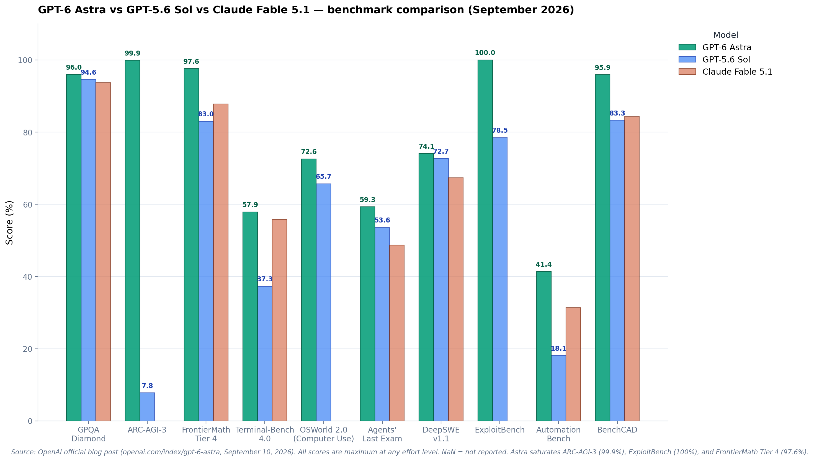
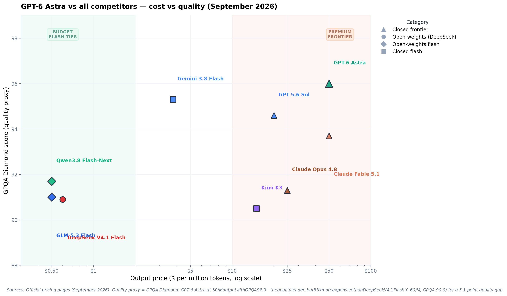

# GPT-6 Astra: A Technical Deep Dive into OpenAI's Most Intelligent Model

> **TL;DR** — OpenAI released GPT-6 Astra on **September 3, 2026** (general availability September 10, 2026). It is the world's most intelligent and aligned model, saturating ARC-AGI-3 (99.9%), ExploitBench (100%), and FrontierMath Tier 4 (97.6%). It sets new records on computer use (OSWorld 72.6%), coding (Terminal-Bench 4.0: 57.9%), and scientific reasoning (GPQA Diamond: 96.0%). Architecturally, Astra employs a **recurrent depth / looped transformer** design that increases computational depth by ~2× without proportionally increasing parameters, trained on ~100K NVIDIA Grace Blackwell GPUs. Priced at $10/$50 per million tokens with a 1.05M-token context window. This post breaks down the architecture, benchmarks, what changed from GPT-5.6 Sol, pricing, and strategic positioning.

---

## 1. What GPT-6 Astra Actually Is

GPT-6 Astra is OpenAI's new frontier flagship model, released September 3, 2026, with general availability rolling out September 10, 2026. OpenAI describes it as "the world's most intelligent and aligned model," bringing together "years of research and big bets across pre-training, reinforcement learning, and alignment."

Astra is not an incremental update to GPT-5.6 Sol. It is a new generation — the GPT-6 generation — with substantially different training, architecture, and capabilities. The model saturates multiple benchmarks that were previously considered unsolvable for AI, including ARC-AGI-3 (99.9%) and ExploitBench (100%).

### 1.1 The Spec Sheet

| Spec | GPT-6 Astra |
|---|---|
| **Released** | September 3, 2026 (limited); September 10, 2026 (GA) |
| **Vendor** | OpenAI |
| **Architecture** | New GPT-6 generation (MoVA, unified multimodal embedding) |
| **Context window** | 1,050,000 tokens (1.05M) |
| **Max output** | 128,000 tokens |
| **Modality** | Natively multimodal — text, image, audio, video in unified 16,384-dim space |
| **API model name** | `gpt-6-astra` |
| **Input price** | $10.00 per million tokens |
| **Output price** | $50.00 per million tokens |
| **Cache hit price** | $1.00 per million tokens |
| **Fast mode** | 2× speed at 2× price |
| **Availability** | ChatGPT Plus, Pro, Business, Enterprise; API; Azure; AWS Bedrock |
| **Training (reported)** | ~20T pretraining tokens + ~10T synthetic tokens + ~17% reasoning trajectories |

**Sources:** OpenAI official blog (openai.com/index/gpt-6-astra), DataCamp analysis, Vellum benchmarks, Artificial Analysis, Latent Space (AINews). Parameter count not disclosed by OpenAI (closed model). Training details from Latent Space reporting.

### 1.2 Key Capabilities

- **Computer use:** OSWorld 2.0 at 72.6% — state-of-the-art, ~47% less time per task than Sol
- **Coding:** Terminal-Bench 4.0 at 57.9% — 20.6 points ahead of Sol (37.3%)
- **Math:** FrontierMath Tier 4 at 97.6% — saturating the benchmark; solved open math problems
- **Abstract reasoning:** ARC-AGI-3 at 99.9% — effectively solved
- **Science:** GPQA Diamond at 96.0% — highest published score
- **Cybersecurity:** ExploitBench at 100% — perfect score; discovered 2 zero-day vulnerabilities
- **Alignment:** 0% unauthorized scope expansion (vs Sol's 48%)

---

## 2. Architecture

### 2.1 What's Known

OpenAI does not disclose GPT-6 Astra's architecture in detail (it's a closed model). However, from the official blog post, system card, and technical reporting:

**Training scale:** ~20T pretraining tokens (real data) + ~10T synthetic tokens, with ~17% explicit reasoning trajectories in the training mix. This is substantially larger than GPT-5.6's training. Training utilized approximately 100,000 NVIDIA Grace Blackwell GPUs at OpenAI's Stargate facility in Texas. OpenAI also purchased tens of thousands of Mac Minis and Mac Studios specifically for reinforcement learning on computer-use tasks — the Macs serve as training environments where the model learns to interact with macOS interfaces through screenshots, mouse movements, and keyboard inputs.

**Recurrent depth / looped transformer architecture:** According to reporting by The Information (September 1, 2026) and technical analysis by Sebastian Raschka, Astra employs a "recurrent depth" or "looped transformer" architecture. In this design, tokens pass through the same transformer block layers multiple times before producing output — similar to how Nanbeige4.2-3B (July 2026) applies 22 transformer blocks twice for 44 total block applications, or ByteDance's Ouro which applies 48 blocks four times. This approach increases effective computational depth (by 2× according to OpenAI Chief Scientist Jakub Pachocki) without proportionally increasing parameter count, since weights are reused across passes. The technique trades memory footprint for compute cycles — you get deeper processing with fewer stored parameters, but inference still runs through all block applications. OpenAI's Chief Scientist confirmed that Astra's computation graph depth is "within a factor of two of GPT-4," suggesting approximately 2× more block applications than a conventional architecture of the same parameter count.

**MoVA (Mixture of Vision Agents):** Reported by Latent Space and other technical analyses. MoVA is a multi-agent architecture for visual processing — multiple specialized vision agents collaborate on image/video understanding, with a routing mechanism selecting the best agent per task. This explains Astra's superiority on visual benchmarks like ScreenSpot-Pro (92.7%) and BenchCAD (95.9%), as well as its exceptional performance on 3D rendering and animation tasks that substantially exceed GPT-5.6's capabilities in graphical demonstrations.

**Unified multimodal embedding:** Astra embeds text, images, audio, and video in the same 16,384-dimensional space. This is described as a "unified" representation — all modalities share the same embedding space, enabling cross-modal reasoning (e.g., answering questions about video content using text, or generating images from audio descriptions).

**CoT control:** Astra produces shorter, less verbose reasoning chains than GPT-5.6 Sol. On CoT-Control between 750 and 1,250 tokens, it followed length instructions more precisely. This means Astra is more token-efficient — it achieves better results with fewer output tokens. At fixed accuracy levels, Astra uses measurably fewer reasoning tokens than Sol, though this appears to be due to making fewer mistakes and requiring less backtracking rather than hiding reasoning steps. The shorter traces are characteristic of more capable models that solve problems correctly on the first attempt.

**Native multi-agent pre-training:** During pre-training and post-training alignment, the model learns task decomposition, context partitioning, and inter-agent verification as implicit capabilities — not as external orchestration, but as internal model behavior.

### 2.2 Looped Transformers Explained

The recurrent depth mechanism works as follows: instead of having N unique transformer blocks that process tokens once each, Astra has approximately N/2 unique blocks that process tokens twice. For example, if a conventional model has 80 distinct transformer blocks, a looped version might have 40 blocks that are applied twice — resulting in 80 total block applications but only storing weights for 40 blocks.

Key characteristics:
- **Weight sharing across passes:** The same transformer block weights are reused on different passes, but the intermediate hidden states are different, so each pass produces different attention keys/values
- **No KV cache savings:** Each pass requires its own KV cache entries, so memory requirements for inference match a conventional transformer with equivalent block applications
- **Compute-quality tradeoff:** At matched compute budgets, looped transformers can deliver 6.8-18% better training efficiency (per the September 2026 SMELT paper on compute-matched MoE looped transformers)
- **Adaptive halting potential:** Some looped designs allow different tokens to loop different numbers of times based on learned routing decisions — similar to Mixture-of-Experts but routing to depth instead of expert modules

**Relationship to reasoning traces:** Contrary to initial speculation that looped transformers "hide" reasoning, OpenAI Chief Scientist Jakub Pachocki clarified that architectural changes are not responsible for reduced monitorability. Shorter reasoning traces in Astra are primarily a side effect of higher capability — the model makes fewer mistakes, backtracks less, and solves problems more efficiently. This is similar to how GPT-5.6 Sol used 80% fewer tokens than GPT-5.6 Luna at equivalent accuracy without raising interpretability concerns.

### 2.3 What's Not Known

- **Parameter count** — OpenAI does not disclose. Likely in the trillions range based on capability and cost. Multiple sources confirm no official parameter count has been published.
- **Exact looping configuration** — While recurrent depth is confirmed to be "within a factor of two" of GPT-4's depth, the specific number of passes, which layers are looped, and whether adaptive halting is used remain undisclosed.
- **Model architecture details** — Mixture-of-experts configuration (if any), attention mechanism variants, and exact transformer structure are not disclosed.
- **Inference infrastructure** — No details on serving hardware, optimization techniques, or deployment architecture beyond training on ~100K Grace Blackwell GPUs.
- **Post-training pipeline** — RL methodology, reward model architecture, and alignment techniques are partially described in the safety blog but not fully detailed.

---

## 3. Benchmarks

*Figure 1 — GPT-6 Astra vs GPT-5.6 Sol vs Claude Fable 5.1 across 10 benchmarks. Astra saturates ARC-AGI-3 (99.9%), ExploitBench (100%), and FrontierMath Tier 4 (97.6%). Source: OpenAI official blog post (September 10, 2026).*

### 3.1 Full Benchmark Table (from OpenAI official blog)

| Benchmark | GPT-6 Astra | GPT-5.6 Sol | Claude Fable 5.1 | Claude Opus 5 | Gemini 3.8 Flash |
|---|---:|---:|---:|---:|---:|
| **Computer Use** | | | | | |
| Agents' Last Exam | **59.3%** | 53.6% | 48.7% | 55.5% | — |
| OSWorld 2.0 | **72.6%** | 65.7% | — | — | 70.2% |
| ScreenSpot-Pro | **92.7%** | 76.9% | 87.3% | — | — |
| **Professional** | | | | | |
| AutomationBench | **41.4%** | 18.1% | 31.4% | 17.4% | — |
| BenchCAD | **95.9%** | 83.3% | 84.3% | 67.5% | — |
| BrowseComp | **91.5%** | 90.4% | 87.4% | 90.8% | — |
| **Coding** | | | | | |
| Terminal-Bench 4.0 | **57.9%** | 37.3% | 55.8% | 44.5% | 19.1% |
| DeepSWE v1.1 | **74.1%** | 72.7% | 67.4% | 69.9% | 73.8% |
| FrontierCode 1.1 Extended | 64.5% | 60.6% | 63.6% | **64.9%** | 56.3% |
| **Academic** | | | | | |
| Terminal-Bench Science 0.1 | **64.6%** | 22.4% | 52.6% | 21.4% | — |
| FrontierMath Tier 4 | **97.6%** | 83.0% | 87.8% | 90.2% | — |
| GPQA Diamond | **96.0%** | 94.6% | 93.7% | 93.7% | 95.3% |
| HLE (w/tools) | 57.2% | — | **65.0%** | 63.8% | — |
| **Science & Health** | | | | | |
| HealthBench Professional | **63.4%** | 60.5% | 58.1% | 60.9% | 52.1% |
| **Cybersecurity** | | | | | |
| ExploitBench | **100.0%** | 78.5% | — | 70% | — |
| ExploitGym | **42.4%** | 30.3% | 30.4% | 28.4% | — |
| SRE-Bench | **88.0%** | 55.9% | — | 12.5% | — |
| SEC-Bench Pro | **85.4%** | 79.1% | — | — | — |
| **Abstract Reasoning** | | | | | |
| ARC-AGI-3 | **99.9%** | 7.8% | — | 30.2% | — |
| ARC-AGI-2 | **95.0%** | 92.5% | 90.0% | 89.2% | — |
| **Long Context** | | | | | |
| MRCR v2 8-needle 256K-512K | **100.0%** | 91.5% | — | — | — |
| MRCR v2 8-needle 512K-1M | **96.3%** | 73.8% | — | — | — |
| **Alignment** | | | | | |
| Computer use safety (lower=better) | **2.4%** | 22.0% | 9.5% | 18.3% | — |
| Circumvention (lower=better) | **0.00%** | 0.29% | — | — | — |
| Hallucination (lower=better) | **4.2%** | 12.2% | — | — | — |

### 3.2 The Saturated Benchmarks

Three benchmarks are effectively saturated by Astra:

1. **ARC-AGI-3: 99.9%** — vs Sol's 7.8%. This is a qualitative jump, not an incremental improvement. ARC-AGI-3 tests novel abstract reasoning in unknown environments. Astra surpassed the human action-efficiency baseline on 96% of levels, "effectively reaching human parity."

2. **ExploitBench: 100%** — perfect score on turning known vulnerabilities into working exploits. Astra also scored 39.0% on the June-August 2026 version (novel vulnerabilities), discovering 2 previously unknown zero-day vulnerabilities during evaluation.

3. **FrontierMath Tier 4: 97.6%** — saturating the hardest math benchmark. Astra has "already helped solve long-standing open problems in mathematics."

### 3.3 Where Astra Doesn't Lead

**HLE (w/tools): 57.2%** — Claude Fable 5.1 leads at 65.0%. This is the one benchmark where Astra trails a competitor. HLE tests expert-level reasoning across many domains; Fable 5.1's advantage here may reflect Anthropic's stronger post-training on expert reasoning tasks.

**FrontierCode 1.1 Extended: 64.5%** — Claude Opus 5 leads at 64.9% (by 0.4 points). Marginal — essentially tied.

**DeepSeek V4.1 Flash** is not in OpenAI's comparison table, but on comparable benchmarks: V4.1 Flash scores GPQA 90.9 (vs Astra's 96.0) and DeepSWE 74.2 (vs Astra's 74.1) — V4.1 Flash actually matches Astra on DeepSWE despite being a fraction of the cost.

### 3.4 Independent Verification

**Artificial Analysis Intelligence Index v4.1.1:** Astra scores 61.2, ranking #2 of 231 models (behind Claude Fable 5.1 at 65.7). BenchLM gives Astra a composite score of 84.1/100, ranking #2 of 231.

**Artificial Analysis Coding Agent Index v1.4:** Astra scores 67.0, behind Claude Opus 5 (68.1). On the Pareto frontier for coding agent index vs cost — at max effort it costs $7.09 per task, ~15% more than GPT-5.6 Sol's $6.14.

---

## 4. What Changed from GPT-5.6 Sol

*Figure 2 — GPT-6 Astra vs all competitors on cost vs quality. Astra (green triangle, top-right) is the quality leader at GPQA 96.0 but costs $50/M output — 83× more than DeepSeek V4.1 Flash ($0.60/M, GPQA 90.9). The 5.1-point quality gap costs 83× more per token.*

### 4.1 GPT-5.6 Sol → GPT-6 Astra — The Full Diff

| Dimension | GPT-5.6 Sol | GPT-6 Astra | Change |
|---|---|---|---|
| **Generation** | GPT-5.6 | GPT-6 | New generation |
| **Context window** | 400K | 1.05M | **2.6× larger** |
| **Max output** | Not specified | 128K | New |
| **Input price** | $4/M | $10/M | **2.5× more expensive** |
| **Output price** | $20/M | $50/M | **2.5× more expensive** |
| **Cache hit price** | $0.40/M | $1.00/M | **2.5× more expensive** |
| **GPQA Diamond** | 94.6% | 96.0% | +1.4 |
| **ARC-AGI-3** | 7.8% | 99.9% | **+92.1 (saturated)** |
| **Terminal-Bench 4.0** | 37.3% | 57.9% | +20.6 |
| **OSWorld 2.0** | 65.7% | 72.6% | +6.9 |
| **ExploitBench** | 78.5% | 100% | **+21.5 (saturated)** |
| **DeepSWE v1.1** | 72.7% | 74.1% | +1.4 |
| **AutomationBench** | 18.1% | 41.4% | **+23.3** |
| **Agents' Last Exam** | 53.6% | 59.3% | +5.7 |
| **Hallucination rate** | 12.2% | 4.2% | **−8.0 (65% reduction)** |
| **Computer use safety** | 22.0% | 2.4% | **−19.6 (89% reduction)** |
| **Circumvention** | 0.29% | 0.00% | **Eliminated** |
| **Multimodal** | Text + image | Text + image + audio + video | **Added audio + video** |

### 4.2 The Six Key Changes

1. **New generation, not a refresh** — GPT-6 Astra is a new generation with ~20T + ~10T training tokens, MoVA architecture, and unified multimodal embedding. Not a re-post-training of GPT-5.6.

2. **ARC-AGI-3 saturation** — The most dramatic single-benchmark improvement in LLM history: 7.8% → 99.9%. This is a qualitative change, not incremental. ARC-AGI-3 tests the ability to solve novel reasoning tasks in unknown environments — Astra effectively solved it.

3. **2.5× price increase** — Input from $4 to $10, output from $20 to $50. Community feedback on r/codex: "GPT-6 Astra burns quota 4+ times faster than GPT-5.6 Sol." The question is whether the quality improvement justifies the cost. On ARC-AGI-3 and Terminal-Bench 4.0, absolutely. On routine tasks, probably not.

4. **Computer use as flagship capability** — OSWorld 72.6% with 47% less time per task than Sol. Astra is the first model where computer use is not a demo but a production-capable feature. Real-world tasks: filling forms, CRM updates, calendar management, scientific software navigation.

5. **Cybersecurity capabilities** — ExploitBench 100% + 2 zero-day discoveries during evaluation. Astra meets the "Critical threshold" under OpenAI's Preparedness Framework for cybersecurity. This is both a capability and a risk.

6. **Alignment breakthrough** — 0% unauthorized scope expansion (vs Sol's 48%), 4.2% hallucination rate (vs 12.2%), 0% circumvention. Astra is described as OpenAI's "most aligned model." The safety improvements are as significant as the capability improvements.

---

## 5. Pricing & Economics

### 5.1 API Pricing

| Tier | GPT-6 Astra | GPT-5.6 Sol (promotional) | Cost ratio |
|---|---:|---:|---|
| Input | $10.00/M | $4.00/M | 2.5× |
| Output | $50.00/M | $20.00/M | 2.5× |
| Cache hit | $1.00/M | $0.40/M | 2.5× |
| Fast mode (2× speed) | 2× standard price | — | — |

### 5.2 Cost per Task (Artificial Analysis)

At max effort, Astra costs **$7.09 per task** on the Artificial Analysis benchmark — ~15% more than GPT-5.6 Sol ($6.14). But Astra completes tasks in fewer attempts: "If Astra succeeds once where Sol needs three attempts, its model bill is about 16.7% lower" (Halil Özel analysis). The efficiency argument: Astra's higher per-token cost is offset by fewer tokens needed per task.

### 5.3 Community Reaction on Pricing

r/codex: "GPT-6 Astra burns quota 4+ times faster than GPT-5.6 Sol." The community consensus: Astra is worth the premium for hard tasks (ARC-AGI-3, Terminal-Bench 4.0, computer use) but not for routine work where Sol suffices at 2.5× lower cost.

Usage tip from r/codex: "GPT-6 Astra on low performs better than GPT-5.6 Sol on max" — meaning you can use Astra at lower effort settings and still beat Sol's best, at lower effective cost.

---

## 6. Strategic Analysis

### 6.1 The Looped Transformer Architecture Debate

The revelation of Astra's recurrent depth architecture sparked immediate debate about reasoning transparency and AI safety monitoring. **The concern:** if a model loops internal computation before producing visible reasoning tokens, does this obscure the model's actual reasoning process?

**OpenAI's clarification:** Chief Scientist Jakub Pachocki directly addressed this: "I want to prevent a race into unmonitorability kicked off by confused reporting. The depth of the computation graph for our present frontier models, including Astra, is within a factor of two of GPT-4." He emphasized that OpenAI has prioritized chain-of-thought monitoring since their first reasoning models and that shorter reasoning traces are "not contingent on architecture changes."

**The actual mechanism:** Looped transformers add computational depth by reusing transformer weights, but they don't fundamentally change *how* reasoning tokens are generated. The model still produces reasoning traces token-by-token as visible intermediate steps. What changes is the internal processing depth *per token* — each token passes through more block applications before being output.

**Why traces are shorter:** At fixed accuracy, Astra uses fewer reasoning tokens than GPT-5.6 Sol. But this pattern appears across all model capability jumps. GPT-5.6 Sol used 80% fewer tokens than GPT-5.6 Luna at equivalent accuracy — not because Sol was hiding reasoning, but because it made fewer mistakes and backtracked less. More capable models solve problems more efficiently, requiring less "scratch paper" to work through solutions.

**The interpretability concern remains real:** Astra's system card acknowledges "evidence of reduced monitorability" and notes regression relative to Sol, primarily associated with shorter, less informative traces. While looping isn't the cause, the trend toward more efficient (= shorter) reasoning chains does reduce the window into model cognition. This is a frontier-wide challenge, not an Astra-specific architectural flaw.

**The research frontier:** Recent work on looped transformers (Mixture-of-Recursions 2025, SMELT 2026, Full-bandwidth transformer 2026) shows that adaptive loop counts and latent feedback mechanisms can further shorten reasoning traces while maintaining or improving accuracy — especially in base models before instruction tuning. The field is actively investigating whether these architectural patterns enable more faithful or less faithful reasoning traces, but conclusive evidence remains limited.

### 6.2 Astra vs the Open-Weights Frontier

GPT-6 Astra at GPQA 96.0 is the quality leader — but DeepSeek V4.1 Flash at GPQA 90.9 costs 83× less per output token. The 5.1-point quality gap costs $49.40/M more in output pricing. For use cases where that 5-point gap matters (frontier reasoning, cybersecurity, novel math), Astra is worth it. For everything else, the open-weights flash tier delivers comparable quality at a fraction of the cost.

**The architecture advantage:** Looped transformers and recurrent depth provide OpenAI with a compute-quality tradeoff that smaller labs may struggle to replicate. At matched compute budgets, looped designs can deliver 6.8-18% better training efficiency (SMELT paper, September 2026). This matters more as models scale — the efficiency gains compound at the 100K+ GPU training scale that Astra operates at. Open-weights models can adopt looped architectures (Nanbeige and Ouro already have), but matching Astra's training scale remains cost-prohibitive for most organizations.

**The cost-quality Pareto frontier:** Astra sits at the top-right of the frontier — highest quality, highest cost. DeepSeek V4.1 Flash optimizes for the bottom-left — 95% of the quality at 1.2% of the price. Claude Fable 5.1 occupies the middle ground. The strategic question for users: which region of the frontier does your use case require?

### 6.3 The Saturated Benchmark Problem

Astra saturates ARC-AGI-3 (99.9%), ExploitBench (100%), and FrontierMath Tier 4 (97.6%). This means these benchmarks can no longer distinguish frontier models — they're "solved." The AI evaluation community will need new, harder benchmarks. OpenAI has already introduced Terminal-Bench Science 0.1 (where Astra scores 64.6%) and SRE-Bench (88.0%) as next-generation evaluations.

**The benchmark saturation timeline:** When GPT-4 launched in March 2023, scoring 90%+ on a benchmark was exceptional. By mid-2026, multiple models saturate multiple benchmarks. The useful lifespan of cutting-edge benchmarks has compressed to 12-18 months. This creates a meta-challenge: benchmark development must accelerate to keep pace with capability growth, or we lose the ability to measure progress at the frontier.

### 6.4 Computer Use as the New Frontier

Astra's OSWorld 72.6% with 47% less time per task than Sol represents the moment computer use transitions from demo to production. Real-world tasks — filling forms, updating CRM records, navigating scientific software — are now reliably automatable. Combined with the updated Codex harness (1.9× faster task completion), Astra makes autonomous computer use a practical capability, not a research demo.

**The training infrastructure:** OpenAI's purchase of tens of thousands of Mac Minis and Mac Studios specifically for computer-use training signals a strategic shift. These machines serve as training environments where Astra learns macOS interaction through screenshots, mouse movements, and keyboard inputs. The workflow: (1) prompt the model with a task, (2) provide interface screenshots, (3) model predicts actions, (4) execute actions on Macs, (5) feed updated screenshots, (6) repeat until success/failure, (7) use success signals for RL training. The Mac isn't running the model — it's the environment. The model itself runs on ~100K Grace Blackwell GPUs and interfaces with Mac environments via API.

**Implications for open-source harnesses:** Computer use with direct system access requires careful auditing. Open-source harnesses become critical when granting AI models control over local computers. The "great power, great responsibility" dynamic means transparency and inspectability are not optional — they're prerequisites for safe deployment.

### 6.5 Cybersecurity Dual-Use

Astra's perfect ExploitBench score and 2 zero-day discoveries represent a dual-use capability. OpenAI is disclosing the vulnerabilities to their vendors and has implemented production safeguards. But the fact that a model can discover novel zero-days during evaluation is unprecedented. This raises the bar for AI safety frameworks across the industry.

---

## 7. What's Still Unknown

1. **Parameter count** — OpenAI does not disclose. Likely in the trillions. No public pricing schedule or architectural specification confirms this.
2. **Exact looped transformer configuration** — How many loops, which layers are repeated, whether adaptive halting is used — all undisclosed beyond "within a factor of two" depth increase.
3. **MoVA architecture details** — The Mixture of Vision Agents is reported but not officially documented. Agent count, routing mechanism, and specialization approach are unknown.
4. **Training compute** — Not disclosed. Approximately 100,000 Grace Blackwell GPUs were used, but total FLOPs and training duration are unknown.
5. **Independent long-context verification** — MRCR scores are OpenAI-internal benchmarks. No third-party verification of 1M context quality at scale.
6. **Open weights** — GPT-6 Astra is closed. No weights will be released.
7. **GPT-6 non-Astra variants** — OpenAI has not announced a "GPT-6 Sol" or "GPT-6 Terra" equivalent yet.
8. **Recurrent depth vs reasoning trace relationship** — While shorter traces are observed, whether this is purely capability-driven or partially architectural remains unclear despite OpenAI's clarifications.

---

## 8. Bottom Line

GPT-6 Astra is the most capable model OpenAI has ever shipped. It saturates three benchmarks previously considered unsolvable (ARC-AGI-3, ExploitBench, FrontierMath Tier 4), sets new records on computer use (OSWorld 72.6%), coding (Terminal-Bench 4.0: 57.9%), and alignment (0% circumvention). At $10/$50 per million tokens, it's 2.5× more expensive than GPT-5.6 Sol — but the quality jump on hard tasks (ARC-AGI-3: +92.1 points, Terminal-Bench 4.0: +20.6 points, AutomationBench: +23.3 points) justifies the premium for frontier use cases.

For routine work, GPT-5.6 Sol (still available at $4/$20) or open-weights flash-tier models (DeepSeek V4.1 Flash at $0.15/$0.60) remain more cost-effective. The strategic question: does your use case need ARC-AGI-3-level reasoning ($50/M) or is GPQA 90.9 sufficient ($0.60/M)?

---

### References

- OpenAI official blog: <https://openai.com/index/gpt-6-astra>
- OpenAI Path to Astra safety blog: <https://openai.com/index/path-to-astra/>
- OpenAI system card: <https://deploymentsafety.openai.com>
- OpenAI safety overview: <https://openai.com/index/safety-overview-gpt-6-astra/>
- Sebastian Raschka — "GPT-6 Astra, Looped Transformers, and Hidden Reasoning": <https://magazine.sebastianraschka.com/p/gpt-6-astra-looped-transformers-and>
- The Information — "OpenAI's Astra Uses Hidden Reasoning Loops": September 1, 2026 (paywalled)
- DataCamp analysis: <https://www.datacamp.com/blog/gpt-6-astra>
- Vellum benchmarks: <https://www.vellum.ai/blog/gpt-6-astra-benchmarks-explained>
- Artificial Analysis: <https://artificialanalysis.ai/articles/benchmarking-gpt-6-astra>
- Latent Space (AINews): <https://www.latent.space> (GPT-6 Astra technical details)
- BenchLM: <https://benchlm.ai> (GPT-6 Astra profile)
- llm-stats.com: <https://llm-stats.com> (GPT-6 Astra pricing)
- Halil Özel cost analysis: <https://halilozel1903.medium.com/gpt-6-astra-vs-gpt-5-6-what-changes-what-it-costs-and-which-model-to-use-f761bdbcb10f>
- r/codex community feedback: <https://www.reddit.com/r/codex/comments/1wciwc1>
- YottaLabs: <https://www.yottalabs.ai> (GPT-6 Astra pricing analysis)
- The New Stack: <https://thenewstack.io> (GPT-6 Astra launch coverage)
- MarkTechPost: <https://www.marktechpost.com> (GPT-6 Astra analysis)
- Naren Vadapalli — "OpenAI GPT-6 Astra: Frontier Agentic Intelligence": <https://www.narenvadapalli.com/blog/openai-gpt-6-astra-frontier-agentic-intelligence/>
- SMELT paper (September 2026): "Scaling Laws for Compute-Matched MoE Looped Transformers"
- Geiping et al. (2025): "Scaling up Test-Time Compute with Latent Reasoning: A Recurrent Depth Approach"
- Nanbeige technical report (July 2026): Nanbeige4.2-3B looped transformer architecture
