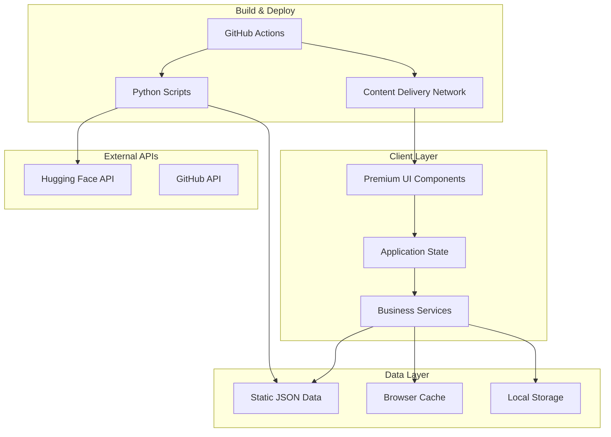
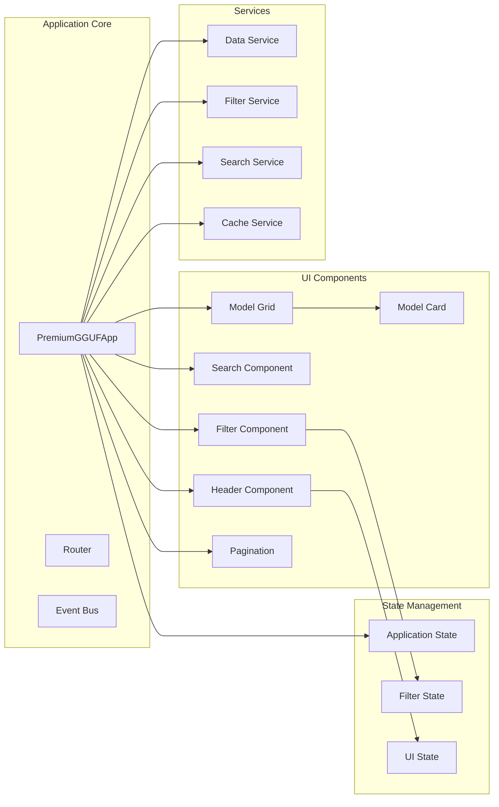
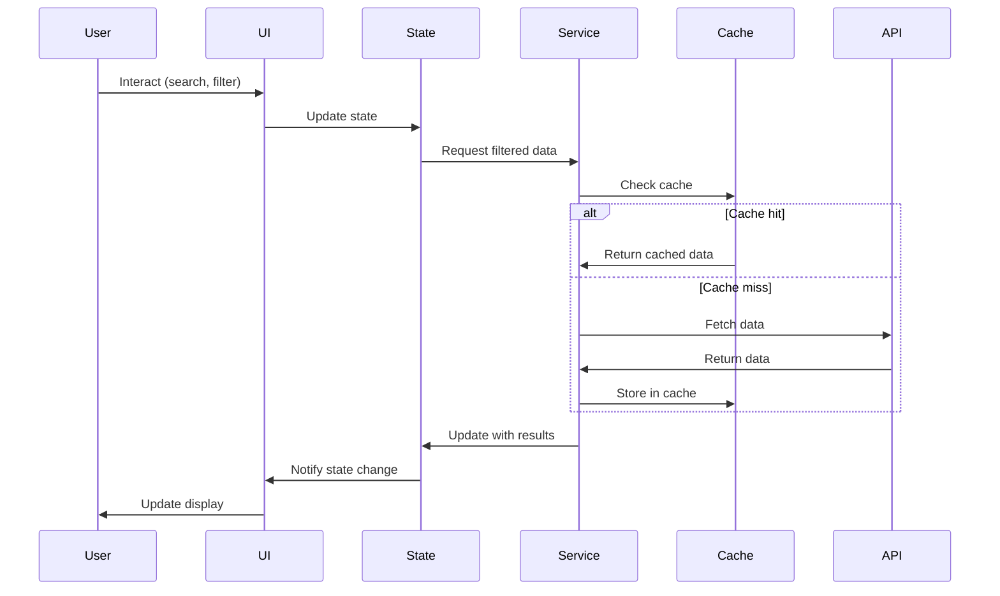

# Architecture Documentation

## Overview

GGUF Model Discovery is a client-side web application built with modern web technologies, focusing on performance, accessibility, and maintainability. This document outlines the system architecture, design patterns, and technical decisions.

## System Architecture

### High-Level Architecture



### Component Architecture



## Frontend Architecture

### Application Structure

```
js/
├── premium-app.js          # Main application controller
├── components/             # Reusable UI components
│   ├── Header.js          # Header with search and navigation
│   ├── ModelCard.js       # Individual model card component
│   ├── SearchFilter.js    # Search and filter controls
│   └── Pagination.js      # Pagination component
├── services/              # Business logic services
│   ├── DataService.js     # Data fetching and management
│   ├── FilterService.js   # Filtering and sorting logic
│   ├── SearchService.js   # Search functionality
│   └── CacheService.js    # Caching strategies
├── state/                 # State management
│   ├── AppState.js        # Global application state
│   ├── FilterState.js     # Filter-specific state
│   └── UIState.js         # UI-specific state
├── utils/                 # Utility functions
│   ├── formatters.js      # Data formatting utilities
│   ├── helpers.js         # General helper functions
│   ├── notifications.js   # Notification system
│   └── engagement.js      # Engagement metrics utilities
└── config/                # Configuration files
    ├── constants.js       # Application constants
    └── settings.js        # Application settings
```

### Design Patterns

#### 1. Component Pattern

```javascript
/**
 * Base Component class providing common functionality
 */
class BaseComponent {
  constructor(container, options = {}) {
    this.container = container;
    this.options = { ...this.defaultOptions, ...options };
    this.element = null;
    this.eventListeners = new Map();
  }
  
  get defaultOptions() {
    return {};
  }
  
  render() {
    if (this.element) return this.element;
    
    this.element = this.createElement();
    this.attachEventListeners();
    this.afterRender();
    
    return this.element;
  }
  
  createElement() {
    throw new Error('createElement must be implemented by subclass');
  }
  
  attachEventListeners() {
    // Override in subclasses
  }
  
  afterRender() {
    // Override in subclasses
  }
  
  addEventListener(element, event, handler) {
    element.addEventListener(event, handler);
    
    if (!this.eventListeners.has(element)) {
      this.eventListeners.set(element, []);
    }
    this.eventListeners.get(element).push({ event, handler });
  }
  
  destroy() {
    // Clean up event listeners
    for (const [element, listeners] of this.eventListeners) {
      listeners.forEach(({ event, handler }) => {
        element.removeEventListener(event, handler);
      });
    }
    this.eventListeners.clear();
    
    // Remove from DOM
    if (this.element && this.element.parentNode) {
      this.element.parentNode.removeChild(this.element);
    }
  }
}

/**
 * Model Card Component
 */
class ModelCard extends BaseComponent {
  constructor(model, options = {}) {
    super(null, options);
    this.model = model;
  }
  
  get defaultOptions() {
    return {
      showEngagement: true,
      showDescription: true,
      compact: false
    };
  }
  
  createElement() {
    const card = document.createElement('div');
    card.className = `premium-model-card ${this.options.compact ? 'compact' : ''}`;
    card.innerHTML = this.getTemplate();
    return card;
  }
  
  getTemplate() {
    return `
      <div class="model-card-header">
        <div class="model-number-badge">#${this.model.rank || 1}</div>
        ${this.options.showEngagement ? this.getEngagementTemplate() : ''}
      </div>
      
      <div class="model-title-section">
        <h3 class="model-name">${this.escapeHtml(this.model.modelName)}</h3>
        ${this.options.showDescription ? `
          <p class="model-description">${this.escapeHtml(this.model.description)}</p>
        ` : ''}
      </div>
      
      <div class="model-metadata">
        <div class="metadata-item">
          <span class="metadata-label">Quantization</span>
          <span class="metadata-value">
            <span class="quantization-badge">${this.model.quantization}</span>
          </span>
        </div>
        <div class="metadata-item">
          <span class="metadata-label">Size</span>
          <span class="metadata-value">${this.formatFileSize(this.model.fileSize)}</span>
        </div>
      </div>
      
      <div class="model-actions">
        <div class="action-group">
          <a href="${this.model.downloadUrl}" 
             class="premium-btn btn-primary" 
             target="_blank" 
             rel="noopener"
             data-action="download">
            <svg class="btn-icon" width="16" height="16">
              <use href="#download-icon"></use>
            </svg>
            Download
          </a>
          <button class="copy-btn" 
                  data-action="copy" 
                  data-url="${this.model.downloadUrl}"
                  title="Copy download URL">
            <svg width="16" height="16">
              <use href="#copy-icon"></use>
            </svg>
          </button>
        </div>
      </div>
    `;
  }
  
  getEngagementTemplate() {
    return `
      <div class="download-stats">
        <div class="download-count">
          <svg width="16" height="16"><use href="#download-icon"></use></svg>
          ${this.formatNumber(this.model.downloadCount)}
        </div>
        <div class="like-count">
          <svg width="16" height="16"><use href="#heart-icon"></use></svg>
          ${this.formatNumber(this.model.likeCount)}
        </div>
      </div>
    `;
  }
  
  attachEventListeners() {
    const downloadBtn = this.element.querySelector('[data-action="download"]');
    const copyBtn = this.element.querySelector('[data-action="copy"]');
    
    if (downloadBtn) {
      this.addEventListener(downloadBtn, 'click', this.handleDownload.bind(this));
    }
    
    if (copyBtn) {
      this.addEventListener(copyBtn, 'click', this.handleCopy.bind(this));
    }
  }
  
  handleDownload(event) {
    // Track download event
    this.dispatchEvent('model:download', { model: this.model });
  }
  
  handleCopy(event) {
    event.preventDefault();
    const url = event.currentTarget.dataset.url;
    
    navigator.clipboard.writeText(url).then(() => {
      this.showNotification('Download URL copied to clipboard', 'success');
      this.dispatchEvent('model:copy', { model: this.model, url });
    }).catch(() => {
      this.showNotification('Failed to copy URL', 'error');
    });
  }
  
  dispatchEvent(eventName, detail) {
    const event = new CustomEvent(eventName, {
      detail,
      bubbles: true
    });
    this.element.dispatchEvent(event);
  }
  
  // Utility methods
  escapeHtml(text) {
    const div = document.createElement('div');
    div.textContent = text || '';
    return div.innerHTML;
  }
  
  formatNumber(num) {
    return new Intl.NumberFormat().format(num || 0);
  }
  
  formatFileSize(bytes) {
    const sizes = ['B', 'KB', 'MB', 'GB'];
    if (bytes === 0) return '0 B';
    const i = Math.floor(Math.log(bytes) / Math.log(1024));
    return Math.round(bytes / Math.pow(1024, i) * 100) / 100 + ' ' + sizes[i];
  }
  
  showNotification(message, type) {
    // Delegate to notification system
    window.showNotification?.(message, type);
  }
}
```

#### 2. Service Pattern

```javascript
/**
 * Data Service - Handles all data operations
 */
class DataService {
  constructor() {
    this.cache = new Map();
    this.cacheTimeout = 5 * 60 * 1000; // 5 minutes
  }
  
  /**
   * Fetch models with caching
   */
  async fetchModels(forceRefresh = false) {
    const cacheKey = 'models';
    const cached = this.cache.get(cacheKey);
    
    if (!forceRefresh && cached && Date.now() - cached.timestamp < this.cacheTimeout) {
      return cached.data;
    }
    
    try {
      const response = await fetch('./gguf_models.json');
      if (!response.ok) {
        throw new Error(`HTTP ${response.status}: ${response.statusText}`);
      }
      
      const models = await response.json();
      
      // Cache the result
      this.cache.set(cacheKey, {
        data: models,
        timestamp: Date.now()
      });
      
      return models;
    } catch (error) {
      console.error('Failed to fetch models:', error);
      
      // Return cached data if available
      if (cached) {
        console.warn('Using stale cached data due to fetch error');
        return cached.data;
      }
      
      throw error;
    }
  }
  
  /**
   * Get model statistics
   */
  getModelStats(models) {
    return {
      totalModels: models.length,
      totalDownloads: models.reduce((sum, model) => sum + (model.downloadCount || 0), 0),
      totalLikes: models.reduce((sum, model) => sum + (model.likeCount || 0), 0),
      averageFileSize: models.reduce((sum, model) => sum + (model.fileSize || 0), 0) / models.length,
      quantizationTypes: [...new Set(models.map(m => m.quantization))].filter(Boolean),
      modelTypes: [...new Set(models.map(m => m.modelType))].filter(Boolean),
      licenses: [...new Set(models.map(m => m.license))].filter(Boolean)
    };
  }
  
  /**
   * Clear cache
   */
  clearCache() {
    this.cache.clear();
  }
}

/**
 * Filter Service - Handles filtering and sorting
 */
class FilterService {
  /**
   * Apply multiple filters to models
   */
  static applyFilters(models, filters) {
    let filtered = [...models];
    
    // Search filter
    if (filters.search) {
      filtered = this.filterBySearch(filtered, filters.search);
    }
    
    // Quantization filter
    if (filters.quantization && filters.quantization !== 'all') {
      filtered = this.filterByQuantization(filtered, filters.quantization);
    }
    
    // Model type filter
    if (filters.modelType && filters.modelType !== 'all') {
      filtered = this.filterByModelType(filtered, filters.modelType);
    }
    
    // License filter
    if (filters.license && filters.license !== 'all') {
      filtered = this.filterByLicense(filtered, filters.license);
    }
    
    // File size range filter
    if (filters.fileSizeMin !== undefined || filters.fileSizeMax !== undefined) {
      filtered = this.filterByFileSize(filtered, filters.fileSizeMin, filters.fileSizeMax);
    }
    
    // Sort results
    if (filters.sortBy) {
      filtered = this.sortModels(filtered, filters.sortBy, filters.sortDirection || 'desc');
    }
    
    return filtered;
  }
  
  /**
   * Filter by search query
   */
  static filterBySearch(models, query) {
    if (!query || query.trim() === '') return models;
    
    const searchTerms = query.toLowerCase().trim().split(/\s+/);
    
    return models.filter(model => {
      const searchableText = [
        model.modelName,
        model.description,
        model.quantization,
        model.modelType,
        model.license
      ].join(' ').toLowerCase();
      
      return searchTerms.every(term => searchableText.includes(term));
    });
  }
  
  /**
   * Sort models by specified criteria
   */
  static sortModels(models, sortBy, direction = 'desc') {
    const sortedModels = [...models];
    
    sortedModels.sort((a, b) => {
      let aValue = a[sortBy];
      let bValue = b[sortBy];
      
      // Handle string sorting
      if (typeof aValue === 'string' && typeof bValue === 'string') {
        aValue = aValue.toLowerCase();
        bValue = bValue.toLowerCase();
      }
      
      // Handle undefined values
      if (aValue === undefined) aValue = direction === 'desc' ? -Infinity : Infinity;
      if (bValue === undefined) bValue = direction === 'desc' ? -Infinity : Infinity;
      
      let comparison = 0;
      if (aValue < bValue) comparison = -1;
      if (aValue > bValue) comparison = 1;
      
      return direction === 'desc' ? -comparison : comparison;
    });
    
    return sortedModels;
  }
  
  // Additional filter methods...
  static filterByQuantization(models, quantization) {
    return models.filter(model => model.quantization === quantization);
  }
  
  static filterByModelType(models, modelType) {
    return models.filter(model => model.modelType === modelType);
  }
  
  static filterByLicense(models, license) {
    return models.filter(model => model.license === license);
  }
  
  static filterByFileSize(models, minSize, maxSize) {
    return models.filter(model => {
      const size = model.fileSize || 0;
      if (minSize !== undefined && size < minSize) return false;
      if (maxSize !== undefined && size > maxSize) return false;
      return true;
    });
  }
}
```

#### 3. State Management Pattern

```javascript
/**
 * Observable State Management
 */
class ObservableState {
  constructor(initialState = {}) {
    this.state = { ...initialState };
    this.listeners = new Map();
  }
  
  /**
   * Get current state
   */
  getState() {
    return { ...this.state };
  }
  
  /**
   * Update state and notify listeners
   */
  setState(updates) {
    const prevState = { ...this.state };
    this.state = { ...this.state, ...updates };
    
    // Notify listeners of changed properties
    Object.keys(updates).forEach(key => {
      if (this.listeners.has(key)) {
        this.listeners.get(key).forEach(callback => {
          callback(this.state[key], prevState[key], this.state);
        });
      }
    });
    
    // Notify global listeners
    if (this.listeners.has('*')) {
      this.listeners.get('*').forEach(callback => {
        callback(this.state, prevState);
      });
    }
  }
  
  /**
   * Subscribe to state changes
   */
  subscribe(key, callback) {
    if (!this.listeners.has(key)) {
      this.listeners.set(key, []);
    }
    this.listeners.get(key).push(callback);
    
    // Return unsubscribe function
    return () => {
      const callbacks = this.listeners.get(key);
      if (callbacks) {
        const index = callbacks.indexOf(callback);
        if (index > -1) {
          callbacks.splice(index, 1);
        }
      }
    };
  }
}

/**
 * Application State
 */
class AppState extends ObservableState {
  constructor() {
    super({
      models: [],
      filteredModels: [],
      loading: false,
      error: null,
      currentPage: 1,
      itemsPerPage: 24,
      totalItems: 0,
      filters: {
        search: '',
        quantization: 'all',
        modelType: 'all',
        license: 'all',
        sortBy: 'likeCount',
        sortDirection: 'desc'
      },
      ui: {
        viewMode: 'grid',
        sidebarOpen: false,
        headerCollapsed: false
      }
    });
  }
  
  // Convenience methods
  setModels(models) {
    this.setState({ 
      models,
      totalItems: models.length,
      loading: false,
      error: null
    });
  }
  
  setFilteredModels(filteredModels) {
    this.setState({ 
      filteredModels,
      totalItems: filteredModels.length,
      currentPage: 1 // Reset to first page
    });
  }
  
  updateFilters(filterUpdates) {
    this.setState({
      filters: { ...this.state.filters, ...filterUpdates }
    });
  }
  
  setLoading(loading) {
    this.setState({ loading });
  }
  
  setError(error) {
    this.setState({ error, loading: false });
  }
  
  setCurrentPage(page) {
    this.setState({ currentPage: page });
  }
  
  toggleViewMode() {
    const newMode = this.state.ui.viewMode === 'grid' ? 'list' : 'grid';
    this.setState({
      ui: { ...this.state.ui, viewMode: newMode }
    });
  }
}
```

### Event System

```javascript
/**
 * Event Bus for decoupled communication
 */
class EventBus {
  constructor() {
    this.events = new Map();
  }
  
  /**
   * Subscribe to an event
   */
  on(eventName, callback) {
    if (!this.events.has(eventName)) {
      this.events.set(eventName, []);
    }
    this.events.get(eventName).push(callback);
    
    // Return unsubscribe function
    return () => this.off(eventName, callback);
  }
  
  /**
   * Unsubscribe from an event
   */
  off(eventName, callback) {
    if (this.events.has(eventName)) {
      const callbacks = this.events.get(eventName);
      const index = callbacks.indexOf(callback);
      if (index > -1) {
        callbacks.splice(index, 1);
      }
    }
  }
  
  /**
   * Emit an event
   */
  emit(eventName, ...args) {
    if (this.events.has(eventName)) {
      this.events.get(eventName).forEach(callback => {
        try {
          callback(...args);
        } catch (error) {
          console.error(`Error in event handler for ${eventName}:`, error);
        }
      });
    }
  }
  
  /**
   * Subscribe to an event once
   */
  once(eventName, callback) {
    const unsubscribe = this.on(eventName, (...args) => {
      unsubscribe();
      callback(...args);
    });
    return unsubscribe;
  }
}

// Global event bus instance
window.eventBus = new EventBus();
```

## Data Architecture

### Data Flow



### Data Models

```javascript
/**
 * Model data structure
 */
const ModelSchema = {
  modelName: String,        // Display name
  description: String,      // Model description
  quantization: String,     // Q4_0, Q4_K_M, Q5_K_M, etc.
  fileSize: Number,        // Size in bytes
  downloadCount: Number,   // Download count
  likeCount: Number,       // Like/star count
  license: String,         // License type
  modelType: String,       // LLaMA, BERT, GPT, etc.
  downloadUrl: String,     // Direct download URL
  huggingFaceUrl: String,  // HF model page URL
  tags: Array,            // Additional tags
  createdAt: Date,        // Creation date
  updatedAt: Date,        // Last update date
  
  // Computed fields
  popularityScore: Number, // Calculated engagement score
  rank: Number,           // Ranking based on popularity
  sizeCategory: String,   // small, medium, large
  engagementLevel: String // low, medium, high
};

/**
 * Filter state structure
 */
const FilterSchema = {
  search: String,          // Search query
  quantization: String,    // Selected quantization
  modelType: String,       // Selected model type
  license: String,         // Selected license
  fileSizeMin: Number,     // Minimum file size
  fileSizeMax: Number,     // Maximum file size
  sortBy: String,          // Sort field
  sortDirection: String,   // asc or desc
  tags: Array,            // Selected tags
  dateRange: Object       // Date range filter
};
```

### Caching Strategy

```javascript
/**
 * Multi-level caching system
 */
class CacheManager {
  constructor() {
    this.memoryCache = new Map();
    this.sessionCache = sessionStorage;
    this.persistentCache = localStorage;
    this.cacheConfig = {
      memory: { ttl: 5 * 60 * 1000 },      // 5 minutes
      session: { ttl: 30 * 60 * 1000 },    // 30 minutes
      persistent: { ttl: 24 * 60 * 60 * 1000 } // 24 hours
    };
  }
  
  /**
   * Get from cache with fallback levels
   */
  get(key) {
    // Try memory cache first
    const memoryItem = this.memoryCache.get(key);
    if (memoryItem && !this.isExpired(memoryItem)) {
      return memoryItem.data;
    }
    
    // Try session cache
    const sessionItem = this.getFromStorage(this.sessionCache, key);
    if (sessionItem && !this.isExpired(sessionItem, 'session')) {
      // Promote to memory cache
      this.setMemoryCache(key, sessionItem.data);
      return sessionItem.data;
    }
    
    // Try persistent cache
    const persistentItem = this.getFromStorage(this.persistentCache, key);
    if (persistentItem && !this.isExpired(persistentItem, 'persistent')) {
      // Promote to higher levels
      this.setMemoryCache(key, persistentItem.data);
      this.setSessionCache(key, persistentItem.data);
      return persistentItem.data;
    }
    
    return null;
  }
  
  /**
   * Set in all cache levels
   */
  set(key, data) {
    this.setMemoryCache(key, data);
    this.setSessionCache(key, data);
    this.setPersistentCache(key, data);
  }
  
  setMemoryCache(key, data) {
    this.memoryCache.set(key, {
      data,
      timestamp: Date.now()
    });
  }
  
  setSessionCache(key, data) {
    try {
      this.sessionCache.setItem(key, JSON.stringify({
        data,
        timestamp: Date.now()
      }));
    } catch (error) {
      console.warn('Session storage full, clearing old items');
      this.clearOldItems(this.sessionCache);
    }
  }
  
  setPersistentCache(key, data) {
    try {
      this.persistentCache.setItem(key, JSON.stringify({
        data,
        timestamp: Date.now()
      }));
    } catch (error) {
      console.warn('Local storage full, clearing old items');
      this.clearOldItems(this.persistentCache);
    }
  }
  
  getFromStorage(storage, key) {
    try {
      const item = storage.getItem(key);
      return item ? JSON.parse(item) : null;
    } catch (error) {
      console.warn(`Failed to parse cached item ${key}:`, error);
      storage.removeItem(key);
      return null;
    }
  }
  
  isExpired(item, level = 'memory') {
    const ttl = this.cacheConfig[level].ttl;
    return Date.now() - item.timestamp > ttl;
  }
  
  clearOldItems(storage) {
    const keys = Object.keys(storage);
    keys.forEach(key => {
      const item = this.getFromStorage(storage, key);
      if (item && this.isExpired(item, storage === this.persistentCache ? 'persistent' : 'session')) {
        storage.removeItem(key);
      }
    });
  }
  
  clear() {
    this.memoryCache.clear();
    this.sessionCache.clear();
    this.persistentCache.clear();
  }
}
```

## Performance Architecture

### Optimization Strategies

#### 1. Virtual Scrolling

```javascript
/**
 * Virtual scrolling for large model lists
 */
class VirtualScroller {
  constructor(container, itemHeight, renderItem) {
    this.container = container;
    this.itemHeight = itemHeight;
    this.renderItem = renderItem;
    this.items = [];
    this.visibleItems = new Map();
    this.scrollTop = 0;
    this.containerHeight = 0;
    
    this.setupScrollListener();
    this.updateContainerHeight();
  }
  
  setItems(items) {
    this.items = items;
    this.updateScrollHeight();
    this.renderVisibleItems();
  }
  
  setupScrollListener() {
    this.container.addEventListener('scroll', () => {
      this.scrollTop = this.container.scrollTop;
      this.renderVisibleItems();
    });
  }
  
  updateContainerHeight() {
    this.containerHeight = this.container.clientHeight;
  }
  
  updateScrollHeight() {
    const totalHeight = this.items.length * this.itemHeight;
    this.container.style.height = `${totalHeight}px`;
  }
  
  renderVisibleItems() {
    const startIndex = Math.floor(this.scrollTop / this.itemHeight);
    const endIndex = Math.min(
      startIndex + Math.ceil(this.containerHeight / this.itemHeight) + 1,
      this.items.length
    );
    
    // Remove items that are no longer visible
    for (const [index, element] of this.visibleItems) {
      if (index < startIndex || index >= endIndex) {
        element.remove();
        this.visibleItems.delete(index);
      }
    }
    
    // Add newly visible items
    for (let i = startIndex; i < endIndex; i++) {
      if (!this.visibleItems.has(i)) {
        const element = this.renderItem(this.items[i], i);
        element.style.position = 'absolute';
        element.style.top = `${i * this.itemHeight}px`;
        element.style.height = `${this.itemHeight}px`;
        
        this.container.appendChild(element);
        this.visibleItems.set(i, element);
      }
    }
  }
}
```

#### 2. Lazy Loading

```javascript
/**
 * Intersection Observer for lazy loading
 */
class LazyLoader {
  constructor(options = {}) {
    this.options = {
      rootMargin: '50px',
      threshold: 0.1,
      ...options
    };
    
    this.observer = new IntersectionObserver(
      this.handleIntersection.bind(this),
      this.options
    );
    
    this.loadingElements = new Set();
  }
  
  observe(element, loadCallback) {
    element.dataset.loadCallback = this.registerCallback(loadCallback);
    this.observer.observe(element);
  }
  
  unobserve(element) {
    this.observer.unobserve(element);
    this.unregisterCallback(element.dataset.loadCallback);
  }
  
  handleIntersection(entries) {
    entries.forEach(entry => {
      if (entry.isIntersecting && !this.loadingElements.has(entry.target)) {
        this.loadElement(entry.target);
      }
    });
  }
  
  async loadElement(element) {
    this.loadingElements.add(element);
    
    try {
      const callbackId = element.dataset.loadCallback;
      const callback = this.callbacks.get(callbackId);
      
      if (callback) {
        await callback(element);
      }
      
      this.observer.unobserve(element);
    } catch (error) {
      console.error('Lazy loading failed:', error);
    } finally {
      this.loadingElements.delete(element);
    }
  }
  
  callbacks = new Map();
  callbackCounter = 0;
  
  registerCallback(callback) {
    const id = `callback_${this.callbackCounter++}`;
    this.callbacks.set(id, callback);
    return id;
  }
  
  unregisterCallback(id) {
    this.callbacks.delete(id);
  }
}
```

#### 3. Debouncing and Throttling

```javascript
/**
 * Performance utilities
 */
class PerformanceUtils {
  /**
   * Debounce function calls
   */
  static debounce(func, wait, immediate = false) {
    let timeout;
    return function executedFunction(...args) {
      const later = () => {
        timeout = null;
        if (!immediate) func.apply(this, args);
      };
      
      const callNow = immediate && !timeout;
      clearTimeout(timeout);
      timeout = setTimeout(later, wait);
      
      if (callNow) func.apply(this, args);
    };
  }
  
  /**
   * Throttle function calls
   */
  static throttle(func, limit) {
    let inThrottle;
    return function executedFunction(...args) {
      if (!inThrottle) {
        func.apply(this, args);
        inThrottle = true;
        setTimeout(() => inThrottle = false, limit);
      }
    };
  }
  
  /**
   * Request animation frame wrapper
   */
  static rafThrottle(func) {
    let rafId;
    return function executedFunction(...args) {
      if (rafId) return;
      
      rafId = requestAnimationFrame(() => {
        func.apply(this, args);
        rafId = null;
      });
    };
  }
  
  /**
   * Batch DOM operations
   */
  static batchDOMUpdates(operations) {
    return new Promise(resolve => {
      requestAnimationFrame(() => {
        operations.forEach(op => op());
        resolve();
      });
    });
  }
}
```

## Security Architecture

### Content Security Policy

```javascript
/**
 * CSP configuration
 */
const CSP_CONFIG = {
  'default-src': ["'self'"],
  'script-src': [
    "'self'",
    "'unsafe-inline'", // Required for inline scripts
    'https://www.googletagmanager.com'
  ],
  'style-src': [
    "'self'",
    "'unsafe-inline'", // Required for dynamic styles
    'https://fonts.googleapis.com'
  ],
  'font-src': [
    "'self'",
    'https://fonts.gstatic.com'
  ],
  'img-src': [
    "'self'",
    'data:',
    'https:'
  ],
  'connect-src': [
    "'self'",
    'https://api.github.com',
    'https://huggingface.co'
  ],
  'frame-ancestors': ["'none'"],
  'base-uri': ["'self'"],
  'form-action': ["'self'"]
};
```

### Input Sanitization

```javascript
/**
 * Security utilities
 */
class SecurityUtils {
  /**
   * Sanitize HTML input
   */
  static sanitizeHtml(input) {
    const div = document.createElement('div');
    div.textContent = input;
    return div.innerHTML;
  }
  
  /**
   * Validate URL
   */
  static isValidUrl(url) {
    try {
      const parsed = new URL(url);
      return parsed.protocol === 'https:' && 
             (parsed.hostname === 'huggingface.co' || 
              parsed.hostname.endsWith('.huggingface.co'));
    } catch {
      return false;
    }
  }
  
  /**
   * Rate limiting
   */
  static createRateLimiter(maxRequests, windowMs) {
    const requests = [];
    
    return function rateLimited() {
      const now = Date.now();
      
      // Remove old requests outside the window
      while (requests.length > 0 && now - requests[0] > windowMs) {
        requests.shift();
      }
      
      // Check if we're within the limit
      if (requests.length >= maxRequests) {
        throw new Error('Rate limit exceeded');
      }
      
      requests.push(now);
      return true;
    };
  }
}
```

This architecture documentation provides a comprehensive overview of the system design, patterns, and technical decisions that make GGUF Model Discovery a robust, performant, and maintainable web application.